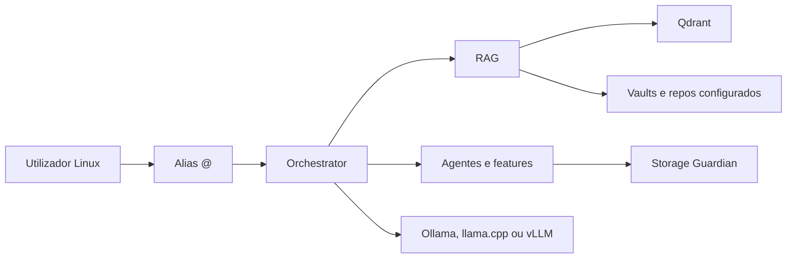

# ai-local

`ai-local` e uma stack local para usar agentes, RAG, storage seguro,
modelos locais e observabilidade numa maquina Linux. O caminho normal de uso e
preparar a maquina, subir a stack Docker e conversar com o sistema pelo alias
`@`.

Este README e para utilizadores Linux. Windows e macOS nao sao alvo deste
guia.

## O Que Precisas De Instalar

Obrigatorio:

- Linux com shell POSIX.
- Git.
- Make.
- Curl.
- Python 3.11 ou superior com `venv` e `pip`.
- Docker Engine.
- Docker Compose plugin (`docker compose`, nao apenas `docker-compose` antigo).
- Acesso a internet para instalar dependencias Python, imagens Docker,
  `sharedai` via GitHub e, se escolheres, modelos locais.

Recomendado:

- 25 GiB livres no minimo antes de builds/modelos.
- Mais espaco se fores usar modelos GGUF, vLLM, observabilidade ou perfis
  pesados.
- GPU NVIDIA com Docker/NVIDIA runtime apenas se quiseres perfis GPU.
- Ollama se quiseres usar ou preparar modelos Ollama com `make models`.

O repo inclui um comando que imprime e executa a instalacao de prerequisitos
correta para a tua distro quando ela e suportada:

```bash
make setup-system
```

O comando instala/valida Git, Make, Curl, Python 3.11+, Docker e Docker Compose
v2. O setup automatico e validado para Ubuntu, Debian, Fedora e Arch; openSUSE
e SLES nao sao aceites porque os pacotes Compose da distro ficam atras do stack
Docker Compose moderno requerido. Depois confirma que o daemon Docker ficou
ativo:

```bash
sudo systemctl enable --now docker
docker info
docker compose version
```

Se `docker info` falhar por permissoes, adiciona o teu utilizador ao grupo
`docker` e abre uma nova sessao:

```bash
sudo usermod -aG docker "$USER"
newgrp docker
docker info
```

Ollama e opcional para o arranque base, mas necessario para `make models`
preparar modelos Ollama:

```bash
ollama --version
```

Se nao existir, instala Ollama pela pagina oficial Linux ou pelo package
manager da tua distro antes de correr `make models`.

## Instalar O Projeto

Clona o repo e entra na pasta:

```bash
git clone https://github.com/PedroMglo/symbiont.git ai-local
cd ai-local
```

Instala prerequisitos da distro e confirma o layout do mono-repo:

```bash
make setup-system
make doctor
```

Cria o ambiente Python local, instala os pacotes runtime/editaveis e instala o
alias `@`:

```bash
make setup
```

O `make setup` cria `.venv`, instala `ai-local`, `storage_guardian`,
`obsidian-rag` quando presente, e prepara o alias de utilizador.

## Primeiro Arranque Base

Este caminho sobe o perfil base `core,storage`, suficiente para uso normal e
validacao inicial:

```bash
make infra
make up
make verify-live
```

`make infra` gera config/secrets locais, builda o catalogo obrigatorio de
imagens Docker e so depois valida a infra. Na primeira execucao pode demorar e
consumir varios GiB de cache Docker; confirma espaco com `make check-disk` ou
`make docker-disk-report` se a maquina for pequena.

Quando `make verify-live` passa, usa:

```bash
@ ola, verifica se o sistema esta pronto e diz-me o que consegues fazer
```

Atalho equivalente para preparar, subir e validar:

```bash
make use
```

## Preparar Modelos Locais

`make models` pode ser demorado e pode transferir ficheiros grandes. Corre-o
quando quiseres preparar Ollama/GGUF para perfis LLM, agentes, material ou
maximos:

```bash
make models
```

Verificar sem transferir modelos:

```bash
./.venv/bin/python scripts/models_prepare.py
```

No modo base, avisos de modelos podem ser apenas degradacao. No modo maximo,
modelos em falta bloqueiam a verificacao.

## Usar O Maximo Suportado Pela Maquina

Para deixar o config center escolher os perfis maximos seguros desta maquina:

```bash
make profiles
make up-auto
./.venv/bin/python scripts/verify_install.py --mode max --live --write-report
```

Se a verificacao maxima falhar por modelos, corre:

```bash
make models
./.venv/bin/python scripts/verify_install.py --mode max --live --write-report
```

Para diagnosticar GPU ou disco:

```bash
make check-gpu
make check-disk
```

## Configurar As Tuas Fontes RAG

Para adicionar vaults Obsidian e repositorios pessoais ao RAG sem editar TOML
manualmente:

```bash
make rag ARGS="--vault-dir ~/Obsidian/Vault --repo-path ~/src"
```

Para limpar fontes pessoais:

```bash
make rag-clear
```

O ficheiro de configuracao fica em:

```text
config/rag/user.toml
```

## Configuracao Que Podes Rever

Normalmente nao precisas de editar ficheiros gerados. Reve apenas os ficheiros
de entrada quando quiseres mudar comportamento:

- `config/main.yaml`: storage, hardware, LLM, limites, portas e privacidade.
- `config/rag/user.toml`: vaults, repositorios e Graphify.
- `config/models/orc.config.json`: alias `@` e politica de modelos.

Nao edites manualmente estes ficheiros gerados; recria-os com `make infra`:

- `.env.storage.generated`
- `.env.llm.generated`
- `.env.services.generated`
- `.env.docker.resources.generated`

## Comandos De Uso Diario

```bash
make up                    # sobe/repara a stack selecionada
make status                # mostra containers ai-local
make logs FOLLOW=1 TAIL=80 # acompanha logs
make verify                # verifica instalacao base sem smoke live
make verify-live           # verifica runtime base com HTTP e alias @
make down                  # para a stack
```

Docker, cache e rollback:

```bash
make docker-disk-report
make docker-safe-prune
make rollback
```

Ollama nativo no host:

```bash
make ollama-host-config
make ollama-host-apply
```

`ollama-host-apply` chama `sudo` de forma explicita para aplicar o drop-in
systemd.

## Troubleshooting Rapido

```bash
make doctor
make check-gpu
make check-disk
make logs FOLLOW=1 TAIL=120
```

Falhas comuns:

- `docker info` falha: inicia Docker ou corrige permissoes do grupo `docker`.
- `make infra` falha: reve Docker, espaco em disco e config gerada.
- `make up` falha: usa `make logs FOLLOW=1` e identifica o servico com erro.
- `make verify-live` falha: confirma que `make up` terminou e que o alias `@`
  existe no `PATH`.
- A verificacao maxima falha por modelos: corre `make models` ou reduz perfis.
- Pouco disco: corre `make docker-disk-report` antes de qualquer prune.

## Documentacao

- [Guia de utilizador](docs/user-guide.md): fluxo end-to-end ate usar `@`.
- [Operacoes](docs/operations.md): perfis, runtime, logs e rollback.
- [Documentacao por owner](docs/owners/README.md): detalhes por componente.
- [Arquitetura](docs/architecture.md): como a stack se liga.
- [Backlog](docs/implementation-backlog.md): trabalho futuro ainda valido.

## Mapa Rapido


