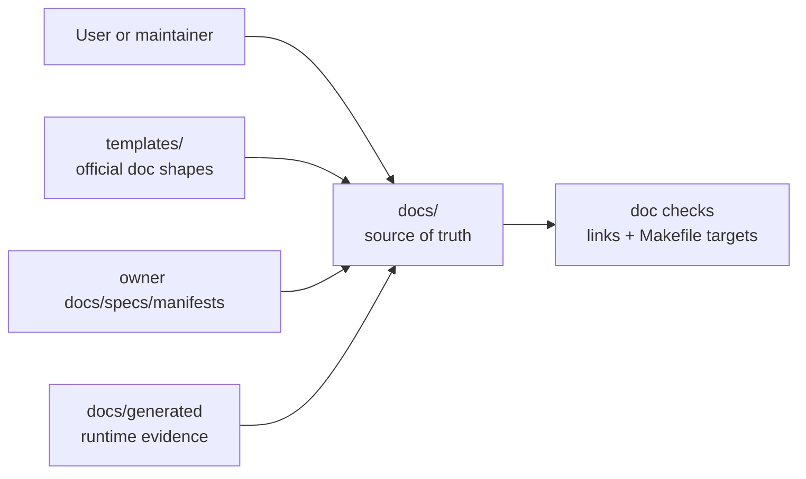
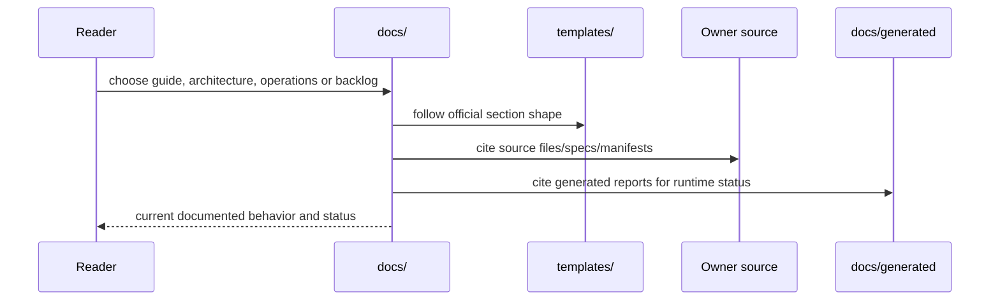
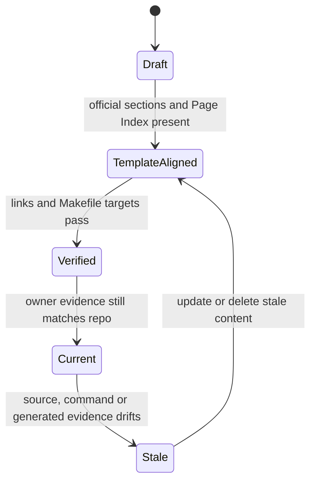

# ai-local Documentation Source Of Truth

Status: enabled-by-default
Owner: `docs/`
Last verified: 2026-06-29
Applies to: `docs/`, `templates/`, `config/`, `orchestrator/`, `agents/`, `features/`, `storage_guardian/`, `obsidian-rag/`, `infra/`
Audience: developer, operator, maintainer, user

Template: `templates/owners/component-doc-template.md`

## Page Index

- [Purpose](#purpose)
- [Ownership](#ownership)
- [User-Facing Behavior](#user-facing-behavior)
- [How To Use](#how-to-use)
- [Architecture](#architecture)
- [Data And Contracts](#data-and-contracts)
- [Failure Modes](#failure-modes)
- [Security And Safety](#security-and-safety)
- [Observability](#observability)
- [Operations](#operations)
- [Implementation Map](#implementation-map)
- [Change Rules](#change-rules)
- [Verification](#verification)
- [Open Questions](#open-questions)

## Purpose

`docs/` is the canonical project documentation surface for the `ai-local`
mono-repo. It gives users, operators and maintainers a compact source of truth
for architecture, first use, operations, generated evidence and future work.

This page follows the official component documentation template because the
documentation set is itself a maintained repo component. Generated reports under
`docs/generated/` are evidence artifacts and are regenerated by scripts instead
of hand-authored from templates.

## Ownership

| Responsibility | Owner | Notes |
| --- | --- | --- |
| Primary behavior | `docs/` | Repo-level documentation index, architecture, usage, operations and backlog. |
| Configuration | `config/` | User-facing runtime knobs, resolver behavior and generated env contracts. |
| Durable storage | `storage_guardian/` | Managed writes, materialized outputs, archive/restore and custody. |
| Execution side effects | `infra/`, `features/workspace_execution` | Infra lifecycle and sandbox execution are not owned by docs. |
| Observability | owners plus `docs/generated/` | Runtime/generated evidence lives in generated reports. |

This component owns:

- repo-level documentation structure;
- links from the root README into current documentation;
- a single implementation backlog for useful work that is not done or not
  proven-live;
- template-compliance rules for hand-written docs.

This component does not own:

- service-specific runtime behavior;
- storage or execution side effects;
- config inference or Docker policy;
- generated report contents.

## User-Facing Behavior

Users should be able to open this folder and understand:

- how to start using the project;
- how the major owners connect;
- which commands operate the stack;
- where runtime/generated evidence lives;
- which implementation ideas remain future work.

### Common Use Cases

| Use case | Input | Output | Success evidence |
| --- | --- | --- | --- |
| First orientation | open `docs/README.md` | current reading path | valid links to all hand-written docs |
| Owner-level review | open `docs/owners/README.md` | detailed docs for agents, features, config, storage, orchestrator, RAG and infra | owner docs cite live README/SPEC/manifest files |
| Setup and daily use | read `docs/user-guide.md` | command sequence and `@` examples | docs target guard confirms command targets in source CI |
| Architecture review | read `docs/architecture.md` | owner map and diagrams | cited owner manifests/specs |
| Operations/debugging | read `docs/operations.md` | command and evidence map | generated reports in `docs/generated/` |
| Future work planning | read `docs/implementation-backlog.md` | single backlog by owner | each item has exit proof |

### Non-Goals

- Replacing owner-local `README.md`, `SPEC.md`, `AGENTS.md` or skill files.
- Hand-editing generated reports as if they were source documents.
- Preserving completed historical plans as live documentation.

## How To Use

### Local Commands

```bash
git diff --check -- docs README.md
```

### API Or Contract

This component has no runtime API. Its contract is Markdown structure plus
template compliance:

```text
hand-written docs -> official template section set + Page Index + Verification
generated reports -> generated status + script-owned content
```

### Configuration

| Key | Owner | Default | Meaning | Safe values |
| --- | --- | --- | --- | --- |
| Documentation templates | `templates/` | official template kit | Required structure for new hand-written docs | nearest owner/flow template |
| Docs target guard | `scripts/check_make_doc_targets.py` | default docs list | Prevents stale `make <target>` references | current doc paths only |
| Generated evidence | `docs/generated/` | script output | Machine-produced runtime evidence | regenerate, do not hand-edit |

## Architecture

### Context Diagram



### Runtime Flow



### State Or Lifecycle



## Data And Contracts

| Contract | Producer | Consumer | Schema/source | Compatibility rules |
| --- | --- | --- | --- | --- |
| Template map | `templates/` | hand-written docs | `templates/README.md`, `templates/INDEX.md` | choose nearest template, keep Page Index |
| Docs index | `docs/README.md` | users/maintainers | this page | link only to current docs |
| Owner docs | `docs/owners/` | users/maintainers | `docs/owners/README.md` | cite owner-local source files and templates |
| Architecture docs | `docs/architecture.md` | maintainers/operators | flow template | cite owner sources and diagrams |
| Operations docs | `docs/operations.md` | operators | service template | commands must exist in Makefile |
| Backlog docs | `docs/implementation-backlog.md` | maintainers | component template | future work must name owner and exit proof |
| Generated reports | scripts/runtime | operators/docs | `docs/generated/*.md`, `*.json` | regenerate through owner scripts |

### Inputs

- local owner files, manifests, specs and generated reports;
- official templates in `templates/`;
- current `Makefile` command surface.

### Outputs

- hand-written Markdown pages with official sections;
- generated evidence links;
- a single backlog for not-yet-finished useful implementation work.

### Events And Evidence

| Event/evidence | When emitted | Required fields | Used by |
| --- | --- | --- | --- |
| link-check output | during docs validation | path, missing target if any | maintainers |
| make-target guard output | during docs validation | checked file count, failures | maintainers |
| generated reports | runtime/infra scripts | status, timestamp/summary where available | operations docs |

## Failure Modes

| Failure | Detection | User impact | Owner | Recovery |
| --- | --- | --- | --- | --- |
| Hand-written doc misses template sections | template compliance check | docs feel incomplete or inconsistent | `docs/` | add official sections or choose correct template |
| Stale command reference | docs target guard in source CI | user runs dead command | `docs/` | update docs or Makefile intentionally |
| Broken relative link | link scan | reader reaches missing file | `docs/` | fix or delete link |
| Generated report edited manually | git diff/re-generation drift | evidence becomes untrustworthy | report owner | regenerate from script |
| Owner behavior copied into docs as truth | code/spec drift | docs mislead maintainers | owning component | cite owner source and summarize only |

## Security And Safety

- Authentication/authorization: documentation has no runtime auth surface.
- Policy gates: docs must not weaken owner policy or approvals.
- Storage safety: docs must state that durable user-machine writes go through
  `storage_guardian` unless an owner spec proves otherwise.
- Execution safety: docs must route command/code execution through the runtime
  owner and sandbox contracts, not direct host shortcuts.
- Secrets: docs must name secret locations only generically and must never
  include real secret values.

## Observability

| Signal | Location | Meaning | Alert or action |
| --- | --- | --- | --- |
| Docker runtime smoke | `docs/generated/docker-runtime-smoke.md` | latest generated core smoke summary | inspect owner logs if failing |
| Docker inventory | `docs/generated/docker-inventory.md` | generated Docker policy status | resolve unapproved violations |
| SLO report | `docs/generated/slo-report.md` | generated SLO summary | inspect report owner if warning/fail |
| Graphify graph | `graphify-out/` | navigation graph, may need semantic refresh for doc edits | refresh with LLM-backed update when available |

## Operations

### Start

```bash
make infra
make up
```

### Stop

```bash
make rollback
```

### Health

```bash
find docs -maxdepth 2 -type f | sort
```

### Debug

```bash
find docs -maxdepth 2 -type f | sort
```

## Implementation Map

| Area | Path | Notes |
| --- | --- | --- |
| Source docs | `docs/*.md` | Hand-written template-aligned docs. |
| Owner docs | `docs/owners/` | Detailed owner-level docs for the major runtime components. |
| Generated docs | `docs/generated/` | Script/runtime-owned evidence artifacts. |
| Templates | `templates/` | Official documentation shapes. |
| Tests/checks | `scripts/check_make_doc_targets.py` | Make target guard for user/operator docs. |
| Root entrypoint | `README.md` | Links users to current docs. |

## Change Rules

- Start new hand-written docs from the nearest template in `templates/`.
- Keep `Page Index` synchronized with headings.
- Keep implementation plans in `docs/implementation-backlog.md` until promoted
  to an owner-local spec.
- Do not duplicate owner internals; cite owner files and summarize current
  behavior.
- Do not edit generated report content manually unless also updating the owning
  generator.

## Verification

| Check | Command or source | Expected result | Last run |
| --- | --- | --- | --- |
| Static docs check | `git diff --check -- docs README.md scripts/check_make_doc_targets.py templates/INDEX.md` | no whitespace errors | 2026-06-29 |
| Owner tests | docs target guard in source CI | all referenced Makefile targets exist | 2026-06-29 |
| Runtime smoke | `docs/generated/docker-runtime-smoke.md` | generated runtime evidence available | 2026-06-29 |

## Open Questions

- Should generated reports get their own generator-level template contract?
- Should docs template compliance become a dedicated CI script?
