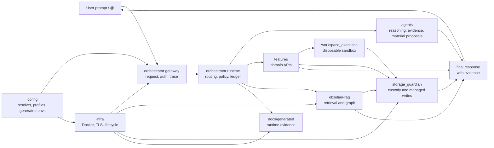
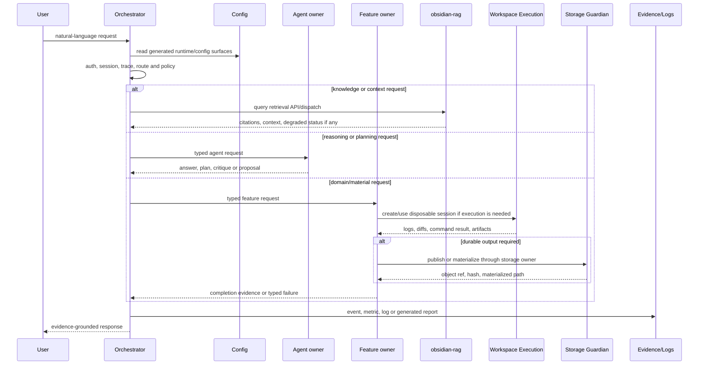
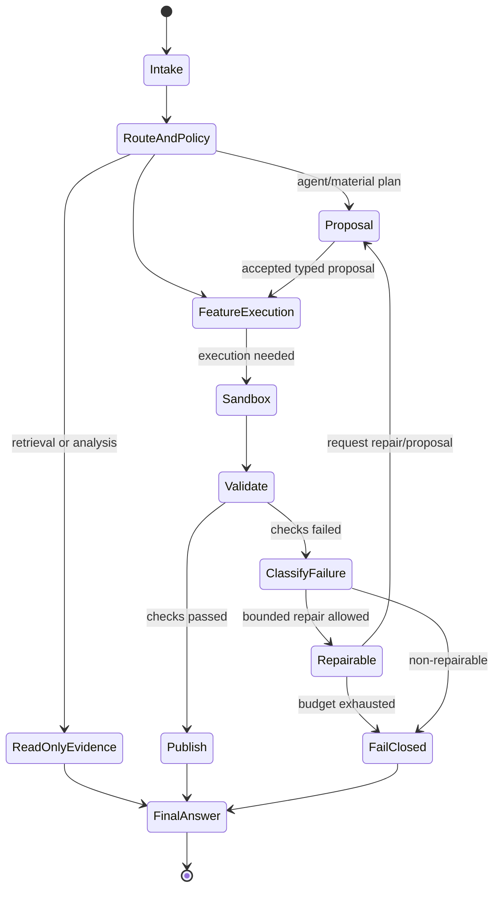

# ai-local End-To-End Architecture

Status: implemented
Owner: cross-component; primary coordinator `orchestrator/`
Last verified: 2026-06-29
Applies to: orchestrator, agents, features, services, storage, observability
Audience: user, operator, developer, maintainer

Template: `templates/flows/end-to-end-loop-template.md`

## Page Index

- [Purpose](#purpose)
- [Scope](#scope)
- [User Prompt Shape](#user-prompt-shape)
- [Ownership Map](#ownership-map)
- [Full Architecture](#full-architecture)
- [Request And Repair Sequence](#request-and-repair-sequence)
- [Repair State Machine](#repair-state-machine)
- [Evidence Contract](#evidence-contract)
- [Failure Classes](#failure-classes)
- [User-Facing Outcomes](#user-facing-outcomes)
- [Operator Runbook](#operator-runbook)
- [Verification](#verification)
- [Open Questions](#open-questions)

## Purpose

This page explains how a user request moves through the `ai-local` mono-repo:
configuration, orchestration, agents, features, RAG, sandbox execution,
storage custody, generated evidence and final response.

It is an end-to-end flow document, not a replacement for owner-local specs.
Every owner remains independently replaceable behind its API, manifest,
generated config or dispatch contract.

## Scope

In scope:

- natural-language requests entering through the local `@` alias or gateway;
- owner selection, policy, dispatch and evidence flow;
- RAG/retrieval, feature execution, agent proposals and material generation;
- storage publication and failure/repair handling;
- repo-wide architecture diagrams and owner boundaries.

Out of scope:

- private implementation details of service owners;
- generated report internals;
- cloud/Kubernetes production deployment plans;
- compatibility with retired documentation paths.

## User Prompt Shape

```text
<natural-language local request>
```

The request may ask for chat, retrieval, repo analysis, document processing,
translation, material generation, command/sandbox execution or operational
diagnosis. Routing must come from manifests, config, typed contracts and owner
capabilities, not scenario-specific prompt examples.

Examples for documentation or tests only:

```text
@ resume as notas configuradas no RAG sobre este tema
@ analisa este repo e explica os owners principais
@ cria um artefacto pequeno com validacao em sandbox e evidencia
```

## Ownership Map

| Step | Owner | Responsibility | Must not do |
| --- | --- | --- | --- |
| Request intake | `orchestrator` | auth, session, trace, policy and routing | execute owner internals directly |
| Config resolution | `config/` | central runtime settings, generated envs, service URLs, model/resource policy | create service-local config islands |
| Capability metadata | `agents/*`, `features/*`, `storage_guardian`, `obsidian-rag` | publish manifests/contracts | hide routing vocabularies in orchestrator code |
| Planning/reasoning | `agents/*` | produce typed reasoning, critique, plans or proposals | perform durable side effects |
| Feature execution | `features/*` | domain APIs and pipelines | bypass storage/policy/sandbox owners |
| Workspace execution | `features/workspace_execution` | disposable sessions, command contracts, diffs, transient artifacts | durable host writes |
| Durable publication | `storage_guardian` | managed writes, object custody, hashes, archive/restore | hidden direct writes |
| Retrieval and memory | `obsidian-rag` | ingestion, retrieval, graph/enrichment and RAG API behavior | orchestrator-owned RAG fallbacks |
| Infra lifecycle | `infra/` | Docker/TLS/secrets/lifecycle assets | runtime business logic |
| Final answer | `orchestrator` and response owners | synthesize grounded response | claim unverified completion |

## Full Architecture



## Request And Repair Sequence



## Repair State Machine



## Evidence Contract

| Evidence | Producer | Required fields | Consumed by | Completion role |
| --- | --- | --- | --- | --- |
| trace/session id | `orchestrator` | id, route, status | all runtime owners | correlation |
| generated env contract | `config/` | contract id, version, values | infra/services | runtime configuration |
| capability manifest | owner services | capability id, transport, policy, schemas | orchestrator | routing and dispatch metadata |
| retrieval evidence | `obsidian-rag` | source refs, citations, degraded state | orchestrator/final answer | knowledge grounding |
| agent proposal | `agents/*` | typed response, confidence/evidence metadata | orchestrator/features | planning/reasoning |
| validation result | `features/workspace_execution` | command, exit, logs, artifact refs | feature/kernel/final answer | execution proof |
| durable artifact | `storage_guardian` | object ref, hash, materialized path | features/final answer | durable success proof |
| generated report | scripts/runtime | status, summary, source JSON | operators/docs | operational evidence |

## Failure Classes

| Class | Example signal | Repairable? | Owner |
| --- | --- | --- | --- |
| Invalid request | schema/auth/policy rejection | usually no | orchestrator/caller |
| Missing config | generated env absent or invalid | yes | `config/`, `infra/` |
| Service unavailable | healthcheck/client failure | maybe | owning service/infra |
| Proposal contract error | invalid agent response | yes, bounded | agent owner |
| Sandbox execution error | command exit/log failure | maybe | `features/workspace_execution` + caller feature |
| Storage denial | storage guardian rejection | maybe | `storage_guardian` |
| Policy denial | approval/risk gate | no until approved | `orchestrator` policy |
| Retry budget exhausted | repeated repair failure | no | coordinator/feature |

## User-Facing Outcomes

| Outcome | Response must include | Response must not claim |
| --- | --- | --- |
| Success | result/artifact refs, validation or citation evidence | unverified extra behavior |
| Partial success | what worked, what is missing, where evidence lives | full completion |
| Failed closed | blocker, owner, evidence, next action | fake fallback success |
| Awaiting approval | requested action, risk and approval path | that work already ran |
| Degraded read-only answer | retrieved context and degraded source status | complete source coverage |

## Operator Runbook

```bash
make setup
make infra
make up
make verify-live
make logs FOLLOW=1 TAIL=80
```

Source files to inspect:

| Need | Source |
| --- | --- |
| owner documentation index | `docs/owners/README.md` |
| agent owner docs | `docs/owners/agents.md` |
| feature owner docs | `docs/owners/features.md` |
| storage owner docs | `docs/owners/storage-guardian.md` |
| orchestrator owner docs | `docs/owners/orchestrator.md`, `docs/owners/orchestrator-prewarming.md` |
| RAG owner docs | `docs/owners/obsidian-rag.md` |
| infra owner docs | `docs/owners/infra.md` |
| config truth | `config/README.md`, `config/RESOLVER_CONTRACTS.md` |
| Docker policy | `config/docker/service-catalog.toml`, `infra/docker/README.md` |
| agent capabilities | `agents/service_capabilities.toml` |
| feature capabilities | `features/service_capabilities.toml` |
| storage authority | `storage_guardian/README.md` |
| RAG authority | `obsidian-rag/README.md` |
| generated evidence | `docs/generated/` |

## Verification

| Check | Command or source | Expected result | Last run |
| --- | --- | --- | --- |
| Contract tests | owner manifests/specs listed above | architecture claims cite owner sources | 2026-06-29 |
| Repair tests | not run for docs-only update | no runtime repair claim made | not-run |
| Storage publication | `storage_guardian/README.md` and manifest refs | docs preserve storage owner boundary | 2026-06-29 |
| Live smoke | `docs/generated/docker-runtime-smoke.md` | generated runtime smoke evidence available | 2026-06-29 |

## Open Questions

- Should Docker inventory violations become a hard release gate?
- Should Graphify semantic extraction be refreshed whenever docs change once an
  LLM backend key is available?
