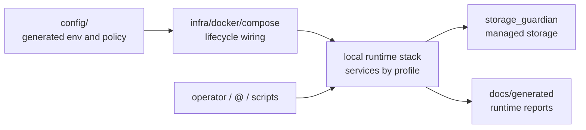
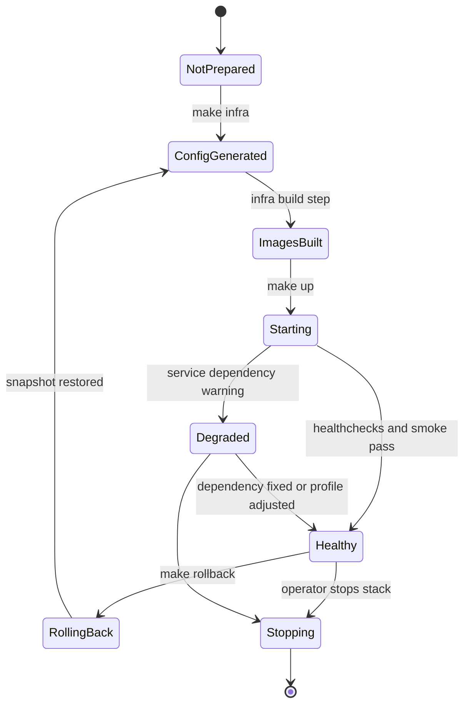
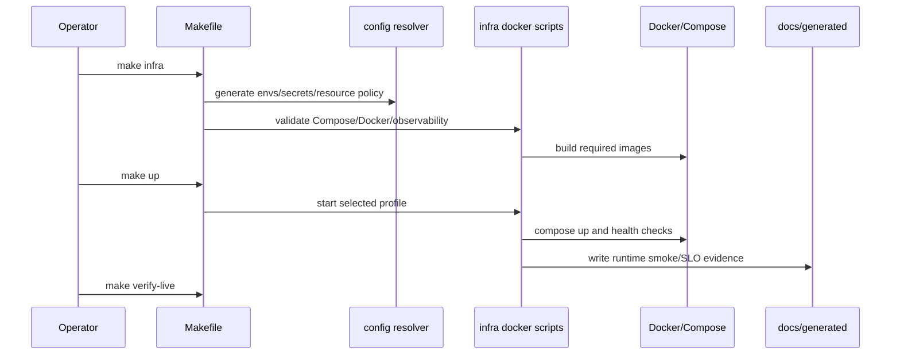

# ai-local Local Runtime Operations

Status: implemented
Owner: `infra/`
Last verified: 2026-06-29
Applies to: `compose.yml`, `infra/docker/`, `config/docker/service-catalog.toml`, local runtime profiles
Audience: operator, developer, maintainer

Template: `templates/owners/service-doc-template.md`

## Page Index

- [Purpose](#purpose)
- [Runtime Identity](#runtime-identity)
- [Ownership Boundary](#ownership-boundary)
- [Start, Stop, Health](#start-stop-health)
- [API Or Worker Contract](#api-or-worker-contract)
- [Lifecycle Diagram](#lifecycle-diagram)
- [Request Flow](#request-flow)
- [Dependencies](#dependencies)
- [Storage And Secrets](#storage-and-secrets)
- [Observability](#observability)
- [Failure Modes](#failure-modes)
- [Verification](#verification)
- [Open Questions](#open-questions)

## Purpose

This page documents the local operational surface for starting, validating,
debugging and rolling back the `ai-local` runtime. It follows the service
template because the command surface operates the local service stack.

## Runtime Identity

| Field | Value |
| --- | --- |
| Compose service | multiple services from `compose.yml` and `infra/docker/compose/*` |
| Image | cataloged in `config/docker/image-build-catalog.toml` and Compose fragments |
| Profile | default `core,storage`; optional `agents`, `features`, `material`, `i18n`, `heavy`, `llm`, `gpu`, `observability`, `rag-graph`, `temporal` |
| Internal URL | generated by `config/` into service env contracts |
| External port | exact values owned by `config/docker/service-catalog.toml` |
| Health endpoint | service healthchecks plus runtime smoke reports |
| Secrets | `infra/docker/secrets/*` generated by `make infra` |
| Persistent volumes | storage paths generated by `config/` and governed by service policy |

## Ownership Boundary



This service surface owns:

- local Docker lifecycle commands;
- runtime profile startup/health/smoke evidence;
- rollback snapshots for generated infra artifacts.

This service surface does not own:

- service business logic;
- central config decisions;
- durable storage policy;
- model routing semantics.

## Start, Stop, Health

```bash
# Prepare infra/config/images
make infra

# Start default runtime
make up

# Validate normal live path
make verify-live

# View logs
make logs FOLLOW=1 TAIL=80
```

Rollback generated infra artifacts:

```bash
make rollback
```

Maximum safe inferred profile:

```bash
make profiles
make up-auto
make verify-max-live
```

## API Or Worker Contract

The operator contract is the root Makefile command surface:

```text
make setup-system
make setup
make models
make infra
make up
make profiles
make up-auto
make verify
make verify-live
make verify-max
make verify-max-live
make doctor
make check-gpu
make logs
make rollback
make check-doc-targets
```

Runtime HTTP/API contracts are owned by the individual services and their
manifests. Operations docs must not redefine those contracts.

## Lifecycle Diagram



## Request Flow



## Dependencies

| Dependency | Required? | Contract | Failure behavior |
| --- | --- | --- | --- |
| Docker + Compose plugin | yes | host prerequisite | setup/up fail |
| Python runtime | yes | setup/config scripts | setup/infra fail |
| `config/` resolver | yes | generated env contracts | infra blocks or degrades |
| `infra/docker/scripts/infra_ops.py` | yes | lifecycle implementation | Make targets fail |
| `storage_guardian` | default profile | storage API/health | storage work blocks/degrades |
| model backend | optional/profile-dependent | Ollama/llama.cpp/vLLM URLs | LLM work degrades/blocks |
| observability stack | opt-in | profile services | dashboards/traces unavailable |

## Storage And Secrets

| Item | Owner | Path/name | Durability | Notes |
| --- | --- | --- | --- | --- |
| generated storage env | `config/` | `.env.storage.generated` | generated compatibility artifact | do not edit manually |
| generated LLM env | `config/` | `.env.llm.generated` | generated compatibility artifact | do not edit manually |
| generated services env | `config/` | `.env.services.generated` | generated compatibility artifact | do not edit manually |
| Docker secrets | `infra/` | `infra/docker/secrets/*` | local secret files | ignored, should not be logged |
| managed data | `storage_guardian` | resolved storage roots | persistent | use storage owner |
| generated reports | runtime scripts | `docs/generated/*` | evidence artifacts | regenerate from owner scripts |

## Observability

| Signal | Source | Meaning | Operator action |
| --- | --- | --- | --- |
| Docker runtime smoke | `docs/generated/docker-runtime-smoke.md` | generated health/smoke summary | inspect failing owner |
| Docker inventory | `docs/generated/docker-inventory.md` | policy status and violation count | fix catalog/compose or approve exception |
| SLO report | `docs/generated/slo-report.md` | generated SLO status | inspect report owner |
| Logs | `make logs FOLLOW=1 TAIL=80` | container/service logs | debug failed profile/service |
| Config explanation | `python -m config.resolver --explain` | resolved config decisions | fix config source |

## Failure Modes

| Failure | Signal | Impact | Recovery |
| --- | --- | --- | --- |
| Compose config invalid | `make infra` failure | stack cannot start | fix Compose/catalog/config owner |
| Service unhealthy | healthcheck/runtime smoke failure | callers degrade or fail | inspect logs and owner service |
| Missing generated env | startup/config error | service cannot start | rerun `make infra` |
| Docker policy violation | generated inventory violation | policy drift | fix or document approved exception |
| Storage unavailable | storage warning/block | durable work blocked/degraded | mount storage or allow local fallback |
| Model backend unavailable | LLM route failure | LLM work degraded/blocked | configure model/profile or accept degraded mode |

## Verification

| Check | Command or source | Expected result | Last run |
| --- | --- | --- | --- |
| Compose config | `make infra` | valid generated config/build path | not-run |
| Health | `docs/generated/docker-runtime-smoke.md` | generated status available | 2026-06-29 |
| Runtime smoke | `make check-doc-targets` | operations command references are valid | 2026-06-29 |

## Open Questions

- Should Docker inventory violations become a hard local release gate?
- Which generated reports should be part of the default `make up` evidence set?
