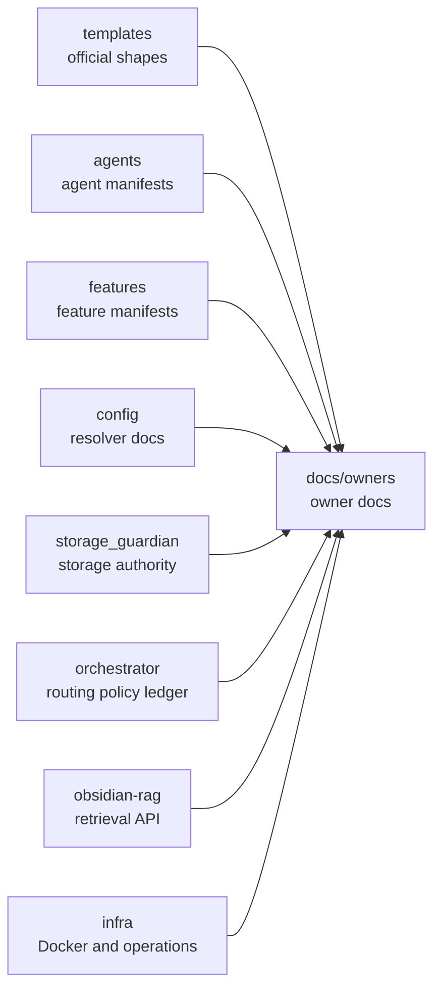
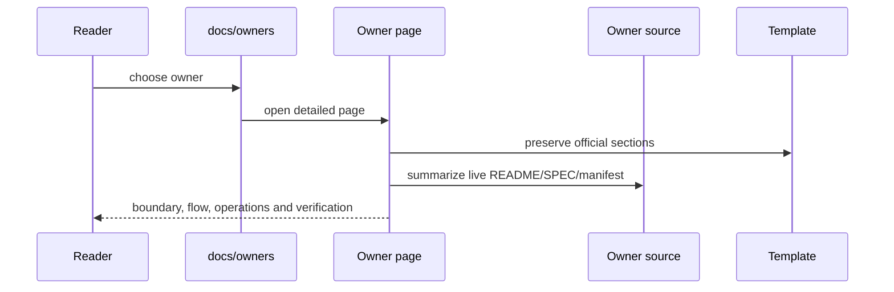
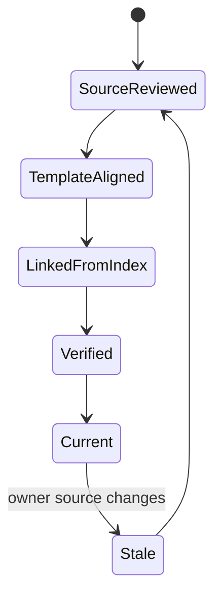

# Owner Documentation Index

Status: implemented
Owner: `docs/owners`
Last verified: 2026-06-29
Applies to: `agents/`, `features/`, `config/`, `storage_guardian/`, `orchestrator/`, `orchestrator/prewarming/`, `obsidian-rag/`, `infra/`
Audience: developer, operator, maintainer, user

Template: `templates/owners/component-doc-template.md`

## Page Index

- [Purpose](#purpose)
- [Ownership](#ownership)
- [User-Facing Behavior](#user-facing-behavior)
- [How To Use](#how-to-use)
- [Architecture](#architecture)
- [Data And Contracts](#data-and-contracts)
- [Failure Modes](#failure-modes)
- [Security And Safety](#security-and-safety)
- [Observability](#observability)
- [Operations](#operations)
- [Implementation Map](#implementation-map)
- [Change Rules](#change-rules)
- [Verification](#verification)
- [Open Questions](#open-questions)

## Purpose

`docs/owners/` is the detailed owner-level documentation layer for the
`ai-local` mono-repo. It complements the end-to-end architecture guide with a
source-of-truth page for every major runtime owner: agents, features, central
config, storage, orchestrator, predictive prewarming, RAG and infra.

The pages summarize owner-local specs, README files and capability manifests.
They do not replace those owner files; they make the live architecture easier
to inspect from one documentation tree.

## Ownership

| Responsibility | Owner | Notes |
| --- | --- | --- |
| Primary behavior | `docs/owners/` | Owner-level documentation and source links. |
| Configuration | `config/` | Central runtime settings and generated env contracts. |
| Durable storage | `storage_guardian/` | Managed writes, archives, restore and custody. |
| Execution side effects | `infra/`, `features/workspace_execution` | Docker lifecycle and sandbox execution surfaces. |
| Observability | each owner | Owner pages point to generated or local observability evidence. |

This component owns:

- a current map from major repo owners to their detailed docs;
- template alignment for owner pages;
- explicit documentation of gaps found during source review.

This component does not own:

- runtime implementation;
- generated report content;
- service-specific source-of-truth contracts;
- compatibility with retired documentation folders.

## User-Facing Behavior

Readers should be able to start at this index and reach the right owner page
without opening historical roadmap folders.

### Common Use Cases

| Use case | Input | Output | Success evidence |
| --- | --- | --- | --- |
| Understand agents | open [agents.md](agents.md) | agent portfolio, manifests, prompt inventory | `agents/service_capabilities.toml` cited |
| Understand features | open [features.md](features.md) | feature APIs, contracts and data flow | `features/service_capabilities.toml` cited |
| Inspect config truth | open [config.md](config.md) | resolver, precedence, generated contracts | `config/README.md` cited |
| Inspect storage authority | open [storage-guardian.md](storage-guardian.md) | storage lifecycle and API surface | `storage_guardian/README.md` cited |
| Inspect orchestration | open [orchestrator.md](orchestrator.md) | routing, policy, ledger, boundaries | `orchestrator/AGENTS.md` cited |
| Inspect prewarming | open [orchestrator-prewarming.md](orchestrator-prewarming.md) | best-effort prediction flow | `orchestrator/prewarming/SPEC.md` cited |
| Inspect RAG | open [obsidian-rag.md](obsidian-rag.md) | API-only RAG surface and auth | `obsidian-rag/README.md` cited |
| Inspect infra | open [infra.md](infra.md) | Docker, secrets, gateway and operations | `infra/README.md` cited |

### Non-Goals

- Duplicating every line of owner README/SPEC files.
- Claiming runtime validation that was not run.
- Keeping stale historical implementation plans.

## How To Use

### Local Commands

```bash
find docs/owners -maxdepth 1 -type f | sort
make check-doc-targets
```

### API Or Contract

Owner page contract:

```text
metadata + Template marker + Page Index + owner boundary + diagrams + verification
```

### Configuration

| Key | Owner | Default | Meaning | Safe values |
| --- | --- | --- | --- | --- |
| Template selection | `templates/` | nearest owner/flow template | Shapes each owner page | component, agent, feature, config, storage, prewarming |
| Source citation | documented owner | required | Prevents docs from inventing behavior | README, SPEC, AGENTS, manifest, tests |
| Status language | `docs/owners/` | conservative | Separates implemented, enabled, draft and unverified | never claim live proof without evidence |

## Architecture

### Context Diagram



### Runtime Flow



### State Or Lifecycle



## Data And Contracts

| Contract | Producer | Consumer | Schema/source | Compatibility rules |
| --- | --- | --- | --- | --- |
| Agent manifest docs | `agents/` | maintainers | [agents.md](agents.md) | summarize owner manifest, do not move prompt behavior |
| Feature manifest docs | `features/` | maintainers | [features.md](features.md) | summarize owner manifest, do not move feature logic |
| Config docs | `config/` | operators | [config.md](config.md) | generated envs are transition artifacts |
| Storage docs | `storage_guardian/` | operators/features | [storage-guardian.md](storage-guardian.md) | durable writes stay with storage owner |
| Orchestrator docs | `orchestrator/` | maintainers | [orchestrator.md](orchestrator.md) | orchestration only, no owner internals |
| RAG docs | `obsidian-rag/` | maintainers | [obsidian-rag.md](obsidian-rag.md) | API-only operation, auth required |

### Inputs

- owner README/SPEC/AGENTS files;
- capability manifests;
- official documentation templates;
- generated reports when an owner page references runtime evidence.

### Outputs

- owner pages in this directory;
- updated links from repo-level docs;
- explicit backlog entries for gaps discovered during documentation review.

### Events And Evidence

| Event/evidence | When emitted | Required fields | Used by |
| --- | --- | --- | --- |
| docs validation | before handoff | command, status | maintainers |
| graph refresh | after doc changes | command, status or blocker | architecture navigation |
| backlog update | when gap found | owner, status, exit proof | maintainers |

## Failure Modes

| Failure | Detection | User impact | Owner | Recovery |
| --- | --- | --- | --- | --- |
| Owner page drifts from source | source review or tests | wrong architecture decision | `docs/owners/` + source owner | update page from owner source |
| Page omits official sections | template checker | incomplete docs | `docs/owners/` | add missing template sections |
| Future work appears as done | review of verification table | false status | page owner | move to backlog or mark not-run |
| Cross-owner behavior copied into docs | architecture review | ownership confusion | affected owner | cite owner contract instead |

## Security And Safety

- Authentication/authorization: owner pages describe auth boundaries but do not
  publish secrets.
- Policy gates: orchestrator policy and storage safety must remain owner
  truths, not doc shortcuts.
- Storage safety: durable writes are documented as `storage_guardian`-owned.
- Execution safety: host execution is documented through sandbox/infra owners.
- Secrets: secret locations may be named; secret values must never appear.

## Observability

| Signal | Location | Meaning | Alert or action |
| --- | --- | --- | --- |
| owner manifests | `agents/service_capabilities.toml`, `features/service_capabilities.toml` | routing metadata truth | update docs when manifest changes |
| generated reports | `docs/generated/` | runtime evidence | cite but do not hand-edit |
| graph output | `graphify-out/` | architecture navigation | refresh after docs/API/contract changes |

## Operations

### Start

```bash
sed -n '1,220p' docs/owners/README.md
```

### Stop

No runtime process is owned by this documentation directory.

### Health

```bash
make check-doc-targets
```

### Debug

```bash
find docs/owners -maxdepth 1 -type f | sort
```

## Implementation Map

| Area | Path | Notes |
| --- | --- | --- |
| Owner docs index | `docs/owners/README.md` | This page. |
| Agent docs | `docs/owners/agents.md` | Agent portfolio and prompt inventory. |
| Feature docs | `docs/owners/features.md` | Feature portfolio and API/data flow. |
| Config docs | `docs/owners/config.md` | Resolver and generated contract truth. |
| Storage docs | `docs/owners/storage-guardian.md` | Durable-write authority. |
| Orchestrator docs | `docs/owners/orchestrator.md` | Control flow and boundaries. |
| Prewarming docs | `docs/owners/orchestrator-prewarming.md` | Best-effort latency predictor. |
| RAG docs | `docs/owners/obsidian-rag.md` | API-only retrieval surface. |
| Infra docs | `docs/owners/infra.md` | Docker, secrets and operations. |

## Change Rules

- Choose the nearest official template for every new owner page.
- Keep source links close to claims.
- Separate implemented code from live runtime proof.
- Move not-yet-implemented but useful work into
  [implementation-backlog.md](../implementation-backlog.md).

## Verification

| Check | Command or source | Expected result | Last run |
| --- | --- | --- | --- |
| Source review | owner README/SPEC/manifest files | pages cite live source paths | 2026-06-29 |
| Template shape | `templates/owners/component-doc-template.md` | required sections present | 2026-06-29 |
| Docs target guard | `make check-doc-targets` | pass | not-run after this edit |
| Link scan | local docs link checker | pass | not-run after this edit |

## Open Questions

- Should each agent and feature get a separate page after their owner-local
  Codex skills are completed?
