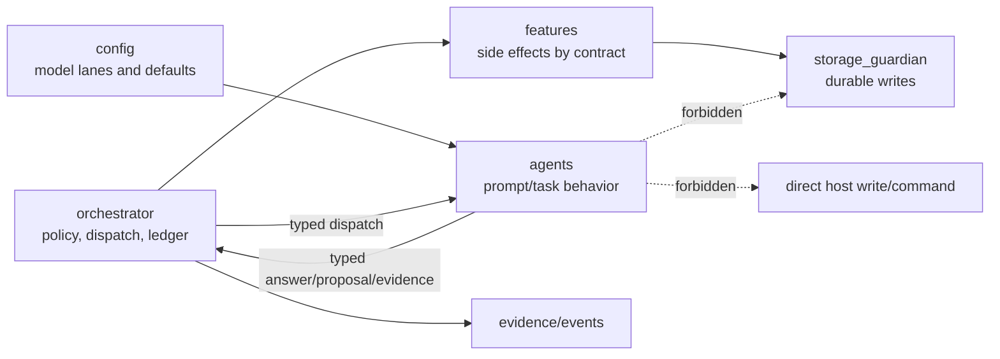
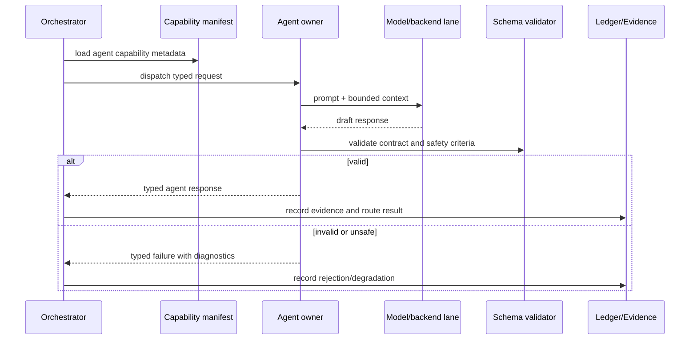

# Agent Owners

Status: implemented
Owner: `agents/`
Last verified: 2026-06-29
Applies to: `agents/`, `agents/service_capabilities.toml`, agent README/SPEC/config files
Audience: developer, maintainer

Template: `templates/owners/agent-doc-template.md`

## Page Index

- [Purpose](#purpose)
- [Ownership Boundary](#ownership-boundary)
- [Inputs And Outputs](#inputs-and-outputs)
- [Prompt Inventory](#prompt-inventory)
- [Runtime Flow](#runtime-flow)
- [How To Use](#how-to-use)
- [Failure And Repair Behavior](#failure-and-repair-behavior)
- [Model And Resource Behavior](#model-and-resource-behavior)
- [Tests](#tests)
- [Verification](#verification)
- [Open Questions](#open-questions)

## Purpose

`agents/` owns model-facing task behavior: direct reasoning, decomposition,
synthesis, critique, static safety review, material planning, audio
transcription and local evidence analysis. Agents return typed proposals or
evidence; they do not own durable writes, host command execution, storage
lifecycle or cross-owner routing.

The source-of-truth runtime metadata is
[`agents/service_capabilities.toml`](../../agents/service_capabilities.toml).
Each agent keeps its own README/SPEC/config/type files under its owner
directory.

## Ownership Boundary

This agent family owns:

- prompt and task behavior for agent-owned capabilities;
- typed response generation for advertised contracts;
- agent-local validation of response shape and safety metadata;
- read-only evidence and proposal generation.

This agent family must not own:

- durable writes or materialization;
- shell, Docker, VM or host command execution;
- storage lifecycle, archive, restore or custody;
- cross-owner routing, lifecycle policy or event ledger decisions.



## Inputs And Outputs

| Agent | Status | Input contract | Output contract | Evidence | Writes |
| --- | --- | --- | --- | --- | --- |
| `reasoning_and_response` | active | `AgentInvokeRequest` | `AgentInvokeResponse` | answer, task plan, synthesis, critique, classification | no |
| `execution_policy_operator` | active | `BashSafetyRequest` | `BashSafetyResponse` | shell safety report, command risk, findings | no |
| `material_builder` | active | `MaterialPlanRequest` | `MaterialPlanResponse` | material plan, file proposal, patch proposal, schema repair | no |
| `audio_transcribe` | active | `AudioQueryRequest` | `AudioQueryResponse` | transcript, audio segments | no |
| `local_evidence_operator` | active | `AnalyzeRequest` | `AnalyzeResponse` | repo/code/data/ops/security evidence | no |

Detailed manifest fields include `policy_action`, `risk_level`,
`resource_profile`, `input_schema`, `output_schema`, `events_published`,
`risk_review_criteria`, `round_dependencies` and `timeout_seconds`.

## Prompt Inventory

| Agent | Prompt/config paths | Purpose | Runtime lane | Must not contain |
| --- | --- | --- | --- | --- |
| `reasoning_and_response` | `agents/reasoning_and_response/reasoning_and_response/prompt/*.md`, `config.toml` | direct response, decomposition, synthesis, critique, classification and polish | `gpu_llm`, interactive, `model_profile=default` | scenario-specific dispatch rules or hidden feature parsers |
| `execution_policy_operator` | `agents/execution_policy_operator/README.md`, `bash_safety/types.py` | static command safety review and destructive-pattern reporting | CPU interactive | command execution or shell side effects |
| `material_builder` | `agents/material_builder/material_builder/prompt/*.md` | material plan/file/patch/schema repair proposals | `gpu_llm`, background, `model_profile=material_plan` | static fallback projects or workspace writes |
| `audio_transcribe` | `agents/audio_transcribe/config.toml`, `streaming/prompt/*.md` | transcription, streaming correction and summaries | `gpu_audio`, background | durable output writes or storage policy |
| `local_evidence_operator` | `agents/local_evidence_operator/*/types.py`, README | bounded local evidence analysis for code, data, ops and security | CPU interactive | unredacted secret output or host mutation |

## Runtime Flow



## How To Use

Agents are normally invoked by orchestrator dispatch from capability metadata.
For documentation and owner review, inspect:

```bash
sed -n '1,260p' agents/service_capabilities.toml
find agents -maxdepth 3 -name README.md -o -name SPEC.md -o -name config.toml
```

Representative typed request shape:

```json
{
  "query": "summarize the evidence and propose next steps",
  "context": {"trace_id": "example"},
  "metadata": {"requested_by": "orchestrator"}
}
```

Expected response shape:

```json
{
  "output": "bounded answer or proposal",
  "confidence": 0.8,
  "metadata": {"evidence": ["agent-owned evidence ref"]}
}
```

## Failure And Repair Behavior

| Failure | Detection | Agent response | Owner of recovery |
| --- | --- | --- | --- |
| Invalid schema | parser/validator | reject with diagnostics | agent owner |
| Unsafe action proposal | policy or contract check | return safe refusal or plan | `orchestrator` policy |
| Missing context | input validation | ask for required context | caller/orchestrator |
| Model unavailable | backend client error | typed degraded/failure result | `config/`, infra, agent owner |
| Repeated bad output | retry budget exhausted | fail closed | orchestrator/caller |
| Direct write attempted | review/tests/policy | block as ownership violation | target owner plus orchestrator |

## Model And Resource Behavior

| Agent | Lane/profile | Config owner | Expected use | Fallback rule |
| --- | --- | --- | --- | --- |
| `reasoning_and_response` | `gpu_llm`, interactive, `default` | `config/` | chat, planning, synthesis, critique, classification | no hidden fallback; report degraded backend |
| `execution_policy_operator` | CPU interactive | `config/` and owner defaults | fast static shell safety review | no shell execution fallback |
| `material_builder` | `gpu_llm`, background, `material_plan` | `config/` | proposal-only material generation | no static fallback project |
| `audio_transcribe` | `gpu_audio`, background | `config/` | media transcription | report unsupported media/backend failure |
| `local_evidence_operator` | CPU interactive | `config/` | bounded repo/data/ops/security evidence | no workspace write fallback |

## Tests

| Test | Path | What it proves |
| --- | --- | --- |
| Agent owner tests | `agents/*/tests` when present | agent-local contracts and behavior |
| Orchestrator dispatch tests | `tests/orchestrator` | manifests remain consumable by dispatch/policy |
| Prompt/schema checks | owner prompt/type files | prompts and types stay scenario-neutral |

## Verification

| Check | Command or source | Expected result | Last run |
| --- | --- | --- | --- |
| Manifest source review | `agents/service_capabilities.toml` | active agents and contracts documented | 2026-06-29 |
| Prompt inventory scan | `rg --files agents \| rg -i '(prompt|config\\.toml|README\\.md|SPEC\\.md|types\\.py)'` | prompt/config/type paths found | 2026-06-29 |
| Agent unit tests | targeted agent `pytest` scope | pass | not-run for docs-only update |
| Runtime smoke | orchestrator dispatch through live stack | pass | not-run for docs-only update |
| Owner Codex skills | `find agents -path '*/.agents/skills/*/SKILL.md'` | one primary skill per agent | gap found 2026-06-29 |

## Open Questions

- Owner-local primary Codex skills were not found under `agents/*/.agents`.
  This is a governance gap to track in the implementation backlog.
