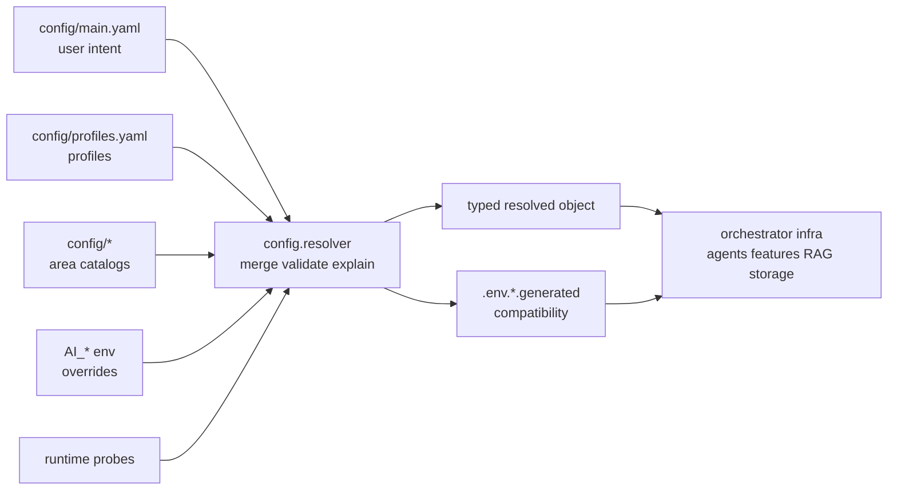
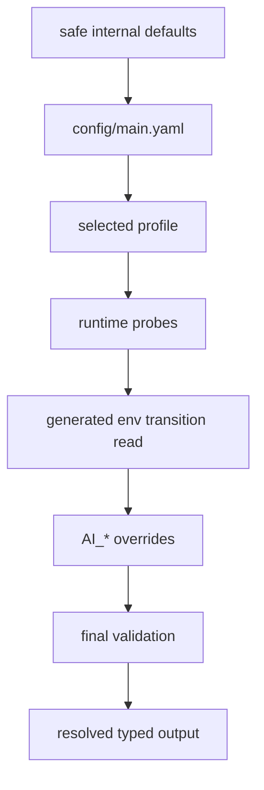
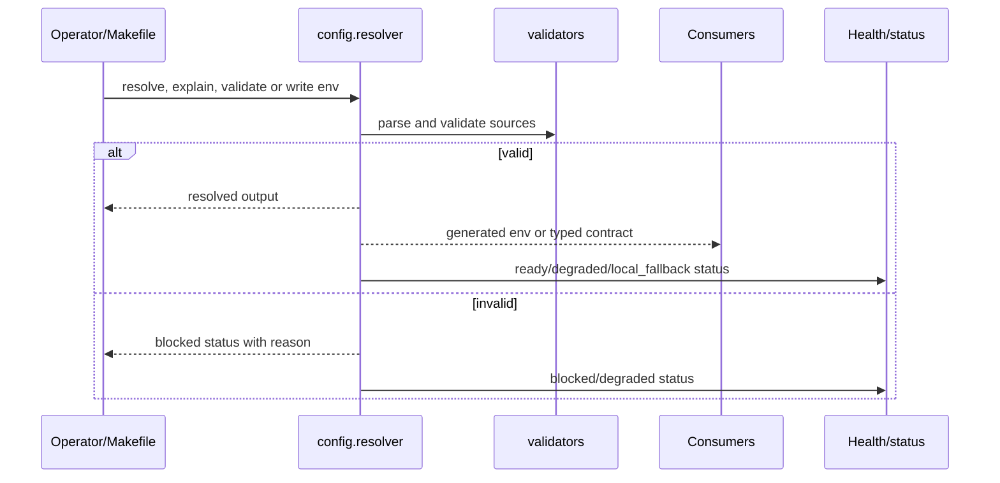
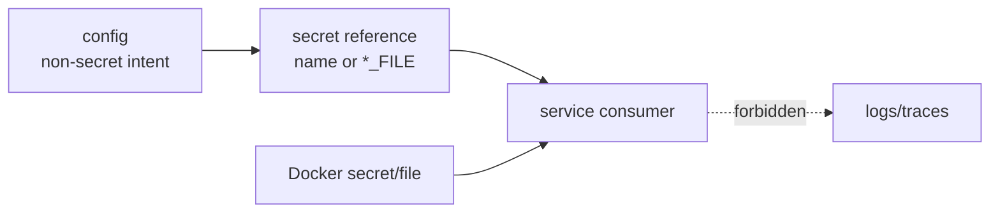

# Configuration Center

Status: enabled-by-default
Owner: `config/`
Last verified: 2026-06-29
Applies to: `config/`, generated env outputs, resolver consumers
Audience: developer, operator, maintainer

Template: `templates/owners/config-doc-template.md`

## Page Index

- [Purpose](#purpose)
- [Ownership Boundary](#ownership-boundary)
- [Source Of Truth](#source-of-truth)
- [Precedence](#precedence)
- [Schema And Validation](#schema-and-validation)
- [Generated Outputs](#generated-outputs)
- [Secrets Boundary](#secrets-boundary)
- [Consumers](#consumers)
- [Operational Flows](#operational-flows)
- [Runtime States](#runtime-states)
- [Drift And Migration Control](#drift-and-migration-control)
- [Safety Rules](#safety-rules)
- [Implementation Map](#implementation-map)
- [Change Rules](#change-rules)
- [Verification](#verification)
- [Open Questions](#open-questions)

## Purpose

`config/` is the intelligent configuration center for the mono-repo. It owns
user-facing runtime intent, machine/profile inference, generated compatibility
envs, model/resource defaults, storage path resolution, service endpoints,
Docker operator limits, RAG/orchestrator runtime budgets and operational self
model output.

The primary source page is [`config/README.md`](../../config/README.md). The
generated-env and resolver contracts are documented in
[`config/RESOLVER_CONTRACTS.md`](../../config/RESOLVER_CONTRACTS.md).

## Ownership Boundary

`config/` owns source-of-truth settings, resolution, validation, generated
compatibility artifacts and operator-facing explanations.

`config/` does not own:

- feature business logic;
- agent prompt behavior;
- storage lifecycle or custody;
- command execution;
- Docker lifecycle actions;
- runtime repair decisions;
- hidden fallbacks inside consumers.



## Source Of Truth

| Config source | Path | Owner | Editable by user? | Purpose |
| --- | --- | --- | --- | --- |
| User intent | `config/main.yaml` | `config/` | yes | high-level mode, hardware, storage, LLM, limits, Docker, privacy |
| Profiles | `config/profiles.yaml` | `config/` | yes, carefully | named overlays such as local/dev/debug |
| Resolver contracts | `config/RESOLVER_CONTRACTS.md` | `config/` | maintainers | generated env and typed output contract |
| Docker image catalog | `config/docker/image-build-catalog.toml` | `config/` + infra | maintainers | mandatory image inventory for `make infra` |
| Model config | `config/models/*.json` | `config/` | maintainers | model intent and prompts without runtime URLs |
| Storage schema | `config/storage_guardian.yaml` | `config/` + storage owner | maintainers | immutable managed store layout |
| Generated envs | `.env.*.generated` | resolver | no | transition artifacts for Docker/services |
| Runtime env override | `AI_*` | operator | yes | explicit local override under validation |

Generated files are not source-of-truth config islands. They exist so Docker,
transition consumers and runtime services can read stable surfaces while more
consumers migrate to typed resolver output.

## Precedence

The resolver applies the order documented by `config/README.md`:

```text
safe internal defaults
+ config/main.yaml
+ selected profile from config/profiles.yaml
+ runtime probes
+ .env.storage.generated transition read
+ AI_* environment overrides
+ final validation
```



| Rank | Source | Can override | Must not override |
| --- | --- | --- | --- |
| 1 | safe defaults | missing values | explicit user intent |
| 2 | `config/main.yaml` | defaults | secrets |
| 3 | selected profile | profile-scoped values | unrelated owner settings |
| 4 | runtime probes | auto values | explicit fixed values unless documented |
| 5 | generated transition read | migration compatibility | source-of-truth settings |
| 6 | `AI_*` env | explicit operator override | schema and safety validation |
| 7 | final validation | invalid values | valid explicit intent |

## Schema And Validation

| Field or area | Type | Required? | Default | Validation | Consumer |
| --- | --- | --- | --- | --- | --- |
| `mode` | enum | yes | project default | known mode | resolver, infra |
| `hardware profile` | enum/auto | yes | `auto` | host probe compatible | resolver, model/runtime budgets |
| `storage.external_root` | path/auto | yes | `auto` | absolute path or discovery | storage envs, storage guardian, Docker binds |
| LLM backend/profile | enum/object | yes | resolver default | known backend/model profile | orchestrator, RAG, agents |
| Docker operator limits | object | yes | auto-tuned | positive limits/caps | infra/docker |
| Runtime service URLs | generated contract | yes for consumers | resolver-derived | valid URL/port shape | orchestrator, agents, features, RAG |
| Secrets | file/ref only | no raw value | none | not logged or resolved as normal config | Docker/services |

Validation must fail or degrade explicitly. Consumers must not silently invent
private defaults when central config is missing.



## Generated Outputs

| Artifact | Contract id/version | Producer command | Consumers | Source inputs | Sunset condition |
| --- | --- | --- | --- | --- | --- |
| `.env.storage.generated` | `ai-local.storage-env.v1` | `python -m config.resolver --write-storage-env` | Docker binds, `storage_guardian`, storage reconcile | config, probes, overrides | consumers read typed resolver output |
| `.env.llm.generated` | `ai-local.llm-env.v1` | `python -m config.resolver --write-llm-env` | LLM serving, orchestrator, RAG, agents | config/models, probes, overrides | LLM consumers read typed resolver output |
| `.env.services.generated` | `ai-local.services-env.v1` | `python -m config.resolver --write-services-env` | Compose service wiring, orchestrator, agents, features, RAG | service/runtime config | service consumers read typed resolver output |
| `.env.docker.resources.generated` | `ai-local.docker-resources-env.v1` | `python -m config.resolver --write-docker-resources-env` | Compose resource limits and infra lifecycle | Docker config, probes | infra lifecycle reads typed resolver output |
| `.local/generated/operational-self-model.json` | resolver self model | `python -m config.resolver --write-operational-self-model` | operators, status surfaces | resolved config and probes | active only while current |
| `.local/generated/autotuning.effective.json` | autotuning overlay | `python -m config.autotuning --apply-approved` | resolver/resource policy | approved proposals | rollback or superseded overlay |

## Secrets Boundary

Secrets are never normal resolved config. Runtime secrets stay in Docker secrets
or `*_FILE` environment variables.

| Secret/input | Correct owner/location | How consumer reads it | Must not happen |
| --- | --- | --- | --- |
| API keys | `infra/docker/secrets/` or `*_FILE` | Docker secret/file ref | log raw value |
| RAG API key | Docker secret/local ignored file | RAG auth middleware | store in generated docs |
| Gateway/TLS secrets | `infra/gateway`, Docker secrets | Caddy/runtime files | commit real cert/key material |
| External service tokens | secret file/ref | explicit consumer contract | merge into `config/main.yaml` |



## Consumers

| Consumer | Reads | How | Failure behavior |
| --- | --- | --- | --- |
| `infra/docker` | Docker build/runtime limits, env contracts | generated envs and catalogs | fail validation or degraded runtime |
| `orchestrator` | service URLs, model/runtime budgets, routing budgets | generated envs/typed config | degraded or blocked dispatch |
| `agents/*` | model lanes, backend URLs, timeouts | generated envs/typed config | typed degraded agent failure |
| `features/*` | service URLs, resource/sandbox/material budgets | generated envs/typed config | feature degraded/blocked |
| `obsidian-rag` | RAG config, model URLs, performance values | `config/rag.py`, generated envs | health degraded/blocked |
| `storage_guardian` | storage roots/schema/envs | `config/storage_guardian.yaml`, generated envs | local fallback, external_missing or blocked |

Consumer rules:

- Consumers may read typed resolver output or generated compatibility artifacts.
- Consumers must not duplicate central inference logic.
- Consumers must report stale or incompatible generated artifacts.

## Operational Flows

### Inspect

```bash
python -m config.resolver --print
python -m config.resolver --explain
python -m config.resolver --validate
```

### Generate

```bash
python -m config.resolver --write-storage-env
python -m config.resolver --write-llm-env
python -m config.resolver --write-services-env
python -m config.resolver --write-docker-resources-env
python -m config.resolver --write-ollama-host-config
```

### Health And Self Model

```bash
python -m config.resolver --health-report
python -m config.resolver --self-model
python -m config.resolver --write-operational-self-model
```

### Area-Specific Commands

```bash
python -m config.autotuning --json
python -m config.autotuning --simulate
python -m config.autotuning --write
python -m config.autotuning --approve all --approver "$USER" --approval-reason "reviewed"
python -m config.autotuning --apply-approved
python -m config.autotuning --rollback
```

## Runtime States

| State | Meaning | User/operator action |
| --- | --- | --- |
| `ready` | Config is valid and consumers can proceed. | none |
| `degraded` | Config works with reduced capability. | inspect warnings |
| `blocked` | Required config is invalid or missing. | fix source config |
| `external_missing` | External resource is required but absent. | mount/provide resource |
| `local_fallback` | Local fallback storage is active. | restore preferred resource when possible |
| `stale` | Generated output no longer matches source. | regenerate with resolver |

## Drift And Migration Control

| Drift risk | Detection | Correct fix |
| --- | --- | --- |
| Consumer has private default | tests/static search | move default to `config/` or generated contract |
| Generated env stale | contract/version/hash/status | regenerate |
| Schema changed without migration | contract tests | add compatibility or migration |
| Secret leaked into config/logs | tests/review/log scan | move to secret ref and redact |
| Profile diverges from source | resolver explain/diff | update profile or source |
| Service URL hardcoded in owner | review/static search | move to generated service env/typed config |

## Safety Rules

- User-facing runtime knobs belong in `config/main.yaml` or typed files under
  `config/`.
- Machine-specific values should be inferred whenever possible.
- Generated envs are compatibility outputs, not manual service ownership.
- Secrets must remain secret refs/files, never normal config values.
- Central config may describe runtime capacity; it must not execute repair or
  service-specific behavior.

## Implementation Map

| Area | Path | Notes |
| --- | --- | --- |
| Main guide | `config/README.md` | User-facing resolver overview. |
| Resolver contracts | `config/RESOLVER_CONTRACTS.md` | Generated env and typed output contracts. |
| User config | `config/main.yaml` | High-level local intent. |
| Profiles | `config/profiles.yaml` | Named overlays. |
| Storage schema | `config/storage_guardian.yaml` | Store layout consumed by storage guardian. |
| Docker policy | `config/docker/` | Image and service catalogs. |
| Model config | `config/models/` | Model intent and prompt config without runtime URLs. |
| Codex skill | `config/.agents/skills/config-center/SKILL.md` | Owner-specific guidance. |

## Change Rules

- Add or change runtime knobs in `config/` first, then update consumers.
- Preserve generated env contract versions or provide a consumer migration.
- Do not put service-specific fallback logic into config.
- Update this page when resolver precedence, generated artifacts or consumers
  change.

## Verification

| Check | Command or source | Expected result | Last run |
| --- | --- | --- | --- |
| Config source review | `config/README.md` | resolver behavior documented here | 2026-06-29 |
| Resolver validation | `python -m config.resolver --validate` | pass | not-run for docs-only update |
| Generated contract review | `config/RESOLVER_CONTRACTS.md` | contract ids match docs | 2026-06-29 |
| Skill presence | `config/.agents/skills/config-center/SKILL.md` | owner skill exists | 2026-06-29 |

## Open Questions

- Which generated env consumers are ready to migrate to typed resolver output
  first?
