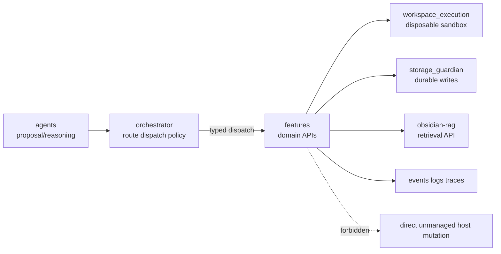
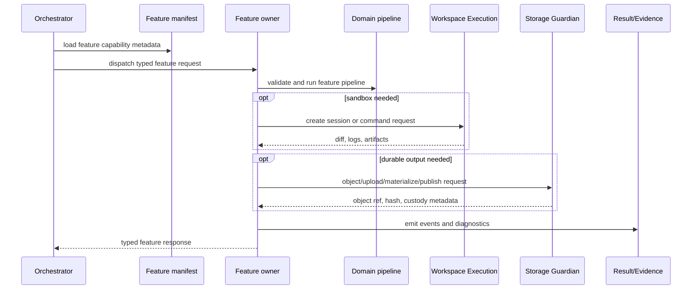
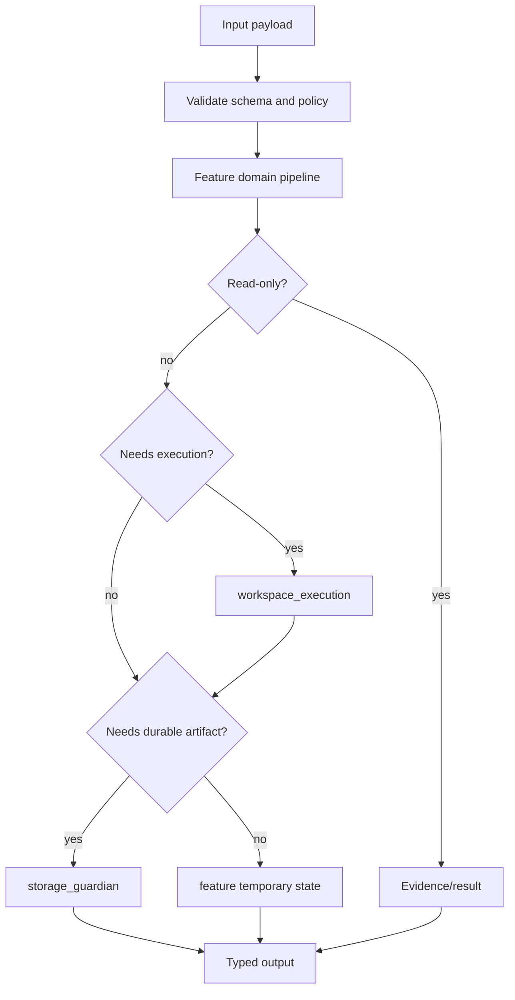

# Feature Owners

Status: implemented
Owner: `features/`
Last verified: 2026-06-29
Applies to: `features/`, `features/service_capabilities.toml`, feature README/SPEC/config files
Audience: developer, operator, maintainer

Template: `templates/owners/feature-doc-template.md`

## Page Index

- [Purpose](#purpose)
- [Ownership Boundary](#ownership-boundary)
- [User Workflows](#user-workflows)
- [API Or Entry Points](#api-or-entry-points)
- [Architecture](#architecture)
- [Data Flow](#data-flow)
- [Configuration](#configuration)
- [Failure Modes](#failure-modes)
- [Operations](#operations)
- [Verification](#verification)
- [Open Questions](#open-questions)

## Purpose

`features/` owns domain APIs and pipelines that the orchestrator can dispatch
to through typed contracts. Features perform domain work such as RAG facade
queries, disposable workspace execution, material execution sessions, personal
context reads, document extraction, translation and voice runtime behavior.

The source-of-truth runtime metadata is
[`features/service_capabilities.toml`](../../features/service_capabilities.toml).
Feature implementation details remain in each `features/<name>` owner.

## Ownership Boundary

This feature family owns:

- domain API behavior for each advertised feature capability;
- feature-local validation and typed contracts;
- feature-local temporary state, if documented by the feature;
- publication requests to other owners through explicit contracts.

This feature family does not own:

- gateway-wide routing, policy or event ledger behavior;
- managed durable writes outside `storage_guardian` contracts;
- RAG internals unless the request crosses the RAG/research API boundary;
- host command execution except through `features/workspace_execution`;
- agent prompt/task behavior.



## User Workflows

| Feature | Status | Workflow | Caller | Output | Evidence |
| --- | --- | --- | --- | --- | --- |
| `research` | active | read-only RAG/search/notes context | orchestrator | `SearchResponse` | citations, semantic memory, RAG context |
| `workspace_execution` | active runtime owner | create disposable session, run approved command, diff/artifacts | orchestrator/features | `SessionResponse` and session events | state hash, redacted log, diff, artifact descriptor |
| `material_execution_kernel` | active | coordinate material sessions through sandbox owner | orchestrator/material flow | `MaterialSessionResponse` | session manifest, diagnostics, validation summary |
| `personal_context` | active | read calendar/email/RSS/personal context | orchestrator | `CalendarResponse` or feature result | personal context evidence |
| `extrator` | active | document ETL, conversion and RAG bundle preparation | orchestrator/features | `ExtratorQueryResponse` | document evidence, conversion report, RAG bundle |
| `translation` | active | normalize/translate text and preserve protected spans | orchestrator | `NormalizeResponse` | translation and language normalization |
| `voice_runtime` | documented owner | voice runtime contracts | orchestrator/audio path | voice runtime types | owner README/SPEC evidence |

## API Or Entry Points

| Feature | Entry point | Type | Policy action | Risk | Notes |
| --- | --- | --- | --- | --- | --- |
| `research` | `POST /v1/research/search` | dispatch/API | `rag.query` | low | read-only retrieval facade |
| `workspace_execution` | `POST /v1/workspace-execution/sessions` | dispatch/API | `workspace.sandbox.create` | medium | internal-only sandbox owner |
| `material_execution_kernel` | `POST /v1/material-execution/sessions` | dispatch/API | `material.execution.start` | medium | requires workspace execution and material builder |
| `personal_context` | `GET /v1/personal/calendar` | dispatch/API | `personal_context.read` | medium | privacy-sensitive read-only context |
| `extrator` | `POST /v1/extrator/query` | dispatch/API | `document.extract` | medium | no managed storage write outside storage owner |
| `translation` | `POST /v1/normalize` | dispatch/API | `translation.invoke` | low | text transform only |
| `voice_runtime` | owner README/SPEC | service/API | owner-defined | medium | see `features/voice_runtime/SPEC.md` |

Example feature request:

```http
POST /v1/extrator/query
Content-Type: application/json

{
  "query": "extract the referenced document and prepare a RAG bundle"
}
```

## Architecture



## Data Flow



## Configuration

| Key or surface | Path | Default | Meaning | Runtime impact |
| --- | --- | --- | --- | --- |
| Feature manifest | `features/service_capabilities.toml` | required | dispatch metadata and policy actions | orchestrator routing/policy |
| Feature-local config | `features/*/config.toml` where present | owner-specific | static feature settings | must not duplicate central config inference |
| Central runtime config | `config/` and generated envs | resolver-derived | URLs, ports, resource policy, model/runtime budgets | feature startup and clients |
| Workspace execution limits | `config/` plus `features/workspace_execution` owner | resolver-derived | CPU/memory/TTL/network/sandbox profiles | command/session safety |
| Storage publication | `storage_guardian` API/config | owner-controlled | object/upload/materialize lifecycle | durable artifact custody |

## Failure Modes

| Failure | Detection | Feature response | Recovery |
| --- | --- | --- | --- |
| Invalid input | schema validation | 4xx or typed rejection | caller fixes request |
| Owner unavailable | health/client error | typed dependency failure | start profile or repair service |
| Contract drift | tests/smoke | fail closed or degraded | update schema, manifest, tests and docs |
| Durable write denied | storage guardian response | no direct fallback | fix storage policy/request |
| Sandbox denied | workspace execution policy | typed failure with reason | adjust request or get approval |
| Privacy-sensitive request | policy/risk criteria | require bounded read or denial | caller/orchestrator policy |

## Operations

```bash
sed -n '1,260p' features/service_capabilities.toml
find features -maxdepth 2 -name README.md -o -name SPEC.md -o -name config.toml
AI_COMPOSE_PROFILES=core,storage,features make up
./.venv/bin/python scripts/workspace_execution_smoke.py
```

Material runtime profile smoke:

```bash
AI_COMPOSE_PROFILES=core,storage,material make up
make material-runtime-profiles-smoke
```

## Verification

| Check | Command or source | Expected result | Last run |
| --- | --- | --- | --- |
| Manifest source review | `features/service_capabilities.toml` | active feature contracts documented | 2026-06-29 |
| Feature source scan | `rg --files features \| rg -i '(README\\.md|SPEC\\.md|config\\.toml|types\\.py)'` | owner files identified | 2026-06-29 |
| Feature tests | targeted `pytest` scope per feature | pass | not-run for docs-only update |
| Runtime smoke | `./.venv/bin/python scripts/workspace_execution_smoke.py` where relevant | pass | not-run for docs-only update |
| Owner Codex skills | `find features -path '*/.agents/skills/*/SKILL.md'` | one primary skill per feature | gap found 2026-06-29 |

## Open Questions

- Owner-local primary Codex skills were not found under `features/*/.agents`.
  This is a governance gap to track in the implementation backlog.
- `research` advertises a `consolidation_target` of `features/knowledge_runtime`;
  keep that as future architecture intent until the owner spec and code exist.
