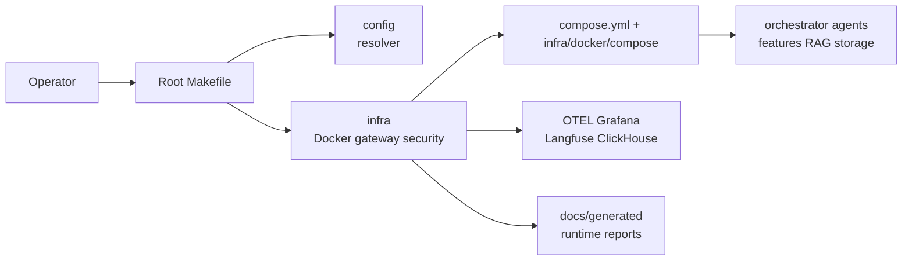
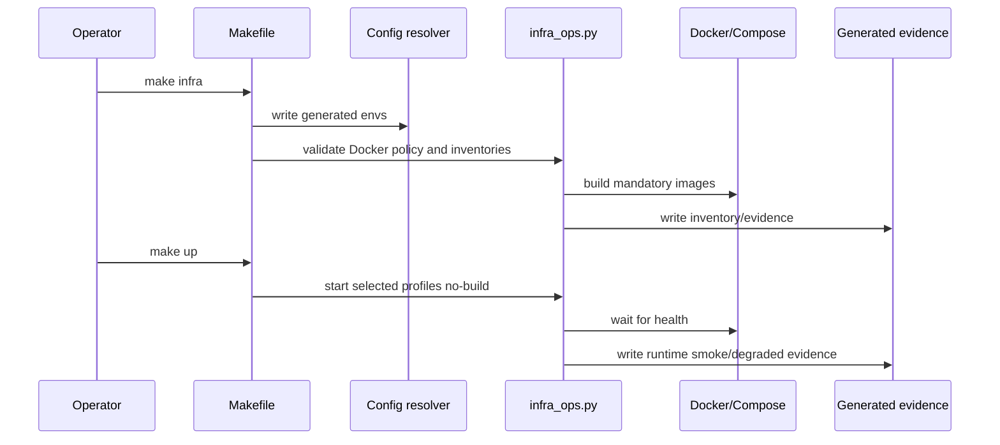
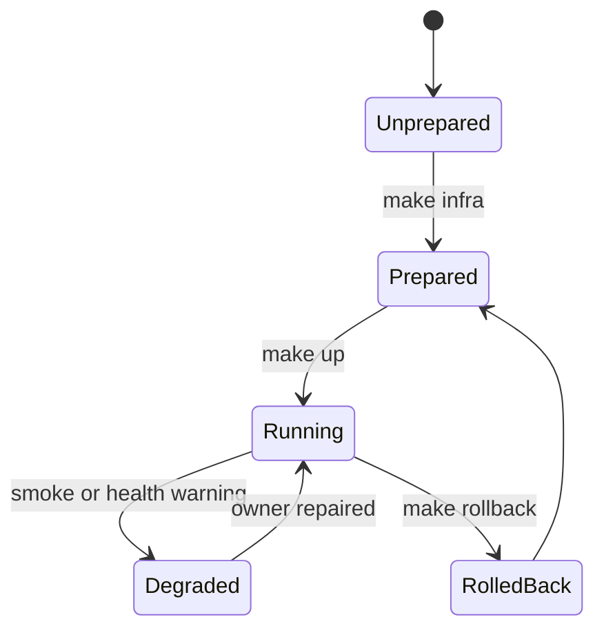

# Infrastructure

Status: implemented
Owner: `infra/`
Last verified: 2026-06-29
Applies to: `infra/`, Docker, gateway, secrets, storage ops, systemd, security notes
Audience: operator, developer, maintainer

Template: `templates/owners/component-doc-template.md`

## Page Index

- [Purpose](#purpose)
- [Ownership](#ownership)
- [User-Facing Behavior](#user-facing-behavior)
- [How To Use](#how-to-use)
- [Architecture](#architecture)
- [Data And Contracts](#data-and-contracts)
- [Failure Modes](#failure-modes)
- [Security And Safety](#security-and-safety)
- [Observability](#observability)
- [Operations](#operations)
- [Implementation Map](#implementation-map)
- [Change Rules](#change-rules)
- [Verification](#verification)
- [Open Questions](#open-questions)

## Purpose

`infra/` is the canonical home for infrastructure and operations assets:
gateway/TLS, Docker Compose fragments, Dockerfiles, observability provisioning,
local Docker secrets, external-storage notes, host/systemd tuning and security
guidance. It prepares and starts the platform; it does not own application
runtime semantics.

The primary source pages are [`infra/README.md`](../../infra/README.md) and
[`infra/docker/README.md`](../../infra/docker/README.md).

## Ownership

| Responsibility | Owner | Notes |
| --- | --- | --- |
| Primary behavior | `infra/` | Docker/gateway/secrets/observability/system operations assets |
| Configuration | `config/` plus infra catalogs | resolver emits Docker/resource envs |
| Durable storage | `storage_guardian/` | infra validates/mounts; storage owner governs lifecycle |
| Execution side effects | `infra/docker/scripts/infra_ops.py` | lifecycle commands, validation, smoke and rollback |
| Observability | `infra/docker/otel`, `infra/docker/grafana` | collector and dashboard assets |

This component owns:

- `gateway/` Caddy/TLS/proxy config;
- `docker/` Compose fragments, images, scripts, Grafana, OTEL and secrets;
- `storage/` operational storage checks/notes;
- `systemd/` host/Ollama/system tuning and rollback helpers;
- `security/` deployment/security notes and secret conventions;
- future cloud placeholders under `cloud/`.

This component does not own:

- orchestrator runtime logic;
- agent or feature behavior;
- RAG retrieval/indexing/chunking logic;
- storage archive/restore lifecycle;
- data, models, caches, volumes, backups or real secrets.

## User-Facing Behavior

Operators use infra through root commands such as `make infra`, `make up` and
`make rollback`. `make infra` prepares config, builds mandatory images and
then validates Docker/Compose. `make up` starts the selected profile without
rebuilding by default, waits for health and records runtime evidence.

### Common Use Cases

| Use case | Input | Output | Success evidence |
| --- | --- | --- | --- |
| Prepare machine | `make infra` | generated envs, built images, validated Compose | docker inventory/report |
| Start stack | `make up` | running selected profiles | runtime smoke report |
| Roll back | `make rollback` | restored snapshot/previous state | rollback snapshot path |
| Inspect logs | `make logs FOLLOW=1 TAIL=80` | service logs | owner error context |
| Report Docker disk | `make docker-disk-report` | cache/image/volume report | operator can prune safely |
| Safe prune | `make docker-safe-prune` | pruned stopped/dangling/cache only | volumes preserved |

### Non-Goals

- Owning app-level business behavior.
- Running storage lifecycle outside `storage_guardian`.
- Exposing internal feature services as public host ports unless explicitly
  allowed by policy.

## How To Use

### Local Commands

```bash
make infra
make up
make rollback
make docker-disk-report
make docker-safe-prune
```

### API Or Contract

Infra has no application API contract. Its contract is root-level lifecycle
behavior:

```text
make infra -> generate config + build mandatory images + validate policy
make up -> start selected profiles with --no-build + health/smoke/evidence
make rollback -> restore from recorded rollback snapshot
```

### Configuration

| Key | Owner | Default | Meaning | Safe values |
| --- | --- | --- | --- | --- |
| `AI_COMPOSE_PROFILES` | operator/config | core,storage base | runtime profile activation | documented profiles only |
| Docker build catalog | `config/docker/image-build-catalog.toml` | required catalog | mandatory images for `make infra` | cataloged targets |
| Docker resource env | `.env.docker.resources.generated` | resolver-derived | Compose/build operator limits | generated or explicit override |
| Secrets | `infra/docker/secrets/` | local ignored files | real runtime secrets | never tracked |
| Secret examples | `infra/docker/secrets.example/` | non-secret examples | expected secret shape | tracked examples only |

## Architecture

### Context Diagram



### Runtime Flow



### State Or Lifecycle



## Data And Contracts

| Contract | Producer | Consumer | Schema/source | Compatibility rules |
| --- | --- | --- | --- | --- |
| Compose wrapper | root `compose.yml` | infra/docker | includes fragments | central wrapper remains root control plane |
| Compose fragments | `infra/docker/compose/*.yml` | Docker/Compose | service definitions | catalog owner/profile coverage required |
| Image catalog | `config/docker/image-build-catalog.toml` | `make infra` | mandatory image build policy | profiles do not shrink inventory |
| Profile contract | `infra/docker/compose/profile-contract.toml` | validators/operators | profile rules | each profile documented |
| Generated reports | infra scripts | docs/operators | `docs/generated/*` | regenerate, do not hand-edit |

### Inputs

- central config and generated envs;
- Docker service/catalog/profile policy;
- local secret files;
- operator profile/env overrides.

### Outputs

- built images and running containers;
- generated reports under `docs/generated/`;
- rollback snapshots under `.local/infra/rollback/`;
- observability stack wiring.

### Events And Evidence

| Event/evidence | When emitted | Required fields | Used by |
| --- | --- | --- | --- |
| Docker inventory | `make infra` | compose projects, violations/status | operators/docs |
| Runtime smoke | `make up` | service status and degraded evidence | operators/docs |
| Rollback snapshot | before/after lifecycle actions | snapshot path and metadata | rollback |
| Observability validation | infra validation | OTEL/Grafana/Langfuse wiring status | operators |

## Failure Modes

| Failure | Detection | User impact | Owner | Recovery |
| --- | --- | --- | --- | --- |
| Generated env missing/stale | infra validation | Compose warnings or bad paths | `config/` + infra | regenerate with resolver |
| Compose profile drift | profile validator | wrong services started or missing | infra/docker | update catalog/profile contract |
| Mandatory image missing | `make up --no-build` or smoke | service cannot start on demand | infra/docker + config catalog | run/fix `make infra` |
| Secret missing | service startup/auth failure | protected API unavailable | infra secrets + service owner | create secret file/ref |
| Docker disk pressure | report/prune commands | slow/failing builds | infra/docker | safe prune preserving volumes |
| Host mount missing | config/storage validation | local fallback or blocked heavy work | config/storage/infra | mount external storage or allow fallback |

## Security And Safety

- Authentication/authorization: infra wires gateway/TLS/secrets; service auth
  remains service-specific.
- Policy gates: Docker policy validators protect accidental ports, missing
  healthchecks and secret/debug drift.
- Storage safety: infra must not prune Docker volumes as routine maintenance.
- Execution safety: command execution belongs to sandbox/feature owners.
- Secrets: real secrets live in ignored `infra/docker/secrets/`; examples are
  tracked under `secrets.example/`.

## Observability

| Signal | Location | Meaning | Alert or action |
| --- | --- | --- | --- |
| OTEL config | `infra/docker/otel/` | collector routing | validate when telemetry changes |
| Grafana provisioning | `infra/docker/grafana/` | dashboards/datasources | update with semantic attr changes |
| Observability runbook | `infra/docker/OBSERVABILITY_RUNBOOK.md` | operator workflow | follow for trace/dashboard debugging |
| Docker inventory | `docs/generated/docker-inventory.md` | Docker policy evidence | fix violations |
| Runtime smoke | `docs/generated/docker-runtime-smoke.md` | live stack evidence | repair degraded services |

## Operations

### Start

```bash
make infra
make up
```

### Stop

```bash
make rollback
```

### Health

```bash
make verify-live
```

### Debug

```bash
make logs FOLLOW=1 TAIL=80
make docker-disk-report
```

## Implementation Map

| Area | Path | Notes |
| --- | --- | --- |
| Infra README | `infra/README.md` | top-level infra contract |
| Docker README | `infra/docker/README.md` | Docker lifecycle and policy |
| Compose fragments | `infra/docker/compose/` | service/profile definitions |
| Docker scripts | `infra/docker/scripts/infra_ops.py` | low-level lifecycle owner |
| Gateway | `infra/gateway/` | Caddy/TLS/proxy config |
| Secrets | `infra/docker/secrets.example/` | non-secret docs for expected files |
| Security | `infra/security/` | permissions and secret conventions |
| Storage ops | `infra/storage/` | external-storage operational notes |
| Systemd | `infra/systemd/` | host/Ollama/system helpers |

## Change Rules

- Keep root Makefile as a user sequence; low-level lifecycle logic stays in
  `infra/docker/scripts/infra_ops.py`.
- Build mandatory images in `make infra`; profiles decide startup, not image
  inventory.
- Do not add real secrets or runtime data under tracked infra paths.
- Preserve Docker volume safety in cleanup commands.
- Update generated reports through scripts, not manual edits.

## Verification

| Check | Command or source | Expected result | Last run |
| --- | --- | --- | --- |
| Infra README review | `infra/README.md` | ownership documented | 2026-06-29 |
| Docker README review | `infra/docker/README.md` | lifecycle contract documented | 2026-06-29 |
| Infra preparation | `make infra` | generated envs, validation, built images | not-run for docs-only update |
| Runtime smoke | `make up` or `make verify-live` | selected stack healthy/degraded evidence | not-run for docs-only update |
| Docker policy | infra validation scripts | no unapproved violations | not-run for docs-only update |

## Open Questions

- Should `infra/` own a primary Codex skill, or should the root spec-driven
  skill remain the only project-wide process skill for infra changes?
