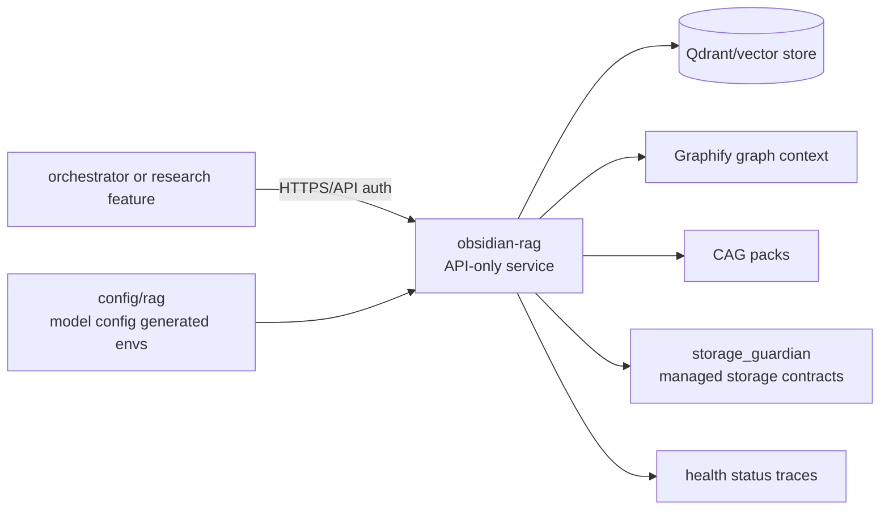
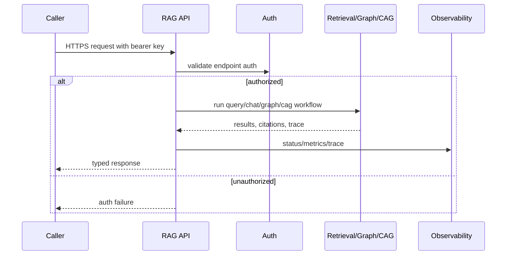
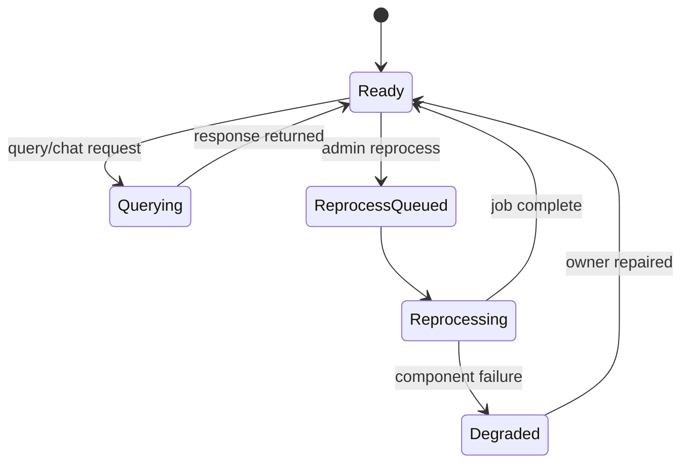

# Obsidian RAG

Status: implemented
Owner: `obsidian-rag/`
Last verified: 2026-06-29
Applies to: `obsidian-rag/`, RAG API, retrieval, graph, CAG, indexing, observability
Audience: developer, operator, maintainer, user

Template: `templates/owners/component-doc-template.md`

## Page Index

- [Purpose](#purpose)
- [Ownership](#ownership)
- [User-Facing Behavior](#user-facing-behavior)
- [How To Use](#how-to-use)
- [Architecture](#architecture)
- [Data And Contracts](#data-and-contracts)
- [Failure Modes](#failure-modes)
- [Security And Safety](#security-and-safety)
- [Observability](#observability)
- [Operations](#operations)
- [Implementation Map](#implementation-map)
- [Change Rules](#change-rules)
- [Verification](#verification)
- [Open Questions](#open-questions)

## Purpose

`obsidian-rag/` owns local RAG for notes, code repositories, Graphify context
and CAG packs. The current operational surface is API-only: queries, chat,
graph context, CAG lookups and manual reprocess requests are authenticated HTTP
calls. The old service CLI is not the operational path.

The primary source page is [`obsidian-rag/README.md`](../../obsidian-rag/README.md).
Runtime metadata is in
[`obsidian-rag/service_capabilities.toml`](../../obsidian-rag/service_capabilities.toml).

## Ownership

| Responsibility | Owner | Notes |
| --- | --- | --- |
| Primary behavior | `obsidian-rag/` | ingestion, retrieval, graph, CAG and RAG API behavior |
| Configuration | `config/rag/`, `config/models/rag.config.json`, generated envs | runtime values generated centrally |
| Durable storage | `storage_guardian/` for managed durable publication | RAG owns indexes/data behavior, not storage lifecycle policy |
| Execution side effects | RAG API/admin endpoints | manual reprocess through API, not container CLI |
| Observability | RAG owner | health components, retrieval/index status and owner telemetry |

This component owns:

- semantic retrieval and code retrieval;
- graph context over configured repositories;
- CAG pack lookup/explain behavior;
- RAG API schemas and auth behavior;
- indexing/reprocess workflows;
- RAG-specific observability.

This component does not own:

- orchestrator routing fallbacks;
- feature-level research facade behavior;
- storage lifecycle/archive/restore policy;
- central config inference;
- agent prompt behavior.

## User-Facing Behavior

Users and services call RAG through HTTP endpoints. The orchestrator may reach
it through the `research` feature facade or a typed RAG dispatch/API boundary.

### Common Use Cases

| Use case | Input | Output | Success evidence |
| --- | --- | --- | --- |
| Query notes | `POST /query` | semantic results | citations/results and elapsed time |
| Query code | `POST /query/code` | code-context results | code refs and trace |
| Chat with context | `POST /chat` | answer with retrieved context | chat response and citations |
| Graph query | `POST /graph/{repo}/query` | local graph answer | graph result from `graph.json` |
| CAG lookup | `GET /cag/packs` or `/cag/packs/{pack_type}` | pack metadata | pack response |
| Manual reprocess | `POST /admin/reprocess` | queued job | job id and polling URL |

### Non-Goals

- Running reprocess commands inside the container as the normal operational
  interface.
- Letting orchestrator implement a parallel RAG fallback.
- Publishing durable artifacts without storage owner contracts.

## How To Use

### Local Commands

```bash
make dev
make infra
make up
```

### API Or Contract

Base internal Docker URL:

```text
https://rag:8484
```

Base local URL:

```text
https://127.0.0.1:8484
```

Authenticated query:

```bash
curl -sS https://127.0.0.1:8484/query \
  -H "Authorization: Bearer $RAG_API_KEY" \
  -H "Content-Type: application/json" \
  -d '{"query":"how does dispatch work?","top_k":5,"debug":false}'
```

Manual reprocess:

```bash
curl -sS https://127.0.0.1:8484/admin/reprocess \
  -H "Authorization: Bearer $RAG_API_KEY" \
  -H "Content-Type: application/json" \
  -d '{"target":"all","force":false}'
```

### Configuration

| Key | Owner | Default | Meaning | Safe values |
| --- | --- | --- | --- | --- |
| RAG config | `config/rag/` | project defaults | RAG runtime behavior | central config only |
| Model registry | `config/models/rag.config.json` | project defaults | model names/prompts without runtime URLs | generated env supplies endpoints |
| RAG API key | Docker secret/env file | required for protected endpoints | API auth | never commit raw key |
| Compose runtime | `infra/docker/compose/rag.yml` | project Compose fragment | container service | managed by infra |

## Architecture

### Context Diagram



### Runtime Flow



### State Or Lifecycle



## Data And Contracts

| Contract | Producer | Consumer | Schema/source | Compatibility rules |
| --- | --- | --- | --- | --- |
| RAG capability manifest | `obsidian-rag` | orchestrator | `service_capabilities.toml` | calls cross RAG API or research facade |
| Query API | RAG API | users/orchestrator/research | `QueryRequest`, `QueryResponse` | bearer auth except public health/docs |
| Health API | RAG API | infra/operators | `/health` | includes component status |
| Admin reprocess | RAG API | operators | `/admin/reprocess`, `/admin/jobs/{job_id}` | API-only operation |
| Graph endpoints | RAG API | callers | `/graph/*` endpoints | no local CLI dependency |

### Inputs

- authenticated query/chat/admin requests;
- configured vault/repos/model settings;
- generated runtime envs and Docker secrets.

### Outputs

- retrieval results, citations, graph context and CAG packs;
- health/status/indexing/retrieval diagnostics;
- admin job ids and job status.

### Events And Evidence

| Event/evidence | When emitted | Required fields | Used by |
| --- | --- | --- | --- |
| `rag.query.completed` | successful query | query, elapsed, trace/results | orchestrator/final answer |
| `rag.miss` | low/empty retrieval | query and miss context | retrieval audit |
| `service.degraded` | component degraded | component and reason | operators |
| admin job status | reprocess | job id, target, status | operators |

## Failure Modes

| Failure | Detection | User impact | Owner | Recovery |
| --- | --- | --- | --- | --- |
| Missing/invalid API key | auth middleware | protected endpoint denied | RAG/infra secrets | provide secret/env |
| Qdrant unavailable | `/health.components.qdrant` | degraded retrieval | RAG/infra | start/repair Qdrant |
| Graph unavailable | health/status graph component | graph endpoints degraded | RAG/Graphify | rebuild graph via API |
| Reprocess job failure | `/admin/jobs/{job_id}` | stale index remains | RAG owner | inspect job and retry |
| Config/model URL drift | startup/health | degraded model/RAG behavior | `config/` + RAG | regenerate env/config |
| Orchestrator fallback duplicate | review/tests | split RAG behavior | orchestrator/RAG | remove fallback and call RAG API |

## Security And Safety

- Authentication/authorization: all endpoints except `/health`, `/docs`,
  `/openapi.json` and `/redoc` require `Authorization: Bearer <RAG_API_KEY>`.
- Policy gates: orchestrator policy still governs user request routing before
  RAG calls.
- Storage safety: managed durable storage belongs to `storage_guardian`.
- Execution safety: reprocess is API-admin mediated, not shelling into the
  container as the normal path.
- Secrets: `RAG_API_KEY` must live in ignored secret surfaces, never docs.

## Observability

| Signal | Location | Meaning | Alert or action |
| --- | --- | --- | --- |
| `/health` | RAG API | service and component status | inspect degraded components |
| `/status/indexing` | RAG API | index state | reprocess if stale |
| `/status/retrieval` | RAG API | retrieval audit | tune or inspect source coverage |
| `/status/bm25` | RAG API | BM25 state | rebuild/index if stale |
| `components.qdrant` | `/health` | vector store readiness | repair Qdrant/volume/config |
| `components.graph` | `/health` | graph context readiness | rebuild graph |
| `components.cag` | `/health` | CAG pack readiness | regenerate packs |

## Operations

### Start

```bash
make infra
make up
```

### Stop

```bash
make rollback
```

### Health

```bash
curl -sS https://127.0.0.1:8484/health
```

### Debug

```bash
curl -sS https://127.0.0.1:8484/status/indexing \
  -H "Authorization: Bearer $RAG_API_KEY"
curl -sS https://127.0.0.1:8484/status/retrieval \
  -H "Authorization: Bearer $RAG_API_KEY"
```

## Implementation Map

| Area | Path | Notes |
| --- | --- | --- |
| README | `obsidian-rag/README.md` | API-only operations source |
| Runtime package | `obsidian-rag/obsidian_rag/` | RAG implementation |
| Retrieval spec | `obsidian-rag/obsidian_rag/retrieval/SPEC.md` | retrieval behavior |
| Workflows spec | `obsidian-rag/obsidian_rag/workflows/SPEC.md` | workflow behavior |
| Observability spec | `obsidian-rag/obsidian_rag/observability/SPEC.md` | RAG telemetry |
| Capability manifest | `obsidian-rag/service_capabilities.toml` | orchestrator metadata |
| Compose | `infra/docker/compose/rag.yml` | runtime container |
| Codex skill | `obsidian-rag/.agents/skills/obsidian-rag/SKILL.md` | owner guidance |

## Change Rules

- Keep operation API-only; do not reintroduce container CLI as the documented
  normal path.
- Preserve bearer auth on protected endpoints.
- Keep model URLs/runtime values in central generated config.
- Update feature `research` and orchestrator dispatch metadata if RAG contracts
  change.

## Verification

| Check | Command or source | Expected result | Last run |
| --- | --- | --- | --- |
| README source review | `obsidian-rag/README.md` | API surface documented | 2026-06-29 |
| Manifest review | `obsidian-rag/service_capabilities.toml` | RAG capability metadata documented | 2026-06-29 |
| RAG health smoke | `curl -sS https://127.0.0.1:8484/health` | ready/degraded status | not-run for docs-only update |
| RAG tests | targeted `pytest obsidian-rag` | pass | not-run for docs-only update |
| Skill presence | `obsidian-rag/.agents/skills/obsidian-rag/SKILL.md` | owner skill exists | 2026-06-29 |

## Open Questions

- Which RAG/generated report should be cited as the canonical proof of latest
  indexing freshness once the live stack is checked?
