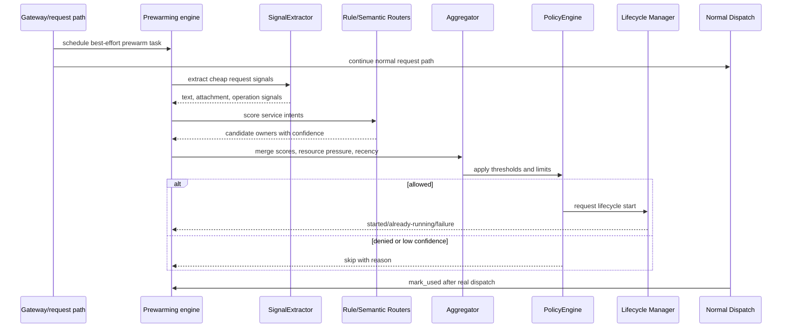
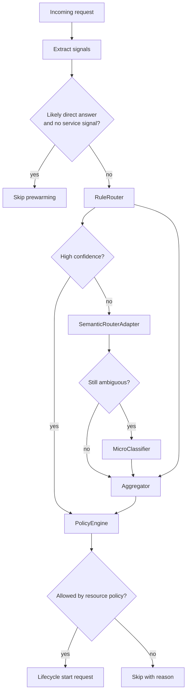

# Predictive Prewarming

Status: implemented
Owner: `orchestrator/prewarming`
Last verified: 2026-06-29
Applies to: `orchestrator/prewarming`, lifecycle manager, service intent catalog
Audience: developer, operator, maintainer

Template: `templates/flows/prewarming-doc-template.md`

## Page Index

- [Purpose](#purpose)
- [Non-Ownership](#non-ownership)
- [Runtime Flow](#runtime-flow)
- [Service Intent Entry](#service-intent-entry)
- [Decision Diagram](#decision-diagram)
- [Resource And Safety Rules](#resource-and-safety-rules)
- [Metrics And Learning](#metrics-and-learning)
- [Failure Modes](#failure-modes)
- [Verification](#verification)
- [Open Questions](#open-questions)

## Purpose

`orchestrator/prewarming` predicts which existing agent, feature or core service
may be needed for a request and asks the lifecycle manager to start it while
normal request planning continues. It exists to reduce latency without changing
which owner executes the real work.

The primary source is
[`orchestrator/prewarming/SPEC.md`](../../orchestrator/prewarming/SPEC.md).
This is not the startup model warmup system in `orchestrator.core.warmup`.

## Non-Ownership

Prewarming must not own:

- feature business logic;
- agent prompt behavior;
- direct-answer behavior;
- storage lifecycle;
- endpoint inference outside runtime registry/config;
- scenario-specific prompt examples as routing truth.

Catalog entries without a live lifecycle service are ghost entries and must be
fixed through catalog/registry alignment.

## Runtime Flow

The main request path must continue even when prewarming fails.

## Service Intent Entry

| Field | Value | Notes |
| --- | --- | --- |
| `id` | service id | Must map to live lifecycle service. |
| `description` | stable service role | One stable sentence. |
| `capabilities` | domain-neutral capabilities | Used for service intent, not behavior execution. |
| `inputs` | input types | File/content/request types. |
| `operations` | verbs/tasks | Durable action vocabulary. |
| `keywords` | cheap deterministic signals | No benchmark shortcuts. |
| `patterns` | durable text patterns | No feature parser duplication. |
| `file_extensions` | relevant extensions | Only when truly tied to service intent. |
| `example_queries` | optional eval/docs hints | Non-authoritative. |
| `prewarm_policy` | `standard`, `aggressive`, `conservative`, `never` | Reason required for `never`. |
| `prewarm_threshold` | number | Policy input. |
| `uses_gpu` | boolean | Resource policy input. |
| `ttl_idle` | duration | Cleanup behavior. |

Semantic routers must build vectors from durable service intent documents, not
from `example_queries`.

## Decision Diagram

## Resource And Safety Rules

| Rule | Reason | Expected behavior |
| --- | --- | --- |
| Best effort only | User request must continue | Failure is non-fatal. |
| Conservative GPU behavior | Avoid starving active work | Skip or delay GPU owners under pressure. |
| Live service mapping required | Avoid ghost catalog entries | Fix catalog/registry mismatch. |
| `example_queries` are non-authoritative | Avoid prompt overfitting | Use intent documents for semantic routing. |
| Direct answer is not a service here | Preserve owner boundary | `reasoning_and_response` owns direct answer behavior. |
| Storage predictions start only storage owner | Preserve storage authority | no archive/restore parsing in prewarming. |
| RAG predictions start only RAG/research owner | Preserve RAG authority | no retrieval behavior in prewarming. |

## Metrics And Learning

| Signal | Meaning | Action |
| --- | --- | --- |
| prewarm requested | candidate selected | check confidence and policy |
| prewarm started | lifecycle accepted | measure latency benefit |
| already running | service warm already | correlate with recency |
| mark_used hit | prediction matched dispatch | reinforce service intent |
| mark_used miss | prediction not used | review keywords/patterns/threshold |
| skipped by policy | resource or threshold gate | tune policy, not feature behavior |
| lifecycle failure | service could not start | inspect lifecycle/service health |

## Failure Modes

| Failure | User impact | Correct recovery |
| --- | --- | --- |
| Router error | none; request continues | fix router/test, keep fail-open to main path |
| Lifecycle start failed | possible latency loss | inspect lifecycle/service health |
| Ghost service id | prewarm cannot start real service | fix catalog/registry contract |
| False positive | resource waste | tune intent metadata and threshold |
| False negative | no latency benefit | add durable service intent signal |
| GPU pressure | prewarm skipped | keep active work protected |

## Verification

| Check | Command or source | Expected result | Last run |
| --- | --- | --- | --- |
| Spec source review | `orchestrator/prewarming/SPEC.md` | runtime flow and constraints documented | 2026-06-29 |
| Prewarming tests | targeted `pytest` scope for `orchestrator/prewarming` | pass | not-run for docs-only update |
| Catalog validity | catalog/registry validation | all service ids live | not-run for docs-only update |
| Lifecycle integration | orchestrator tests around `/prewarm/status` or lifecycle starts | start/skip reason recorded | not-run for docs-only update |
| Runtime smoke | main request succeeds if prewarming fails | pass | not-run for docs-only update |

## Open Questions

- Should the prewarming catalog validity check become part of the standard docs
  or infra validation gate?
