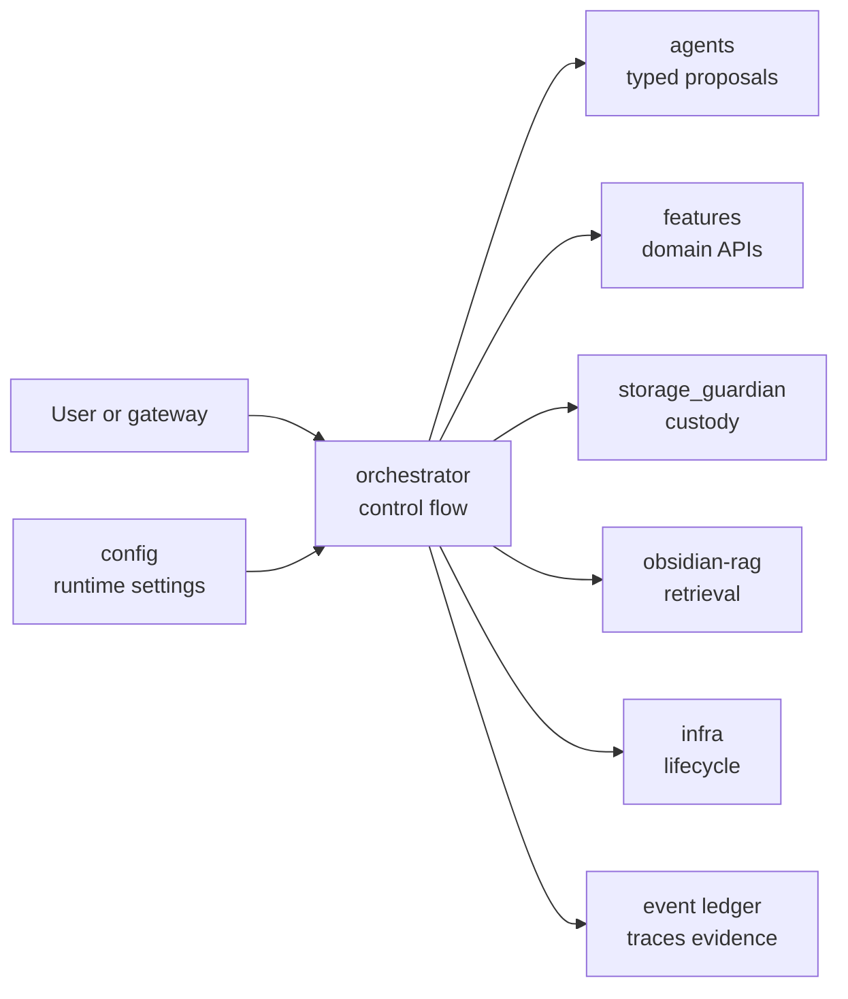
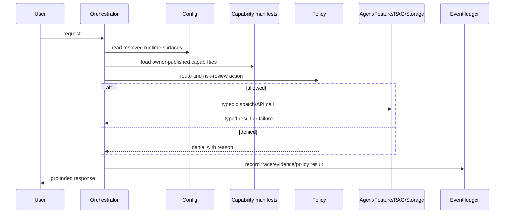
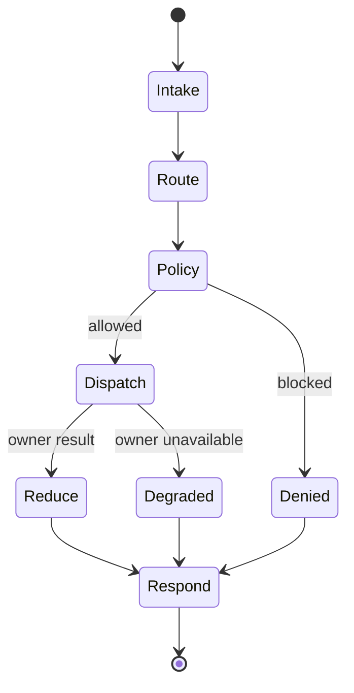

# Orchestrator

Status: implemented
Owner: `orchestrator/`
Last verified: 2026-06-29
Applies to: `orchestrator/`, capability registry, dispatch, policy, ledger, observability
Audience: developer, operator, maintainer

Template: `templates/owners/component-doc-template.md`

## Page Index

- [Purpose](#purpose)
- [Ownership](#ownership)
- [User-Facing Behavior](#user-facing-behavior)
- [How To Use](#how-to-use)
- [Architecture](#architecture)
- [Data And Contracts](#data-and-contracts)
- [Failure Modes](#failure-modes)
- [Security And Safety](#security-and-safety)
- [Observability](#observability)
- [Operations](#operations)
- [Implementation Map](#implementation-map)
- [Change Rules](#change-rules)
- [Verification](#verification)
- [Open Questions](#open-questions)

## Purpose

`orchestrator/` owns runtime control flow for the local AI system: gateway
integration, routing, dispatch, agentic state, policy gates, command/tool
boundaries, lifecycle coordination, event ledger, reducers and observability
hooks. It coordinates owners; it must not become a fallback implementation of
agents, features, storage, RAG or central config.

The primary boundary source is
[`orchestrator/AGENTS.md`](../../orchestrator/AGENTS.md). Observability rules
are in [`orchestrator/observability/SPEC.md`](../../orchestrator/observability/SPEC.md).

## Ownership

| Responsibility | Owner | Notes |
| --- | --- | --- |
| Primary behavior | `orchestrator/` | request control flow, routing, dispatch, policy, ledger and reducers |
| Configuration | `config/` | service URLs, runtime budgets, model/resource policy |
| Durable storage | `storage_guardian/` | orchestrator stores refs/evidence, not managed files directly |
| Execution side effects | orchestrator policy + owner APIs | no direct domain execution outside typed boundaries |
| Observability | `orchestrator/observability` | routing, dispatch, policy, tool and ledger telemetry |

This component owns:

- gateway request/session/trace integration;
- capability registry loading and dispatch;
- policy gates and risk decisions;
- agentic state chain and reducers;
- event ledger and evidence correlation;
- lifecycle coordination and predictive prewarming hooks;
- command tool boundaries and approval flow.

This component does not own:

- feature-specific business logic;
- agent-specific prompt/task behavior;
- managed storage lifecycle;
- RAG retrieval/indexing internals;
- central machine config inference;
- service-specific fallback clients, parsers or probes.

## User-Facing Behavior

The user sees the orchestrator as the coordinator behind local requests: it
accepts the request, chooses owners, enforces policy, gathers evidence and
returns a response that should not overclaim beyond the evidence.

### Common Use Cases

| Use case | Input | Output | Success evidence |
| --- | --- | --- | --- |
| Direct answer | natural-language request | answer from reasoning agent | agent response and ledger event |
| Retrieval | question requiring notes/code context | RAG-backed answer | citations and RAG trace |
| Feature dispatch | document/material/personal/translation request | typed feature result | feature event and response contract |
| Sandbox execution | approved command/material validation request | sandbox result, logs and diff | workspace execution evidence |
| Storage operation | archive/restore/object request | storage owner response | custody/manifests from `storage_guardian` |
| Policy denial | high-risk request without approval | fail-closed response | policy event with reason |

### Non-Goals

- Duplicating RAG, storage, agent or feature behavior inside orchestrator code.
- Hiding routing vocabularies in Python term lists when manifests should own
  capability metadata.
- Treating raw LLM output as the runtime contract.

## How To Use

### Local Commands

```bash
make up
make verify-live
make logs FOLLOW=1 TAIL=80
```

### API Or Contract

Canonical autonomous runtime chain from `orchestrator/AGENTS.md`:

```text
AgentState -> AgentDecision -> PolicyEngine -> ToolExecutor -> ActionResult -> EventLedger -> Reducer -> AgentState
```

### Configuration

| Key | Owner | Default | Meaning | Safe values |
| --- | --- | --- | --- | --- |
| Service endpoints | `config/` generated envs | resolver-derived | where dispatch sends owner requests | generated/typed config only |
| Capability metadata | owner manifests | required | action, transport, schemas, risk | owner-published manifests |
| Policy actions | orchestrator + manifests | capability-specific | risk and approval gates | documented action ids |
| Observability attrs | `orchestrator/observability` | `ai.local.*` | trace correlation | semantic constants |

## Architecture

### Context Diagram



### Runtime Flow



### State Or Lifecycle



## Data And Contracts

| Contract | Producer | Consumer | Schema/source | Compatibility rules |
| --- | --- | --- | --- | --- |
| Capability manifest | agents/features/storage/RAG | orchestrator | `*/service_capabilities.toml` | metadata only; owner executes behavior |
| Agent decision | agent/LLM | orchestrator policy/runtime | structured runtime proposal | not an execution router |
| Action result | tool/owner | reducer/ledger | orchestrator runtime types | must carry status/evidence |
| Event ledger | orchestrator | reducers, final response, observability | runtime event schema | raw LLM output is evidence only |
| Semantic telemetry | orchestrator | OTEL/Langfuse/dashboards | `ai.local.*` attributes | use constants, avoid string drift |

### Inputs

- natural-language request and session metadata;
- generated config/runtime surfaces;
- owner-published capability manifests;
- policy and approval state.

### Outputs

- typed owner requests;
- policy denials or approvals;
- event ledger entries and telemetry;
- final evidence-grounded response.

### Events And Evidence

| Event/evidence | When emitted | Required fields | Used by |
| --- | --- | --- | --- |
| request trace | request intake | request id, owner, trace kind | logs/traces/final evidence |
| capability dispatch | owner call | capability id, policy action, risk | dispatch audit |
| policy decision | before action | action, risk, allow/deny reason | safety/audit |
| action result | after owner/tool | status, evidence refs | reducer/final response |
| model call trace | model work | model name/backend/profile | observability |

## Failure Modes

| Failure | Detection | User impact | Owner | Recovery |
| --- | --- | --- | --- | --- |
| Missing generated config | startup/dispatch validation | degraded or blocked routing | `config/` + infra | regenerate/validate config |
| Stale capability metadata | dispatch schema/policy error | wrong or failed routing | owner manifest + orchestrator | update manifest/tests |
| Owner unavailable | health/client failure | partial/degraded response | target owner + infra | start/repair owner |
| Policy denial | risk gate | action not run | orchestrator policy | request approval or change request |
| Cross-owner import/logic | review/tests | architecture drift | orchestrator + source owner | remove duplicate and call owner API |
| Telemetry drift | missing attrs/dashboards | weak audit | orchestrator observability | use semantic constants |

## Security And Safety

- Authentication/authorization: enforced at gateway/service boundary according
  to runtime profile.
- Policy gates: orchestrator validates/reduces proposed actions before tools or
  owners execute side effects.
- Storage safety: durable writes go through `storage_guardian`.
- Execution safety: command execution must cross execution policy and sandbox
  boundaries.
- Secrets: orchestrator reads secret refs through runtime config; it must not
  log raw secret values.

## Observability

| Signal | Location | Meaning | Alert or action |
| --- | --- | --- | --- |
| `ai.local.owner` | OTEL spans/events | owner correlation | required for cross-owner traces |
| `ai.local.request_id` | traces/logs/ledger | request correlation | inspect missing ids |
| capability id/policy action | dispatch spans | route and risk context | check manifest drift |
| Langfuse traces | LLM/pipeline views | model/pipeline diagnostics | compare with OTEL spans |
| transition sinks | ClickHouse, JSONL, SQLite | compatibility stores | migrate only with parity and rollback |

## Operations

### Start

```bash
make up
```

### Stop

```bash
make rollback
```

### Health

```bash
make verify-live
```

### Debug

```bash
make logs FOLLOW=1 TAIL=80
sed -n '1,240p' orchestrator/AGENTS.md
```

## Implementation Map

| Area | Path | Notes |
| --- | --- | --- |
| Operating spec | `orchestrator/AGENTS.md` | authoritative boundary rules |
| Observability spec | `orchestrator/observability/SPEC.md` | telemetry contract |
| Capability bootstrap | `orchestrator/capabilities/service_capabilities.toml` | compatibility/bootstrap only |
| Prewarming | `orchestrator/prewarming/` | best-effort lifecycle prediction |
| Codex skill | `orchestrator/.agents/skills/symbiont-orchestrator/SKILL.md` | owner guidance |
| Tests | `tests/orchestrator` | targeted orchestrator tests |

## Change Rules

- Check owner manifests/specs before adding routing or dispatch behavior.
- Keep capability semantics in owner manifests, not hidden orchestrator lists.
- Do not import owner packages for runtime behavior.
- Preserve `AgentState -> AgentDecision -> PolicyEngine -> ToolExecutor ->
  ActionResult -> EventLedger -> Reducer -> AgentState`.
- Update observability attributes/tests when telemetry changes.

## Verification

| Check | Command or source | Expected result | Last run |
| --- | --- | --- | --- |
| Boundary source review | `orchestrator/AGENTS.md` | owner limits documented | 2026-06-29 |
| Observability source review | `orchestrator/observability/SPEC.md` | telemetry contract documented | 2026-06-29 |
| Orchestrator tests | targeted `pytest tests/orchestrator` | pass | not-run for docs-only update |
| Runtime smoke | `make verify-live` | pass | not-run for docs-only update |
| Skill presence | `orchestrator/.agents/skills/symbiont-orchestrator/SKILL.md` | owner skill exists | 2026-06-29 |

## Open Questions

- Which remaining orchestrator-local domain parsers/probes, if any, should be
  migrated to owner manifests or owner APIs next?
