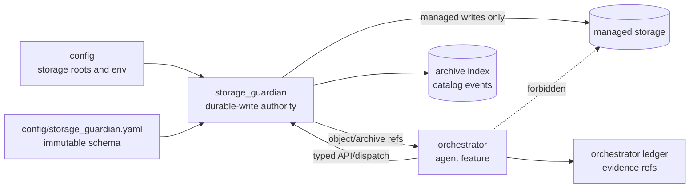
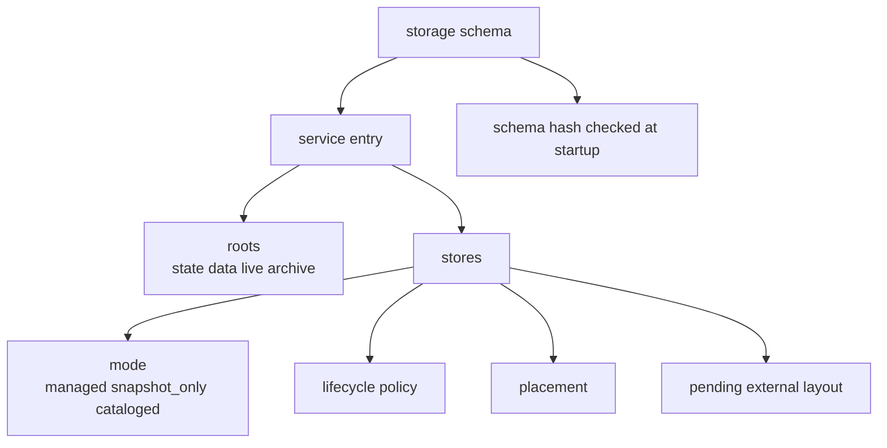
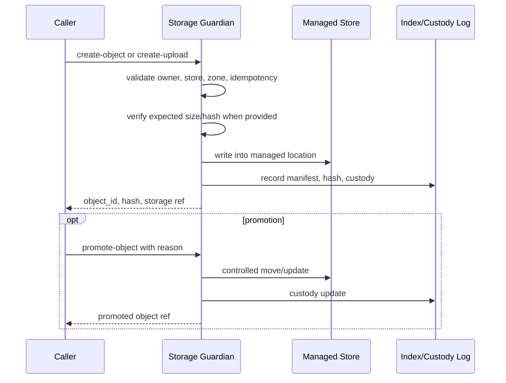
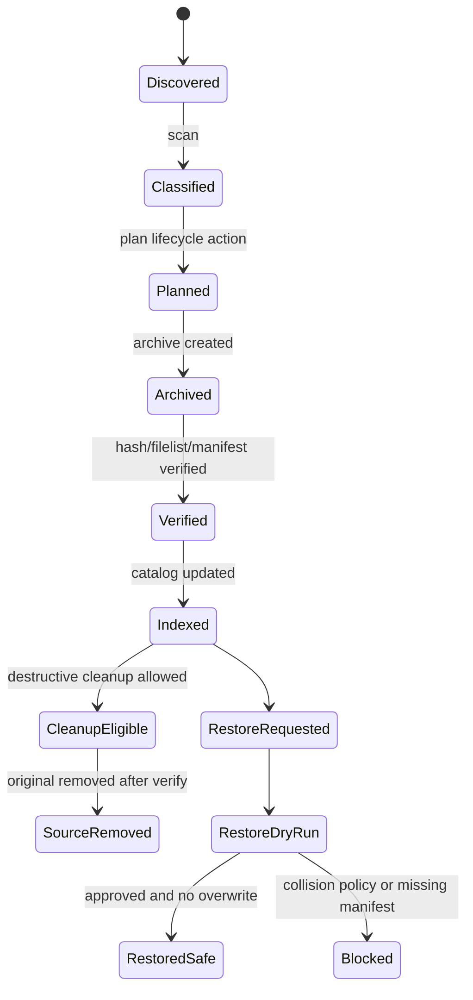
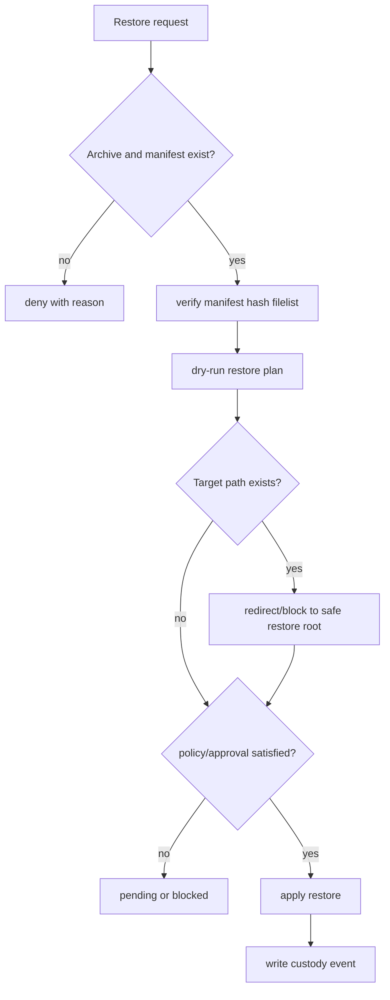
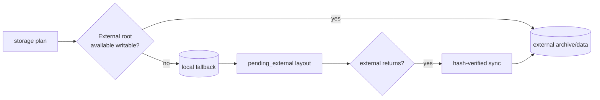
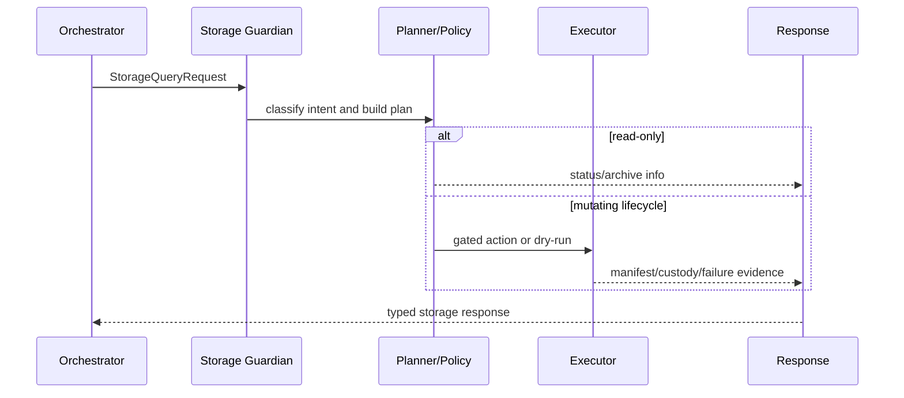

# Storage Guardian

Status: implemented
Owner: `storage_guardian/`
Last verified: 2026-06-29
Applies to: `storage_guardian/`, `config/storage_guardian.yaml`, storage API, managed stores, generated storage envs
Audience: operator, developer, maintainer

Template: `templates/owners/storage-guardian-doc-template.md`

## Page Index

- [Purpose](#purpose)
- [Authority Boundary](#authority-boundary)
- [Runtime Identity](#runtime-identity)
- [Storage Schema](#storage-schema)
- [API And CLI Surface](#api-and-cli-surface)
- [Object And Upload Flow](#object-and-upload-flow)
- [Archive Lifecycle](#archive-lifecycle)
- [Restore Safety](#restore-safety)
- [Lifecycle Policy](#lifecycle-policy)
- [Placement And Fallback](#placement-and-fallback)
- [Chain Of Custody](#chain-of-custody)
- [Natural-Language Storage Query](#natural-language-storage-query)
- [Safety Rules](#safety-rules)
- [Failure Modes](#failure-modes)
- [Observability](#observability)
- [Operator Commands](#operator-commands)
- [Implementation Map](#implementation-map)
- [Change Rules](#change-rules)
- [Verification](#verification)
- [Open Questions](#open-questions)

## Purpose

`storage_guardian` is the durable-write authority for managed storage. It scans
registered stores, classifies files, plans lifecycle actions, archives
candidates, writes manifests, verifies archives, updates the index, restores
only into safe locations and exposes controlled object/upload APIs for agents
and features.

The primary source page is
[`storage_guardian/README.md`](../../storage_guardian/README.md). Runtime
metadata is published in
[`storage_guardian/service_capabilities.toml`](../../storage_guardian/service_capabilities.toml).

## Authority Boundary

Other owners may request objects, uploads, archive actions, restore plans,
promotion, delete or materialization through typed contracts. They must not
receive direct filesystem write authority for managed stores.

This area owns:

- managed filesystem writes;
- object and upload sessions;
- archive, restore and archive recovery;
- manifests, hashes, filelists, verify records and policy snapshots;
- safe restore directories and collision prevention;
- zones, promotion/delete and chain-of-custody;
- storage query intent mapping through `/internal/storage/query`;
- fallback/pending-external layout for managed stores.

This area does not own:

- central storage root inference, which belongs to `config/`;
- Docker lifecycle, which belongs to `infra/docker`;
- feature business logic;
- agent prompt behavior;
- workspace sandbox execution;
- RAG ingestion/retrieval internals.



## Runtime Identity

| Field | Value |
| --- | --- |
| Service name | `storage_guardian` |
| Profile | `storage` |
| Config | `config/storage_guardian.yaml` |
| Capability manifest | `storage_guardian/service_capabilities.toml` |
| Main package | `storage_guardian` |
| CLI | `./.venv/bin/python -m storage_guardian.cli --config config/storage_guardian.yaml ...` |
| Health | `GET /health` |
| Metrics | `GET /metrics` |
| Codex skill | `storage_guardian/.agents/skills/storage-guardian/SKILL.md` |

## Storage Schema

| Field | Value |
| --- | --- |
| Schema source | `config/storage_guardian.yaml` |
| Immutable? | yes, schema hash checked at startup |
| Strict store coverage | managed stores belong to exactly one service |
| Fallback layout | `pending_external/services/{service}/stores/{store}` |
| Placement | external preferred or local fallback as resolved by `config/` |
| Live storage protection | live Qdrant storage and live DB files are blocked |
| Restore overwrite | false; restore never overwrites an existing path |



## API And CLI Surface

### Read-Only Status And Inspection

| Operation | API or CLI | Purpose | Mutates storage? |
| --- | --- | --- | --- |
| Health | `GET /health` | readiness | no |
| Status | `GET /status` or `status` | runtime state | no |
| Stores | `GET /stores` | configured stores | no |
| Archives | `GET /archives` | archive catalog | no |
| Effective config | `GET /effective-config` or `effective-config` | derived config | no |
| Storage schema | `GET /storage/schema` or `storage-schema` | schema view | no |
| Policies | `GET /storage/policies` or `storage-policies` | policy view | no |
| Metrics | `GET /metrics` | Prometheus-style metrics | no |

### Mutating Or High-Risk Operations

| Operation | API or CLI | Required evidence | Policy/risk |
| --- | --- | --- | --- |
| Scan | `POST /internal/scan` or `scan` | scan result | read-only or low |
| Plan | `POST /internal/plan` or `plan` | storage plan | dry-run/plan |
| Run cycle | `POST /internal/run-cycle` or `run-cycle` | manifest, verify, events | high |
| Storage query | `POST /internal/storage/query` | typed request and response | depends on intent |
| Archive recovery inspect | `POST /internal/archive-recovery/inspect` | recovery report | high review |
| Restore | `POST /internal/restore` | restore plan and collision check | high |
| Create object | `POST /internal/storage/objects` | hash, owner, zone | controlled write |
| Upload session | `POST/PUT /internal/storage/uploads` | expected size/hash | controlled write |
| Materialize | `POST /internal/storage/materialize` | object/archive ref and hash | controlled write |
| Promote/delete | `POST /internal/storage/promote|delete` | custody update and reason | controlled mutation |

## Object And Upload Flow



## Archive Lifecycle



## Restore Safety

Restore is fail-closed. It must never overwrite an existing path and must use a
safe restore directory or explicit approved target.



## Lifecycle Policy

| Policy field | Current documented behavior | Safety impact |
| --- | --- | --- |
| Compressed archive | canonical copy after verification | source removal depends on verified archive |
| Destructive actions | enabled only when policy flags allow | high-risk gate |
| Delete originals | allowed after archive verification when configured | requires manifests and verify records |
| Live storage protection | live Qdrant and DB files blocked | prevents corruption |
| Unregistered paths | ignored | avoids unmanaged surprises |
| Lossy transforms | blocked | preserves evidence |
| Restore overwrite | false | prevents destructive restore |
| Model stores | cataloged unless explicitly managed | avoids mutating model caches unexpectedly |

## Placement And Fallback

| Placement path | Owner | Purpose | Failure behavior |
| --- | --- | --- | --- |
| local archive root | `storage_guardian` | local archive buffer | used when external missing and fallback allowed |
| external archive root | `storage_guardian` + `config/` | preferred durable archive | require writable if configured |
| pending external root | `storage_guardian` | local fallback queue | reconcile when external returns |
| index paths | `storage_guardian` | archive catalog and events | keep controlled by storage owner |



## Chain Of Custody

| Custody event | Trigger | Required fields | Consumer |
| --- | --- | --- | --- |
| object created | object/upload commit | object id, owner, store, hash, zone | caller/ledger |
| archive created | archive operation | archive id, manifest, filelist, policy snapshot | catalog/restore |
| archive verified | verification pass | hashes, verifier, timestamp | cleanup gate |
| object promoted | promote call | old zone, new zone, reason, actor | caller/ledger |
| object deleted | delete call | reason, actor, hash/ref | audit/recovery |
| restore dry-run | restore request | target, collision status, plan | approval/policy |
| restore applied | approved restore | target, source archive, hashes | audit/ledger |

## Natural-Language Storage Query

`POST /internal/storage/query` maps storage questions to the storage authority.
The orchestrator may route to this endpoint, but it must not implement storage
intent parsing or lifecycle actions itself.



## Safety Rules

- No direct managed-store writes from agents, features or orchestrator internals.
- Restore never overwrites an existing path.
- Archive cleanup requires verified archive evidence.
- Fallback/local pending paths must be reconciled by hash, not trust.
- Storage query parsing stays inside `storage_guardian`.
- Durable publication from sandbox/material flows goes through object/upload APIs.

## Failure Modes

| Failure | User impact | Correct recovery |
| --- | --- | --- |
| External storage missing | local fallback or blocked heavy work | restore mount or allow configured fallback |
| Schema hash mismatch | service blocked or degraded | fix schema/config migration |
| Archive verify failure | cleanup blocked | inspect source, retry archive, preserve originals |
| Restore collision | restore denied or redirected | choose safe target or clean collision intentionally |
| Caller bypasses API | ownership violation | remove direct path and route through storage API |
| Custody record missing | output not durable/proven | repeat controlled object/upload flow |

## Observability

| Signal | Location | Meaning | Alert or action |
| --- | --- | --- | --- |
| `/health` | storage API | readiness | repair config/storage if unhealthy |
| `/metrics` | storage API | operation counters/latency | inspect lifecycle failures |
| archive manifests | managed archive paths | proof of archive contents | required before cleanup |
| custody events | storage index/logs | object/archive history | required for audit |
| generated storage env | `.env.storage.generated` | resolved bind paths | regenerate on config drift |

## Operator Commands

```bash
./.venv/bin/python -m storage_guardian.cli --config config/storage_guardian.yaml status
./.venv/bin/python -m storage_guardian.cli --config config/storage_guardian.yaml effective-config
./.venv/bin/python -m storage_guardian.cli --config config/storage_guardian.yaml scan
./.venv/bin/python -m storage_guardian.cli --config config/storage_guardian.yaml plan
./.venv/bin/python -m storage_guardian.cli --config config/storage_guardian.yaml run-cycle
./.venv/bin/python -m storage_guardian.cli --config config/storage_guardian.yaml storage-policies
./.venv/bin/python -m storage_guardian.cli --config config/storage_guardian.yaml storage-schema
make storage-guardian-up
```

## Implementation Map

| Area | Path | Notes |
| --- | --- | --- |
| Source | `storage_guardian` | runtime implementation |
| README | `storage_guardian/README.md` | operational source summary |
| Config | `config/storage_guardian.yaml` | immutable storage schema |
| Capability manifest | `storage_guardian/service_capabilities.toml` | runtime metadata |
| Tests | `storage_guardian/tests` | owner tests when present |
| Codex skill | `storage_guardian/.agents/skills/storage-guardian/SKILL.md` | owner guidance |

## Change Rules

- Preserve the durable-write authority boundary.
- Add API/CLI changes to README, manifest, tests and this page together.
- Do not add direct filesystem write shortcuts to callers.
- Do not weaken restore overwrite, archive verification or custody guarantees.

## Verification

| Check | Command or source | Expected result | Last run |
| --- | --- | --- | --- |
| Source review | `storage_guardian/README.md` | API/lifecycle behavior documented | 2026-06-29 |
| Manifest review | `storage_guardian/service_capabilities.toml` | owner metadata exists | 2026-06-29 |
| Storage CLI smoke | `./.venv/bin/python -m storage_guardian.cli --config config/storage_guardian.yaml status` | ready/degraded status | not-run for docs-only update |
| Owner tests | targeted `pytest storage_guardian` | pass | not-run for docs-only update |
| Skill presence | `storage_guardian/.agents/skills/storage-guardian/SKILL.md` | owner skill exists | 2026-06-29 |

## Open Questions

- Which storage consumers can migrate from generated env files to typed resolver
  output first?
