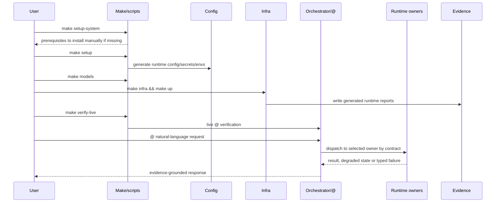
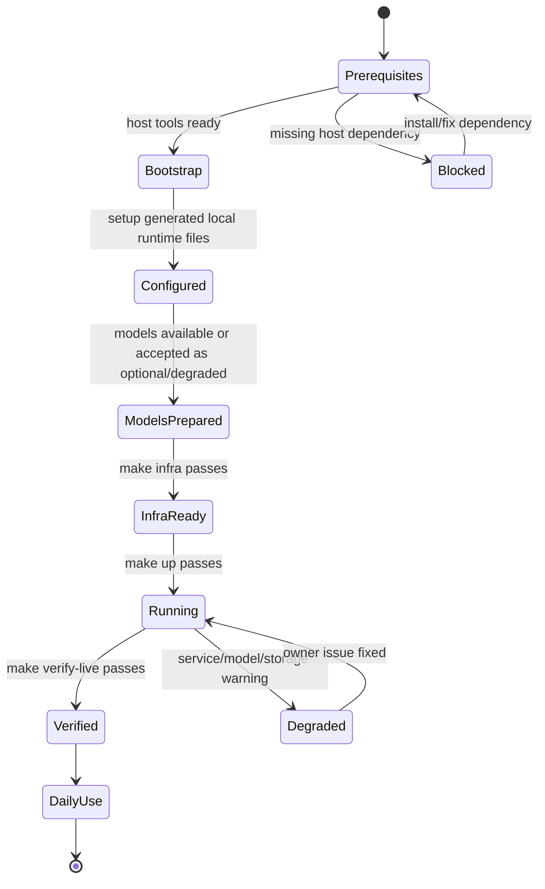

# ai-local First-Use Flow

Status: enabled-by-default
Owner: cross-component; primary coordinator `config/` and `infra/`
Last verified: 2026-06-29
Applies to: orchestrator, agents, features, services, storage, observability
Audience: user, operator, developer, maintainer

Template: `templates/flows/end-to-end-loop-template.md`

## Page Index

- [Purpose](#purpose)
- [Scope](#scope)
- [User Prompt Shape](#user-prompt-shape)
- [Ownership Map](#ownership-map)
- [Full Architecture](#full-architecture)
- [Request And Repair Sequence](#request-and-repair-sequence)
- [Repair State Machine](#repair-state-machine)
- [Evidence Contract](#evidence-contract)
- [Failure Classes](#failure-classes)
- [User-Facing Outcomes](#user-facing-outcomes)
- [Operator Runbook](#operator-runbook)
- [Verification](#verification)
- [Open Questions](#open-questions)

## Purpose

This page documents the user-visible path from a fresh Linux checkout to daily
use through the `@` alias. It is a flow document because setup crosses config,
infra, model preparation, runtime health, RAG sources and orchestrator entry.

## Scope

In scope:

- first local setup on Linux;
- configuring personal RAG sources;
- starting the default stack;
- validating the runtime;
- sending daily natural-language requests through `@`.

Out of scope:

- direct API integration details;
- service-specific debugging beyond first checks;
- production cloud deployment;
- manual editing of generated env files or generated reports.

## User Prompt Shape

```text
@ <natural-language request>
```

Examples for documentation or tests only:

```text
@ ola, verifica se o sistema esta pronto e diz-me o que consegues fazer
@ pesquisa nas minhas notas sobre agentic runtime e resume o essencial
@ analisa este repo e explica a arquitetura principal
cat README.md | @ resume este ficheiro e indica proximos passos
```

## Ownership Map

| Step | Owner | Responsibility | Must not do |
| --- | --- | --- | --- |
| Host prerequisites | user/operator | install Docker, Python, Git, make, curl and optional model/GPU tooling | assume repo can run without host basics |
| Bootstrap | root Makefile/scripts | setup runtime env, local secrets and `@` alias | hide failed prerequisites |
| Config inference | `config/` | resolve storage, ports, profiles, LLMs and generated envs | require manual generated env edits |
| Infra lifecycle | `infra/` | build/start Docker services and collect runtime evidence | own service business logic |
| Main entrypoint | `orchestrator` | accept `@` request, route, policy and trace | execute owner internals directly |
| Knowledge retrieval | `obsidian-rag` | answer RAG/context requests | own storage lifecycle |
| Durable storage | `storage_guardian` | managed writes/custody | allow hidden durable host writes |
| Feature/agent work | `features/*`, `agents/*` | execute domain APIs or propose typed work | bypass policy/storage/sandbox owners |

## Full Architecture

```mermaid
flowchart LR
    Clone[Clone repo]
    SetupSystem[make setup-system]
    Setup[make setup]
    Models[make models]
    Infra[make infra]
    Up[make up]
    Verify[make verify-live]
    Alias[@ alias]
    Orchestrator[orchestrator]
    Owners[RAG, agents, features, storage]
    Evidence[docs/generated]

    Clone --> SetupSystem
    SetupSystem --> Setup
    Setup --> Models
    Models --> Infra
    Infra --> Up
    Up --> Verify
    Verify --> Alias
    Alias --> Orchestrator
    Orchestrator --> Owners
    Up --> Evidence
```

## Request And Repair Sequence



## Repair State Machine



## Evidence Contract

| Evidence | Producer | Required fields | Consumed by | Completion role |
| --- | --- | --- | --- | --- |
| setup diagnostics | setup scripts | pass/fail, missing prerequisite | user/operator | bootstrap proof |
| generated envs | `config/` | contract id/version, values | Docker/services | runtime config proof |
| runtime smoke | infra scripts | status, check summary | user/operator/docs | stack readiness proof |
| `@` response | orchestrator | status, evidence/degraded state | user | daily-use proof |
| generated reports | scripts/runtime | Markdown/JSON status | docs/operators | operational evidence |

## Failure Classes

| Class | Example signal | Repairable? | Owner |
| --- | --- | --- | --- |
| Missing host tool | setup-system/setup diagnostic | yes | user/operator |
| Config validation failure | resolver/infra error | yes | `config/` |
| Docker lifecycle failure | `make up`/health failure | yes | `infra/` plus service owner |
| Storage unavailable | storage warning or blocked path | yes | `config/`, `storage_guardian` |
| Model unavailable | degraded LLM status | maybe | `config/`, model services |
| Live verification failure | `make verify-live` fails | yes | orchestrator or called owner |

## User-Facing Outcomes

| Outcome | Response must include | Response must not claim |
| --- | --- | --- |
| Setup success | next command and generated evidence location | that all optional profiles are ready |
| Runtime success | stack status and usable `@` path | unverified live capability |
| Degraded readiness | missing owner/dependency and next action | full readiness |
| Blocked setup | concrete missing dependency | generic failure |
| Daily answer | evidence refs or degraded status where relevant | hidden static fallback success |

## Operator Runbook

```bash
cd ai-local

make setup-system
make setup
make models
make infra
make up
make verify-live

@ ola, verifica se o sistema esta pronto e diz-me o que consegues fazer
```

Configure personal RAG sources:

```bash
make rag ARGS="--vault-dir ~/Obsidian/Vault --repo-path ~/src"
make rag-clear
```

Maximum safe local profile:

```bash
make profiles
make up-auto
make verify-max-live
```

## Verification

| Check | Command or source | Expected result | Last run |
| --- | --- | --- | --- |
| Contract tests | `make check-doc-targets` | all referenced Makefile targets exist | 2026-06-29 |
| Repair tests | not run for docs-only update | no setup repair behavior changed | not-run |
| Storage publication | `storage_guardian/README.md` | durable writes remain storage-owned | 2026-06-29 |
| Live smoke | `docs/generated/docker-runtime-smoke.md` | generated runtime evidence available | 2026-06-29 |

## Open Questions

- Should `make models` be documented as optional for very small CPU-only hosts?
- Should first-run validation include a lightweight live `@` query by default?
