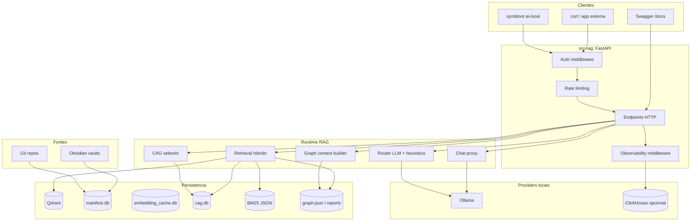
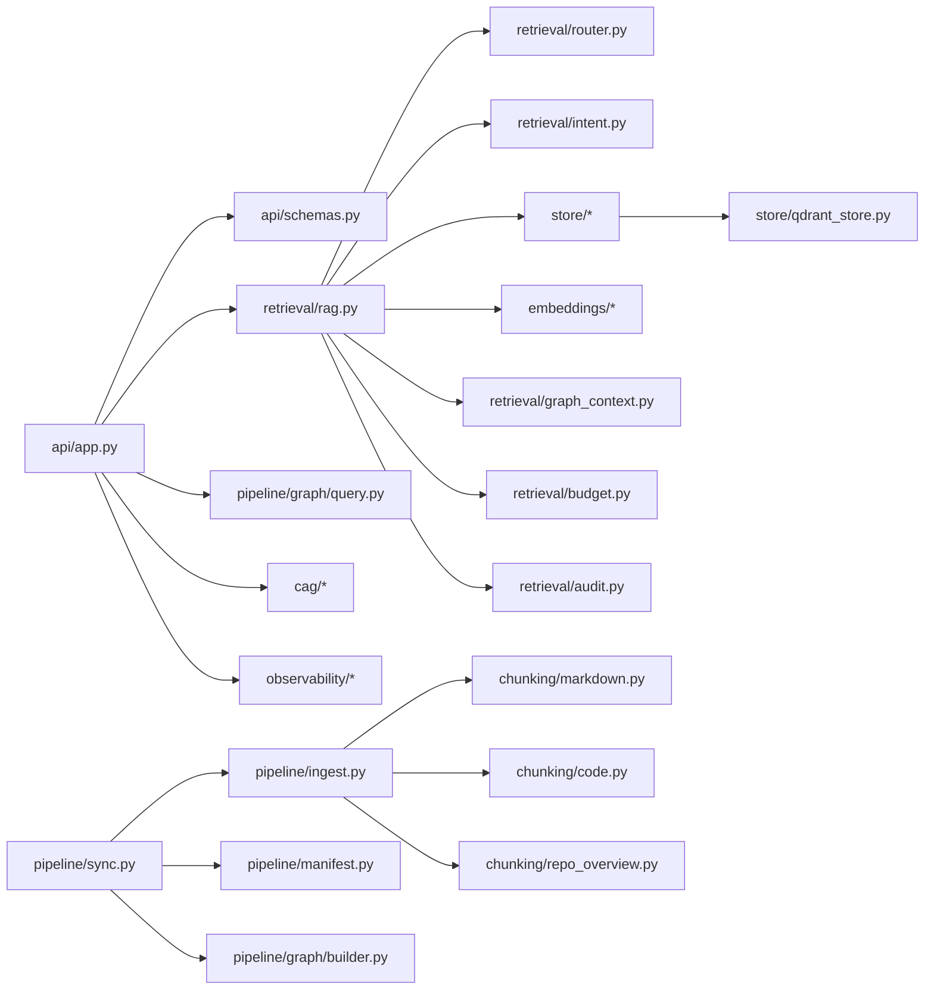
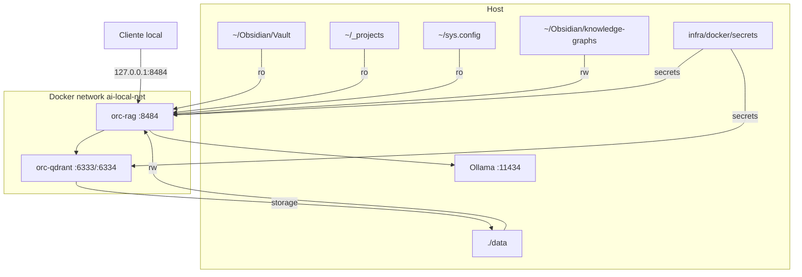

# Arquitetura

## Visao Macro

## Servicos Docker

| Servico | Container | Porta host | Porta interna | Papel |
| --- | --- | --- | --- | --- |
| RAG API | `orc-rag` | `8484` | `8484` | FastAPI, retrieval, chat, admin jobs. |
| Qdrant | `orc-qdrant` | `16336` HTTP, `16337` gRPC | `6333`, `6334` | Vector store denso+sparse. |
| Ollama | externo ao compose | normalmente `11434` | n/a | Embeddings e LLMs. |
| ClickHouse | externo/opcional | normalmente `8123` | n/a | Observabilidade. |

## Modulos Python

## Fluxo de Requests

1. `auth_middleware` valida Bearer token, exceto nos paths publicos.
2. `observability_middleware` cria IDs e emite evento de request.
3. O endpoint chama store, retrieval, graph ou CAG conforme o path.
4. Operacoes com LLM usam clientes Ollama ou HTTP pool para `/api/chat`.
5. Respostas sao Pydantic models definidos em `api/schemas.py`.

## Persistencia

| Artefacto | Criado por | Consumido por | Conteudo |
| --- | --- | --- | --- |
| Qdrant `obsidian_vault` | `sync_notes` | `/query`, `/chat` | Chunks de notas. |
| Qdrant `code_repos` | `sync_repos` | `/query/code`, `/chat` | Chunks de codigo/docs/repo overview. |
| `manifest.db` | `IngestPipeline` | `/status/indexing` e proximas runs | Ficheiros, chunks e runs. |
| `embedding_cache.db` | `OllamaEmbeddingProvider` | ingestao | Embeddings por hash+modelo. |
| `bm25/*.json` | pipeline apos writes | retrieval hibrido | Vocabulario e pesos BM25. |
| `cag.db` | CAG generators | `/cag/*`, `/chat` | Packs com TTL. |
| `graphify-out/graph.json` | Graphify | graph endpoints e context builder | Nos, edges, comunidades. |
| ClickHouse | dispatcher observability | dashboard | Eventos de requests, retrieval, ingest, store e recursos. |

## Limites de Responsabilidade

- FastAPI nao indexa diretamente no request de query. Indexacao entra por admin job.
- Qdrant e o unico backend de store implementado atualmente, embora a interface seja um `Protocol`.
- Graphify e acionado pelo RAG, mas a extracao em si corre como subprocess `graphify`.
- CAG nao substitui retrieval semantico; apenas fornece contexto cached auxiliar.
- Observabilidade falha silenciosamente por design quando configurada assim.

## Diagrama de Deploy Standalone

