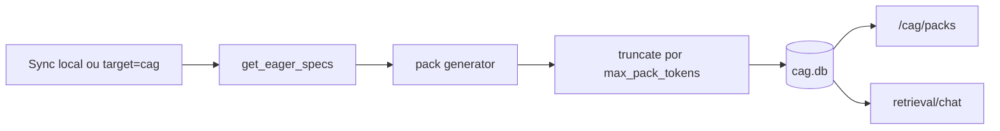

# CAG — Cached Augmented Generation

CAG guarda packs de contexto precomputado numa base SQLite. Estes packs ajudam o RAG a responder sobre estado do projeto, configuracao e ambiente sem repetir trabalho caro em cada query.

Os geradores sao extrativos: compilam informacao existente de ficheiros, config, runtime e comandos locais. Nao fazem chamadas LLM.

## Store

`cag/store.py` cria:

- tabela `packs`;
- tabela `response_cache`, atualmente preparada para cache de respostas.

Campos importantes dos packs:

- `pack_type`;
- `scope`;
- `content`;
- `content_hash`;
- `source_hash`;
- `config_version`;
- `model_version`;
- `ttl_seconds`;
- `created_at`;
- `expires_at`;
- `metadata_json`.

## Tipos de Pack

| Pack | Eager | TTL | Conteudo |
| --- | --- | --- | --- |
| `project_architecture` | sim | 3600 | Modulos e estrutura do repo. |
| `repo_state` | sim | 3600 | Branch, ultimo commit, dirty state dos repos. |
| `vault_summary` | sim | 3600 | Contagem de notas/pastas dos vaults. |
| `recurring_errors` | sim | 3600 | Padroes recentes de erro em logs. |
| `config_environment` | sim | 3600 | Paths, Ollama, retrieval, pipeline, router. |
| `system_state` | nao | 300 | Snapshot CPU/RAM/swap/disco/GPU. |
| `local_services` | nao | 300 | Ollama, Qdrant e Docker. |
| `local_models` | sim | 3600 | Modelos Ollama instalados. |
| `security_exclusions` | sim | 86400 | Padroes excluidos de indexacao. |
| `rag_index_state` | sim | 3600 | Manifest e estado do indice. |
| `pending_tasks` | sim | 3600 | TODO/FIXME/HACK no codigo. |
| `knowledge_graph_summary` | sim | 3600 | Resumo dos outputs Graphify. |

## Geracao



Packs eager sao gerados:

- apos `sync_local`;
- em `target=all`;
- em `target=cag`.

## Selecao para Chat

`get_relevant_packs` seleciona por:

- intent/mode do router;
- keywords da query;
- freshness por TTL.

Packs sempre candidatos:

- `config_environment`;
- `rag_index_state`.

Packs de sistema:

- `system_state`;
- `local_services`;
- `local_models`.

Packs de codigo/arquitetura:

- `project_architecture`;
- `repo_state`;
- `knowledge_graph_summary`;
- `pending_tasks`.

## Endpoints

Listar:

```bash
curl -sS "https://127.0.0.1:8484/cag/packs?intent=code&budget=2000" \
  -H "Authorization: Bearer $RAG_API_KEY"
```

Detalhe:

```bash
curl -sS "https://127.0.0.1:8484/cag/packs/project_architecture?scope=global" \
  -H "Authorization: Bearer $RAG_API_KEY"
```

Explicar selecao:

```bash
curl -sS https://127.0.0.1:8484/cag/explain \
  -H "Authorization: Bearer $RAG_API_KEY" \
  -H "Content-Type: application/json" \
  -d '{"query":"estado dos meus repos e modelos","budget":2000}'
```

## Quando CAG Ajuda

- Perguntas recorrentes sobre configuracao.
- Estado geral do indice.
- Resumos de arquitetura sem abrir muitos chunks.
- Contexto minimo quando retrieval vetorial esta fraco mas os packs estao frescos.
- Reducao de chamadas LLM para informacao estrutural simples.

## Limites

- TTL nao garante que a fonte nao mudou antes de expirar.
- Packs sao sumarios/extratos, nao substituem chunks especificos.
- Dados live como `system_state` e `local_services` sao lazy por terem TTL curto e custo/runtime variavel.
