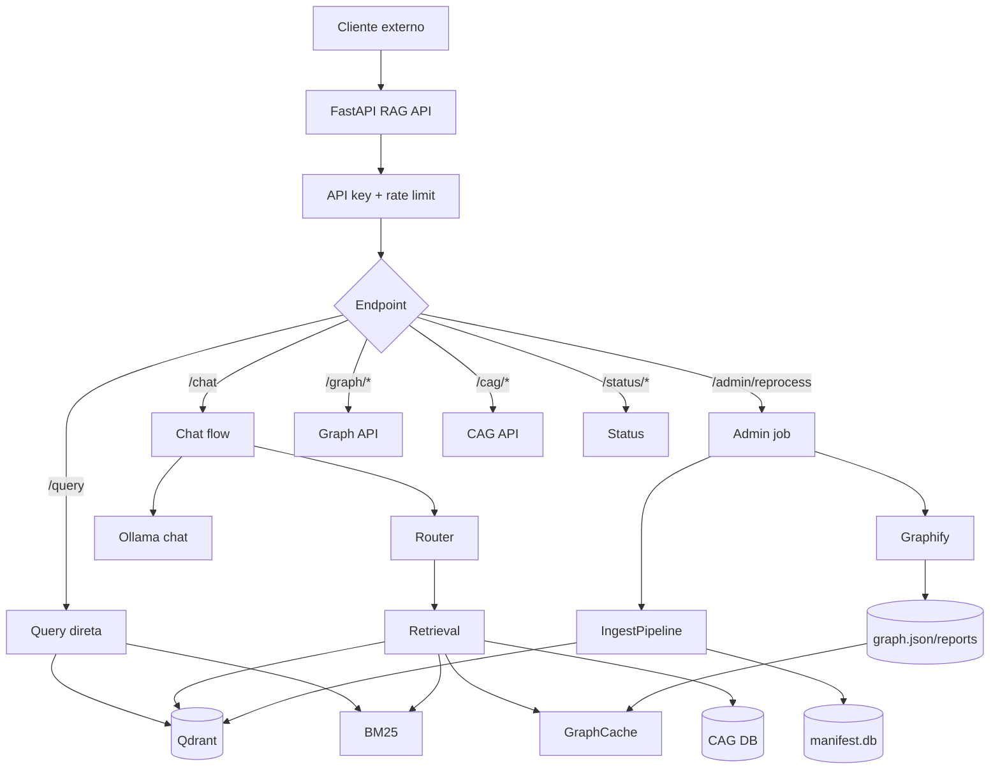
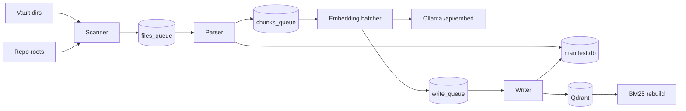
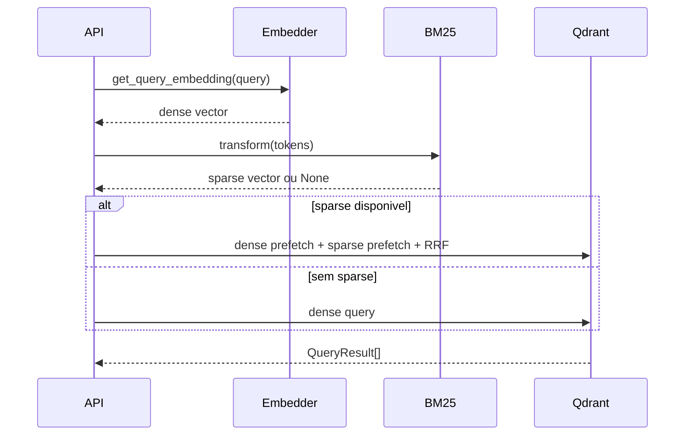
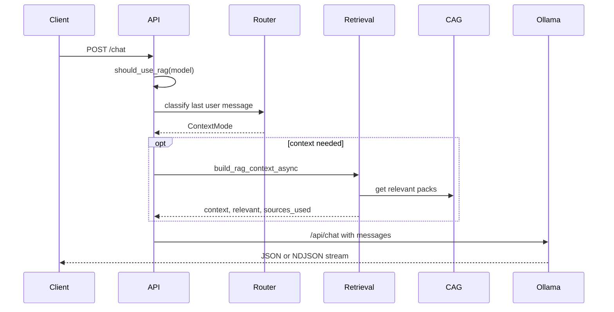
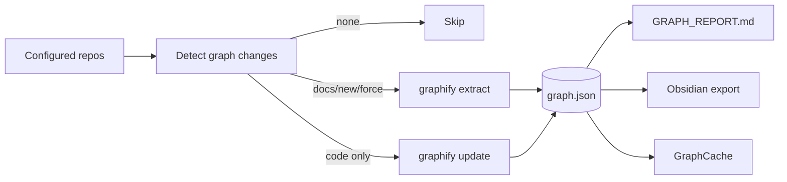
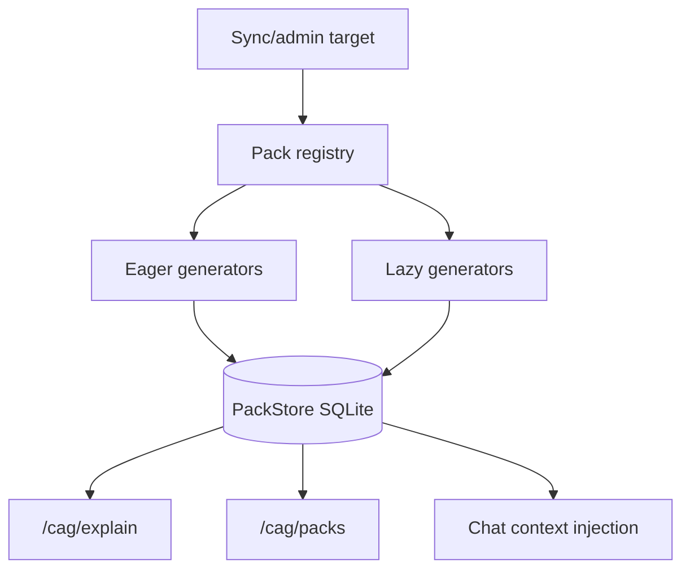
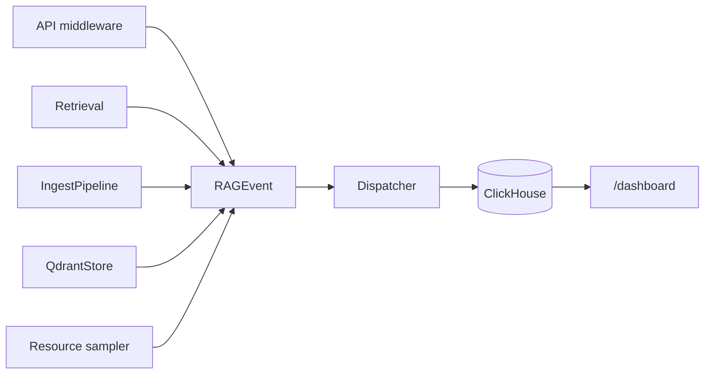

# Diagramas

Este ficheiro junta os diagramas principais para estudo rapido da arquitetura.

## Arquitetura Geral



## Ingestao



## Retrieval

```mermaid
flowchart TD
    query[Query] --> route[route_query]
    route --> intent[QueryIntent]
    intent --> notes{use_notes?}
    intent --> code{use_code?}
    intent --> graph{use_graph?}
    notes -- sim --> note_search[Hybrid notes search]
    code -- sim --> code_search[Hybrid code search]
    note_search --> filter[threshold + dedup + rerank]
    code_search --> filter
    graph -- sim --> graphctx[Graph context]
    filter --> cag[CAG packs]
    graphctx --> cag
    cag --> gate[Relevance gate]
    gate -->|pass| context[Context string]
    gate -->|fail| none[No context]
```

## Pesquisa Hibrida no Qdrant



## Chat



## Graphify



## CAG



## Observabilidade


