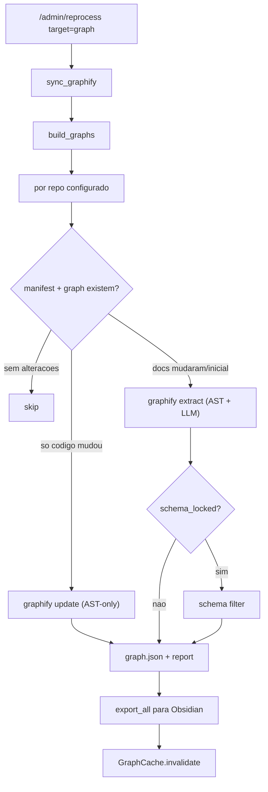
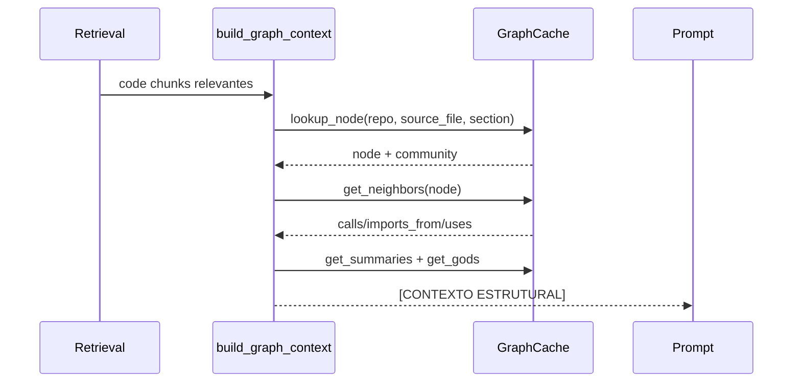

# Graphify

Graphify gera knowledge graphs estruturais dos repos configurados.

O RAG usa estes grafos para:

- listar estado por repo em `/repos`;
- devolver relatorios em `/graph/{repo}`;
- consultar vizinhos e queries locais;
- construir contexto estrutural para `/chat`;
- exportar notas para um vault Obsidian de grafos.

## Artefactos

Por repo:

```text
data/graphify/<repo>/graphify-out/
  graph.json
  GRAPH_REPORT.md
  manifest.json
  ...
```

Export Obsidian:

```text
<graphify.graph_vault_dir>/
```

## Build



## Incrementalidade

`pipeline/graph/builder.py` usa `manifest.json` do Graphify para detetar:

- ficheiros alterados;
- ficheiros apagados;
- ficheiros novos;
- se a alteracao foi apenas em codigo ou tambem em docs.

Se apenas codigo mudou, usa `graphify update`, que evita chamadas LLM.

Se docs mudaram, usa `graphify extract`, porque Markdown/texto precisa extracao semantica.

## Config Relevante

```toml
[graphify]
enabled = true
backend = "ollama"
output_dir = "data/graphify"
graph_vault_dir = "~/Obsidian/knowledge-graphs"
auto_update = true
extract_mode = "deep"
max_concurrency = 1
schema_locked = false
prefilter_enabled = true
candidate_score_threshold = 0.4
prefilter_min_chars = 200
prefilter_max_llm_chunks_per_doc = 20
community_min_members = 5
community_incremental = true
export_incremental = true
```

## Ollama para Graphify

Quando `backend="ollama"`:

- `OLLAMA_BASE_URL` e forçado para terminar em `/v1`;
- `OLLAMA_API_KEY` e obrigatoria;
- se nao estiver em env, o builder tenta ler `OLLAMA_API_KEY_FILE`.

O modelo vem da role `graph-enrichment` no registry.

## GraphCache

`pipeline/graph/cache.py` carrega e indexa grafos em memoria, com TTL configuravel.

Usado por:

- `/graph/context`;
- `retrieval/graph_context.py`;
- queries de grafo;
- listagem de repos.

## Contexto Estrutural

O contexto estrutural parte dos chunks de codigo relevantes.



Relacoes consideradas mais uteis para contexto:

- `calls`
- `imports_from`
- `uses`

## Endpoints

- `GET /repos`
- `GET /graph/{repo}`
- `POST /graph/{repo}/query`
- `GET /graph/{repo}/neighbors/{node}`
- `POST /graph/context`

## Operacao Recomendada

Para rebuild incremental:

```bash
curl -sS https://127.0.0.1:8484/admin/reprocess \
  -H "Authorization: Bearer $RAG_API_KEY" \
  -H "Content-Type: application/json" \
  -d '{"target":"graph","force":false}'
```

Para rebuild completo:

```bash
curl -sS https://127.0.0.1:8484/admin/reprocess \
  -H "Authorization: Bearer $RAG_API_KEY" \
  -H "Content-Type: application/json" \
  -d '{"target":"graph","force":true}'
```
