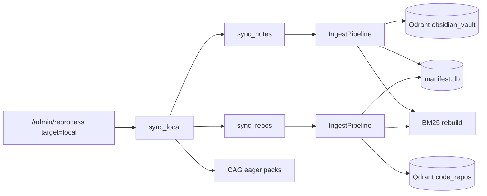
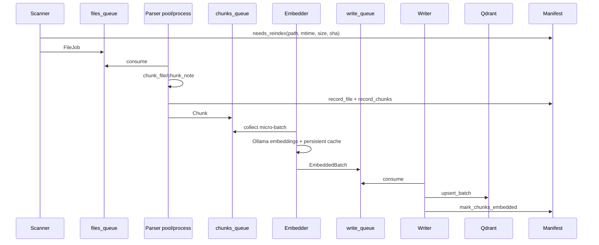

# Pipeline de Ingestao

O pipeline converte ficheiros em chunks, embeddings e pontos no Qdrant.

Entradas operacionais:

- `POST /admin/reprocess {"target":"local"}` para notas + repos + CAG eager.
- `POST /admin/reprocess {"target":"sources","sources":[{"path":"/path/pedido","source_type":"auto"}]}` para registar e indexar apenas fontes locais pedidas em runtime.
- `POST /admin/reprocess {"target":"all"}` para local + Graphify + CAG.

## Fontes

| Fonte | Config | Colecao |
| --- | --- | --- |
| Vaults Obsidian | `paths.vault_dirs` | `obsidian_vault` |
| Repos Git | `repos.paths` | `repos.collection_name`, por defeito `code_repos` |
| Fontes locais pedidas em runtime | `AdminReprocessRequest.sources` persistido em `paths.data_dir/requested_sources.json` | `obsidian_vault` para vaults; `repos.collection_name` para codigo/documentos |

Fontes locais pedidas pelo user nao alteram `config/rag/user.toml`. O RAG resolve
o path para o mount read-only de fontes do host (`AI_RAG_HOST_HOME`) usando
`AI_RAG_HOST_SOURCE_ROOT` quando recebe paths absolutos do host. Se a fonte for
`auto`, o RAG classifica a root como vault Obsidian, Git/code ou pasta
heterogenea de documentos. Pastas heterogeneas podem conter texto, codigo,
tabelas, Office/PDF e media; os chunkers chamam os donos externos apropriados
por HTTP quando precisam de extracao ou transcricao.

## Fluxo Geral

## Pipeline Bounded

`pipeline/ingest.py` implementa quatro etapas ligadas por filas limitadas:

Backpressure:

- Se o embedder estiver lento, os parsers bloqueiam em `chunks_queue`.
- Se o writer estiver lento, o embedder bloqueia em `write_queue`.
- Isto impede que uma run grande acumule todos os chunks em memoria.
- Quando um parser precisa de um owner externo (`extrator` para documentos ou
  `audio_transcribe` para media), uma recusa retryable do Resource Governor
  deve ser tratada como atraso dentro do orcamento da operacao. O ficheiro so
	  deve ficar `pending_external_service` quando o owner continua indisponivel
	  depois desse orcamento, para evitar perda permanente de contexto por picos
	  transitorios de pressao.

## Resource Governor

O RAG consome a política global emitida por `config/resource_governor.yaml`.
`max_parallel_jobs` controla apenas scan/parse por fonte; embedding e writes
ficam em lanes separadas e serializadas por semaforos/leases.

Swap residual nao é tratado como pausa automática. Se a RAM continua dentro do
orcamento, o swap nao esta a crescer e PSI nao mostra stalls, o governor devolve
`REDUCE` para limitar trabalho background. `PAUSE`, `deferred_resource_pressure`
ou `failed_resource_pressure` exigem pressao ativa: crescimento de swap, pouca
RAM disponivel, PSI memory/IO ou limite RAM real.

No fim de fases/jobs, o RAG liberta apenas recursos do proprio processo:
`gc.collect`, `malloc_trim` quando disponivel e caches locais de embeddings. A
politica proibe acoes globais como `swapoff`, `drop_caches`, matar processos
desconhecidos ou `docker prune`.

## Scanner

Para cada fonte:

1. Itera ficheiros elegiveis.
2. Calcula `source_id` estavel por nome+path.
3. Usa `manifest.needs_reindex`.
4. Se `mtime_shortcircuit=true`, compara primeiro mtime+size antes de ler SHA.
5. Enfileira `FileJob`.

Em repos, alem dos ficheiros de codigo/docs, gera chunks de overview com `chunking/repo_overview.py`.

## Parser

Para notas:

- `chunking.markdown.chunk_note`
- extrai frontmatter, tags, tasks, wikilinks, headings e datas;
- divide por headings e tamanho.

Para codigo:

- `chunking.code.chunk_file`
- usa AST para Python;
- pode usar Tree-sitter se extras estiverem instalados;
- cai para chunking textual quando necessario;
- preserva metadados como `repo_name`, `source_path`, `symbol_type`, `section_header`.

## Embeddings

O embedder usa `OllamaEmbeddingProvider`:

- endpoint `/api/embed`;
- modelo da role `embedding`;
- cache LRU para query-time;
- cache persistente SQLite para ingestao;
- retries em erros HTTP/timeout/connect;
- modo GPU-first apenas em rebuild forçado `target=all` com `force=true`.

## Writer

O writer:

- chama `VectorStore.upsert_batch`;
- grava payload com `_document`, `_id`, metadados e `content_hash`;
- marca chunks como embedded no manifest;
- apos a run, chama `finalize_collection_index` se aplicavel;
- faz cleanup global de chunks obsoletos.

## Manifest SQLite

Tabelas:

- `files`: ficheiros por `source_id + path`, hash, mtime, size, config version.
- `chunks`: chunks e estado vetorial.
- `ingest_runs`: runs em curso/completas/abortadas.

Uso:

- incrementalidade;
- retomar depois de crash;
- `/status/indexing`;
- cleanup de stale chunks.

## BM25

No fim de uma run com writes, o pipeline cria uma thread background para reconstruir o indice BM25 da colecao. O retrieval usa esse indice para pesquisa sparse combinada com dense via RRF no Qdrant.

## Governor de Recursos

Antes e durante ingestao, `ResourceGovernor` pode:

- continuar;
- reduzir batch;
- throttle;
- pausar ate recursos ficarem seguros;
- abortar se RAM/swap/disco estiverem criticos.

Pausas nao sao infinitas. `performance.resource_pause_max_seconds`,
`performance.resource_pause_total_budget_seconds` e
`performance.resource_retry_max_attempts` definem o limite. Se a pressao
persistir, o child fica `retry_scheduled` com `retry_at`, `attempt`,
`pause_started_at`, `pause_budget_seconds` e `last_governor_snapshot`; ao esgotar
tentativas, fica `failed_resource_pressure`.

O paralelismo e separado por fase:

- scan/parse de fontes usa `performance.source_scan_parallel_jobs`;
- embedding usa `performance.embedding_lane_concurrency` e lease
  `embedding_gpu_batch`;
- vector write usa lane global unica e lease de escrita;
- `performance.max_parallel_jobs` nao implica embeddings simultaneos.

Tambem existem leases opcionais via `resource_governor_client` para embedding,
Qdrant write e Graphify. Leases mantidos pelo RAG devem ter heartbeat e release
em `finally`.

## Targets Admin

| Target | Funcoes chamadas |
| --- | --- |
| `local` | `sync_local` -> `sync_notes`, `sync_repos`, `generate_cag_packs` |
| `sources` | `sync_requested_sources` -> apenas fontes indicadas no pedido |
| `graph` | `sync_graphify` -> `build_graphs`, `export_all`, invalidate GraphCache |
| `cag` | `generate_cag_packs` |
| `all` | `sync_all` -> local, graph, cag |

`local`, `graph` e `all` usam apenas fontes persistidas em configuracao
(`paths.vault_dirs` e `[repos].paths`). Fontes passadas no payload de uma chamada
runtime ficam isoladas em `target=sources`; elas nao entram em rebuilds globais e
nao alteram a lista configurada do utilizador.

## Quando Usar `force`

Usa `force=true` quando:

- alteraste regras de chunking e queres reconstruir tudo;
- suspeitas de manifest inconsistente;
- mudaste modelo de embedding/dimensao;
- queres rebuild Graphify completo.

Semantica:

- nas colecoes vetoriais afetadas, o estado anterior e eliminado antes da nova
  ingestao;
- o manifest SQLite das fontes afetadas e limpo antes de ser substituido pela
  nova run;
- o modelo BM25 persistido dessa colecao e removido e reconstruido quando a run
  grava novos chunks;
- no Graphify, o manifest do repo e removido para forcar rebuild completo antes
  da exportacao.

Impacto:

- mais chamadas Ollama;
- mais carga em CPU/GPU;
- rebuild pode ser longo;
- no `all`, ativa caminho GPU-first para embeddings.
