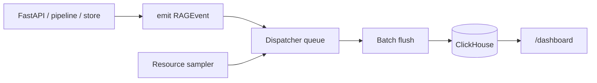

# Observabilidade

A observabilidade e opcional e envia eventos para ClickHouse atraves de um dispatcher em background.

Quando `settings.observability.enabled=true`, a app FastAPI chama `observability.start()` no lifespan.

## Componentes

| Componente | Papel |
| --- | --- |
| `observability/events.py` | Define `EventName`, `RAGEvent` e mapping para tabelas. |
| `observability/_dispatcher.py` | Bufferiza e escreve batches no ClickHouse. |
| `observability/_resource_sampler.py` | Emite amostras de RAM/disco/VRAM/PSI. |
| `observability/dashboard.py` | Endpoints e UI de dashboard. |
| `observability/schema.sql` | Tabelas ClickHouse. |

## Fluxo



## Eventos

| Area | Eventos |
| --- | --- |
| API | `request_completed`, `request_error`, `auth_failure`, `rate_limited` |
| Retrieval | `retrieval_completed` |
| Embeddings | `embedding_batch` |
| Ingestao | `ingest_run_started`, `ingest_run_completed`, `ingest_stage`, `governor_action`, `bm25_rebuild`, `stale_cleanup` |
| CAG/Grafo | `cag_pack_store`, `cag_pack_get`, `cag_pack_invalidate`, `cag_response_cache`, `graph_context_built` |
| Store | `store_query`, `store_upsert`, `store_delete` |
| Recursos | `resource_sample` |

## Tabelas ClickHouse

O schema cria:

- `rag_requests`
- `rag_retrieval`
- `rag_ingest_runs`
- `rag_ingest_stages`
- `rag_embedding_batches`
- `rag_cag_operations`
- `rag_store_operations`
- `rag_resource_samples`

As tabelas usam TTL de 90 dias por defeito.

## Privacidade

Queries nao sao guardadas em claro nos eventos de retrieval. O campo `query_hash` e `SHA256` truncado para 16 chars.

## Config

```toml
[observability]
enabled = true
clickhouse_database = "obsidian_rag"
clickhouse_username = "default"
clickhouse_password_env = "CLICKHOUSE_PASSWORD"
batch_size = 500
flush_interval_seconds = 2.0
queue_max_size = 10000
retention_days = 90
fail_silent = true
resource_sampling = true
resource_sample_interval = 5.0
```

## Dashboard

O router do dashboard e incluido pela API. Paths com prefixo `/dashboard` estao isentos de API key no middleware atual.

Usa o dashboard para:

- timeline de eventos;
- latencia e status por endpoint;
- qualidade de retrieval;
- ingest runs;
- operacoes CAG;
- recursos do host/container.

## Falhas

Com `fail_silent=true`, falhas de ClickHouse nao devem quebrar o RAG. Isto e importante porque observabilidade nao pode tornar query/chat indisponiveis.
