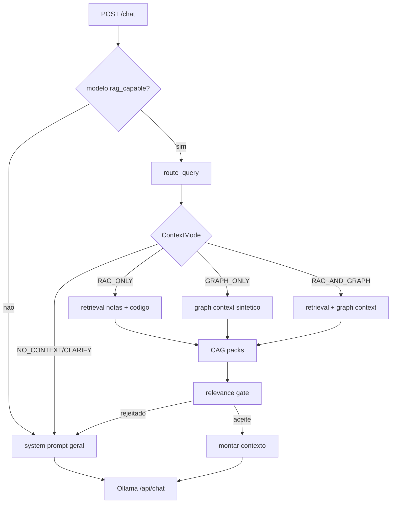
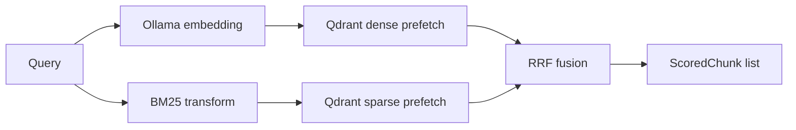

# Retrieval e Chat

O retrieval e responsavel por decidir se ha contexto local relevante e por construir o bloco final que sera injetado no chat.

## Fluxo de Chat

## Router

O router esta em `retrieval/router.py`.

Modos:

- `NO_CONTEXT`: pergunta geral, sem contexto local.
- `RAG_ONLY`: notas/codigo.
- `GRAPH_ONLY`: grafo estrutural.
- `RAG_AND_GRAPH`: conteudo semantico + grafo.
- `CLARIFY`: ambigua.

Em `context_mode=auto`:

1. tenta classificar com LLM;
2. se falhar, usa heuristica por palavras-chave;
3. devolve `RoutingDecision` com modo, confidence, reason, method e latency.

Overrides explicitos:

| `context_mode` | Resultado |
| --- | --- |
| `none` | `NO_CONTEXT` |
| `rag_only` | `RAG_ONLY` |
| `graph_only` | `GRAPH_ONLY` |
| `both` | `RAG_AND_GRAPH` |

## Pesquisa Hibrida

Cada pesquisa usa:

- embedding denso via Ollama;
- sparse query BM25 se o modelo da colecao existir;
- Qdrant `query_points` com dense + sparse prefetch;
- fusion RRF (`models.Fusion.RRF`) quando sparse esta disponivel.

## Pipeline de Filtragem

Depois da query:

1. deduplicacao exata por chave composta;
2. remocao de chunks de navegacao/indice em notas;
3. threshold dinamico: `max(score_threshold, best_score * dynamic_threshold_ratio)`;
4. corte por `effective_k`;
5. deduplicacao semantica por embeddings;
6. reranking opcional.

## `effective_k`

O `top_k` final e adaptado por:

- complexidade da pergunta (`simple`, `normal`, `complex`);
- tamanho da colecao, com escala logaritmica quando ha mais de 1000 pontos.

Queries simples reduzem custo. Queries complexas aumentam candidatos ate um limite.

## Reranker

Se `settings.reranker.enabled`:

- queries simples saltam o reranker;
- tenta cross-encoder primeiro, se instalado;
- fallback para reranker LLM;
- `top_k` final depende da complexidade:
  - simple: ate 3;
  - normal: ate 5;
  - complex: ate 8.

## CAG no Retrieval

Os packs CAG sao carregados antes do relevance gate. Isto permite que contexto cached fresco responda mesmo quando a pesquisa vetorial tem poucos hits.

`sources_used` pode incluir:

- `rag`
- `graph`
- `cag`
- combinacoes como `cag+graph+rag`

## Relevance Gate

O gate rejeita contexto quando:

- nao ha chunks, grafo nem CAG;
- melhor score esta abaixo de `context_policy.min_relevance_score` e nao ha CAG;
- numero de chunks relevantes e menor que `context_policy.min_relevant_chunks` e nao ha CAG.

Se rejeitado, o chat usa system prompt geral e nao injeta contexto fraco.

## Montagem do Contexto

`_build_context_string` cria blocos:

- `[CACHED CONTEXT]`
- `[SEMANTIC — PERSONAL NOTES]`
- `[SEMANTIC — CODE: repo]`
- `[SEMANTIC — REPO DOCS: repo]`
- `[CONTEXTO ESTRUTURAL — repo]`

O budget e distribuido por `retrieval/budget.py` entre notas, codigo e grafo.

## API `/query` vs `/chat`

`/query` e `/query/code` fazem pesquisa direta e devolvem chunks. Nao usam todo o pipeline de router/gate/chat.

As respostas diretas tambem publicam o contrato versionado
`rag-evidence.v1`:

- `evidence[]`: cada item contem `citation`, `score`, `provenance`,
  `freshness` e `truncation`.
- `citation`: referencia estavel ao chunk (`source_namespace`,
  `source_path`, `chunk_id`, `chunk_index`, `source_type`, repo/simbolo quando
  existir).
- `provenance`: colecao, backend de retrieval (`vector` ou
  `hybrid_vector_sparse`), source id/name e filtros aplicados.
- `freshness`: estado `fresh`, `stale` ou `unknown`, com hash/mtime/indexed_at
  quando o indice expuser essa informacao.
- `truncation`: marca fontes truncadas no ingest, por exemplo
  `max_chunks_per_file`.
- `retrieval_trace`: envelope `retrieval-trace.v1` com colecao, `top_k`,
  `min_score`, contagens, namespaces, budget de candidatos e `miss_reasons`
  quando nao ha evidence.

`/chat` usa:

- router;
- retrieval paralelo async para notas/codigo;
- CAG;
- graph context;
- relevance gate;
- Ollama chat.

## Debug

Em `/query`, `debug=true` devolve trace com informacao de dense/sparse, scores e filtros.

Em `/chat`, quando `settings.debug.enabled=true`, o trace e anexado:

- ao JSON final em modo non-stream;
- como ultima linha NDJSON em modo stream.
