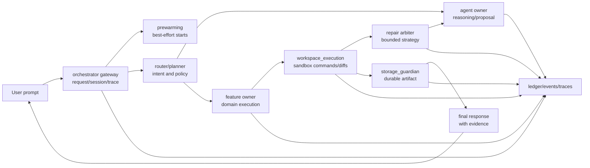
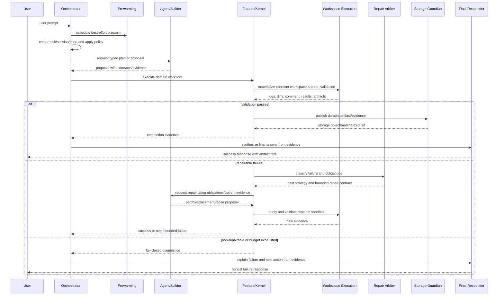
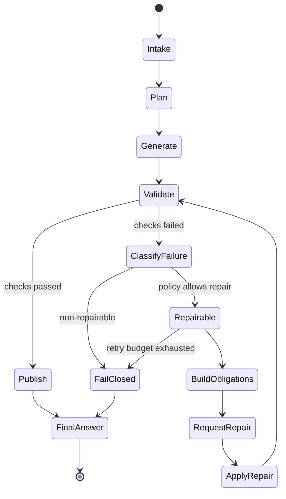

# <End-To-End Flow Name>

Status: <implemented | enabled-by-default | opt-in | draft | blocked>
Owner: cross-component; primary coordinator `<owner-path>`
Last verified: <YYYY-MM-DD>
Applies to: orchestrator, agents, features, services, storage, observability
Audience: user, operator, developer, maintainer

## Page Index

- [Purpose](#purpose)
- [Scope](#scope)
- [User Prompt Shape](#user-prompt-shape)
- [Ownership Map](#ownership-map)
- [Full Architecture](#full-architecture)
- [Request And Repair Sequence](#request-and-repair-sequence)
- [Repair State Machine](#repair-state-machine)
- [Evidence Contract](#evidence-contract)
- [Failure Classes](#failure-classes)
- [User-Facing Outcomes](#user-facing-outcomes)
- [Operator Runbook](#operator-runbook)
- [Verification](#verification)
- [Open Questions](#open-questions)

## Purpose

Explain the full user-visible flow in plain language: what the user asks, what
the system does, what can be produced, and how success is proven.

## Scope

In scope:

- <request type or user prompt class>
- <components involved>
- <success criteria>
- <repair or fallback behavior>

Out of scope:

- <behavior owned elsewhere>
- <manual operations not part of this flow>

## User Prompt Shape

Document the class of user prompt this flow handles without hardcoding one
benchmark prompt.

```text
<generalized user request shape>
```

Examples for documentation or tests only:

```text
<scenario-neutral example 1>
<scenario-neutral example 2>
```

## Ownership Map

| Step | Owner | Responsibility | Must not do |
| --- | --- | --- | --- |
| Request intake | `orchestrator` | auth, routing, trace/session | execute owner internals directly |
| Prewarming | `orchestrator/prewarming` | best-effort lifecycle prediction | block request or own feature behavior |
| Planning/reasoning | `agents/*` or orchestrator node | produce typed decisions | perform side effects directly |
| Feature execution | `features/*` | domain pipeline/API | bypass storage/policy owners |
| Workspace execution | `features/workspace_execution` | sandbox, commands, diffs, transient artifacts | durable host writes |
| Repair arbitration | `<repair owner>` | classify failures, select bounded repair strategy | infinite retries or scenario hacks |
| Durable publication | `storage_guardian` | object custody/materialization | hidden direct writes |
| Final answer | `reasoning_and_response` or orchestrator response path | explain result using evidence | static fake success |

## Full Architecture



## Request And Repair Sequence



## Repair State Machine



## Evidence Contract

| Evidence | Producer | Required fields | Consumed by | Completion role |
| --- | --- | --- | --- | --- |
| task/session id | `orchestrator` | id, trace, status | all owners | correlation |
| proposal | `agent` | files/patches/plan/schema | feature/kernel | input to execution |
| validation result | `workspace_execution` | command, exit, logs, artifacts | feature/repair | pass/fail proof |
| repair obligations | repair owner | issue, target, required interfaces | agent/feature | repair contract |
| durable artifact | `storage_guardian` | object ref, hash, materialized path | final responder | success proof |
| final answer | responder | status, evidence refs, user message | user | user-visible result |

## Failure Classes

| Class | Example signal | Repairable? | Owner |
| --- | --- | --- | --- |
| Invalid user input | schema/auth rejection | usually no | orchestrator/caller |
| Proposal schema error | parser/contract rejection | yes, bounded | agent owner |
| Interface drift | missing export/import/entrypoint | yes | feature repair owner |
| Sandbox execution error | command exit/log failure | maybe | workspace + feature owner |
| Policy denial | approval/risk denied | no until approved | orchestrator/policy |
| Durable publish failure | storage guardian rejection | maybe | storage owner |
| Retry budget exhausted | repeated repair failure | no | coordinator |

## User-Facing Outcomes

| Outcome | Response must include | Response must not claim |
| --- | --- | --- |
| Success | artifact/result refs, validation evidence, next use | unverified extra behavior |
| Partial success | what worked, what is missing, where evidence lives | full completion |
| Failed closed | blocker, owner, evidence, next action | fake artifact or static fallback |
| Awaiting approval | requested action, risk, approval path | that work already ran |

## Operator Runbook

```bash
# Prepare config/images/policy
make infra

# Start normal runtime
make up

# Run focused smoke for this flow
<smoke command>

# Inspect events/logs
<debug command>
```

## Verification

| Check | Command or source | Expected result | Last run |
| --- | --- | --- | --- |
| Contract tests | `<command>` | pass | <date or not-run> |
| Repair tests | `<command>` | pass/fail-closed behavior proven | <date or not-run> |
| Storage publication | `<command>` | object ref/hash/materialized path | <date or not-run> |
| Live smoke | `<command>` | final response grounded in evidence | <date or not-run> |

## Open Questions

- <question, owner, or decision still pending>
