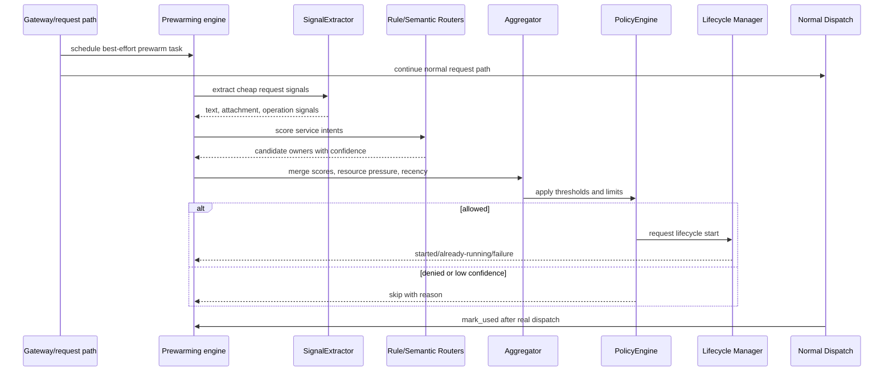
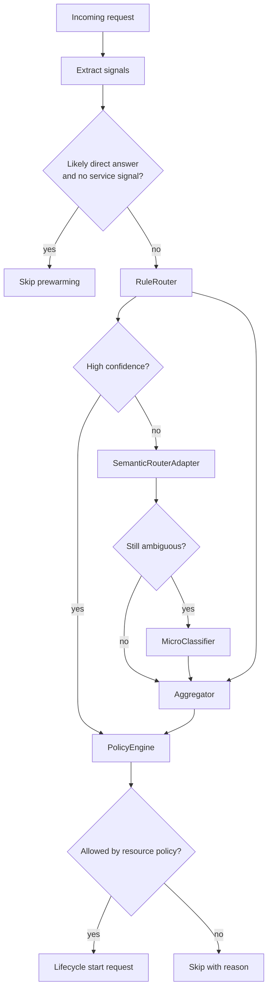

# <Prewarming Area Or Service Intent>

Status: <implemented | enabled-by-default | opt-in | draft | blocked>
Owner: `orchestrator/prewarming`
Last verified: <YYYY-MM-DD>
Applies to: `orchestrator/prewarming`, lifecycle manager, service catalog
Audience: developer, operator, maintainer

## Page Index

- [Purpose](#purpose)
- [Non-Ownership](#non-ownership)
- [Runtime Flow](#runtime-flow)
- [Service Intent Entry](#service-intent-entry)
- [Decision Diagram](#decision-diagram)
- [Resource And Safety Rules](#resource-and-safety-rules)
- [Metrics And Learning](#metrics-and-learning)
- [Failure Modes](#failure-modes)
- [Verification](#verification)
- [Open Questions](#open-questions)

## Purpose

Explain what this prewarming behavior predicts and which latency problem it
solves. Prewarming is best-effort runtime infrastructure: it starts likely
needed owners earlier while the normal request path continues.

## Non-Ownership

Prewarming must not own:

- Feature business logic.
- Agent prompt behavior.
- Direct-answer behavior.
- Storage lifecycle.
- Endpoint inference outside runtime registry/config.
- Scenario-specific prompt examples as routing truth.

## Runtime Flow

## Service Intent Entry

| Field | Value | Notes |
| --- | --- | --- |
| `id` | `<service-id>` | Must map to live lifecycle service. |
| `description` | `<stable role>` | One stable sentence. |
| `capabilities` | `<capabilities>` | Domain-neutral. |
| `inputs` | `<input types>` | File/content/request types. |
| `operations` | `<operations>` | Verbs/tasks. |
| `keywords` | `<keywords>` | Cheap signals only. |
| `patterns` | `<patterns>` | Durable patterns, no benchmark shortcuts. |
| `file_extensions` | `<extensions>` | Only if truly relevant. |
| `prewarm_policy` | `<standard|aggressive|conservative|never>` | Include reason for `never`. |
| `prewarm_threshold` | `<number>` | Policy input. |
| `uses_gpu` | `<true|false>` | Resource policy input. |
| `ttl_idle` | `<duration>` | Cleanup behavior. |

## Decision Diagram

## Resource And Safety Rules

| Rule | Reason | Expected behavior |
| --- | --- | --- |
| Best effort only | User request must continue | Failure is non-fatal. |
| Conservative GPU behavior | Avoid starving active work | Skip or delay GPU owners under pressure. |
| Live service mapping required | Avoid ghost catalog entries | Fix catalog/registry mismatch. |
| `example_queries` are non-authoritative | Avoid prompt overfitting | Use intent documents for semantic routing. |
| Direct answer is not a service here | Preserve owner boundary | `reasoning_and_response` owns direct answer behavior. |

## Metrics And Learning

| Signal | Meaning | Action |
| --- | --- | --- |
| prewarm requested | Candidate selected | Check confidence and policy. |
| prewarm started | Lifecycle accepted | Measure latency benefit. |
| mark_used hit | Prediction matched dispatch | Reinforce service intent. |
| mark_used miss | Prediction not used | Review keywords/patterns/threshold. |
| skipped by policy | Resource or threshold gate | Tune policy, not feature behavior. |

## Failure Modes

| Failure | User impact | Correct recovery |
| --- | --- | --- |
| Router error | None; request continues | Fix router/test, keep fail-open to main path. |
| Lifecycle start failed | Possible latency loss | Inspect lifecycle/service health. |
| Ghost service id | Prewarm cannot start real service | Fix catalog/registry contract. |
| False positive | Resource waste | Tune intent metadata and threshold. |
| False negative | No latency benefit | Add durable service intent signal. |

## Verification

| Check | Command or source | Expected result | Last run |
| --- | --- | --- | --- |
| Prewarming tests | `<command>` | pass | <date or not-run> |
| Catalog validity | `<command>` | all service ids live | <date or not-run> |
| Lifecycle integration | `<command>` | start/skip reason recorded | <date or not-run> |
| Runtime smoke | `<command>` | main request succeeds even if prewarm fails | <date or not-run> |

## Open Questions

- <question, owner, or decision still pending>
