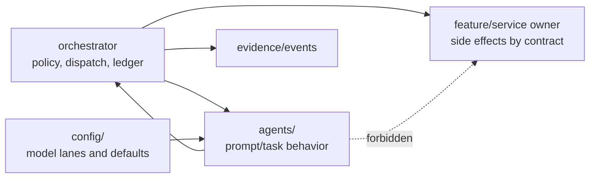
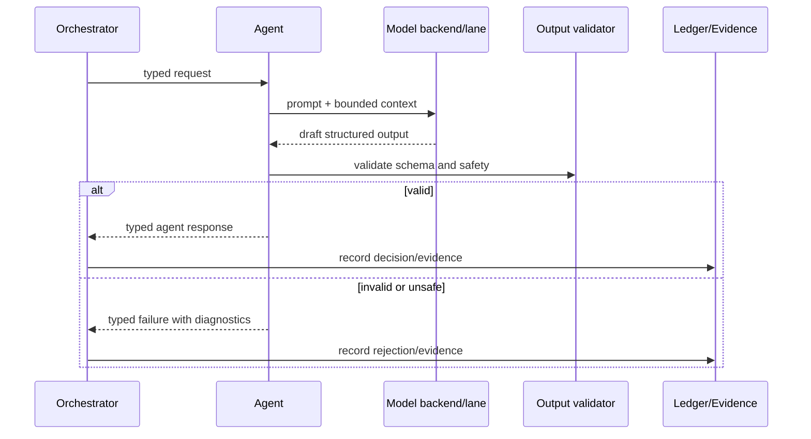

# <Agent Name>

Status: <implemented | enabled-by-default | opt-in | draft | blocked>
Owner: `agents/<agent-name>`
Last verified: <YYYY-MM-DD>
Applies to: `agents/<agent-name>`, related manifests, tests
Audience: developer, maintainer

## Page Index

- [Purpose](#purpose)
- [Ownership Boundary](#ownership-boundary)
- [Inputs And Outputs](#inputs-and-outputs)
- [Prompt Inventory](#prompt-inventory)
- [Runtime Flow](#runtime-flow)
- [How To Use](#how-to-use)
- [Failure And Repair Behavior](#failure-and-repair-behavior)
- [Model And Resource Behavior](#model-and-resource-behavior)
- [Tests](#tests)
- [Verification](#verification)
- [Open Questions](#open-questions)

## Purpose

Explain what reasoning or task behavior this agent owns. Keep this focused on
decision-making, structured outputs, prompts, critique, planning, or synthesis.

## Ownership Boundary

This agent owns:

- Prompt/task behavior for <domain>.
- Typed response generation for <contract>.
- Local validation of its own output shape.

This agent must not own:

- Durable writes or materialization.
- Shell, Docker, VM, or host command execution.
- Storage lifecycle, archive, restore, or custody.
- Cross-owner routing or policy ledger decisions.



## Inputs And Outputs

| Contract | Direction | Schema/source | Notes |
| --- | --- | --- | --- |
| `<input-contract>` | in | `<path>` | <validation> |
| `<output-contract>` | out | `<path>` | <required fields> |

## Prompt Inventory

| Prompt | Path | Purpose | Runtime lane | Must not contain |
| --- | --- | --- | --- | --- |
| `<prompt>` | `<path>` | <purpose> | <model/lane> | scenario-specific runtime rules |

## Runtime Flow



## How To Use

```bash
<targeted test or local invocation>
```

Example request:

```json
{
  "task": "<example>",
  "constraints": ["<constraint>"]
}
```

Expected response:

```json
{
  "status": "<ok|rejected|needs_more_context>",
  "evidence": ["<evidence>"]
}
```

## Failure And Repair Behavior

| Failure | Detection | Agent response | Owner of recovery |
| --- | --- | --- | --- |
| Invalid schema | parser/validator | reject with diagnostics | `agents/<agent-name>` |
| Unsafe action proposal | policy or contract check | return safe refusal/action plan | `orchestrator` |
| Missing context | input validation | request required context | caller/orchestrator |
| Repeated bad output | retry budget exhausted | fail closed | orchestrator or caller |

## Model And Resource Behavior

| Lane/profile | Config owner | Expected use | Fallback rule |
| --- | --- | --- | --- |
| `<lane>` | `config/` | <use> | no hidden fallback; report degradation |

## Tests

| Test | Path | What it proves |
| --- | --- | --- |
| <test> | `<path>` | <proof> |

## Verification

| Check | Command or source | Expected result | Last run |
| --- | --- | --- | --- |
| Agent unit tests | `<command>` | pass | <date or not-run> |
| Prompt/schema contract | `<command>` | pass | <date or not-run> |
| Runtime smoke | `<command>` | pass or not applicable | <date or not-run> |

## Open Questions

- <question, owner, or decision still pending>
