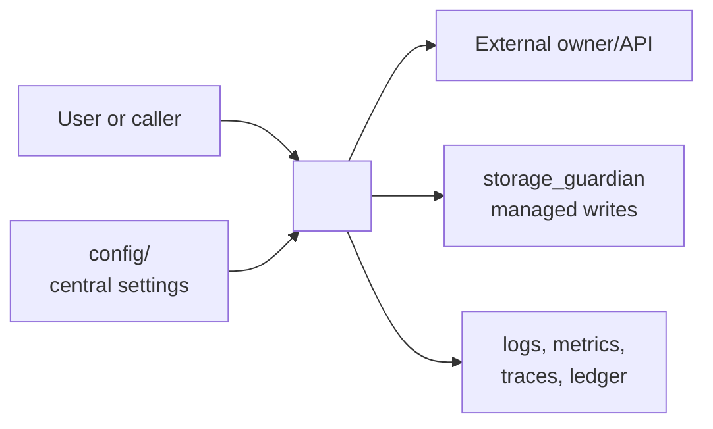
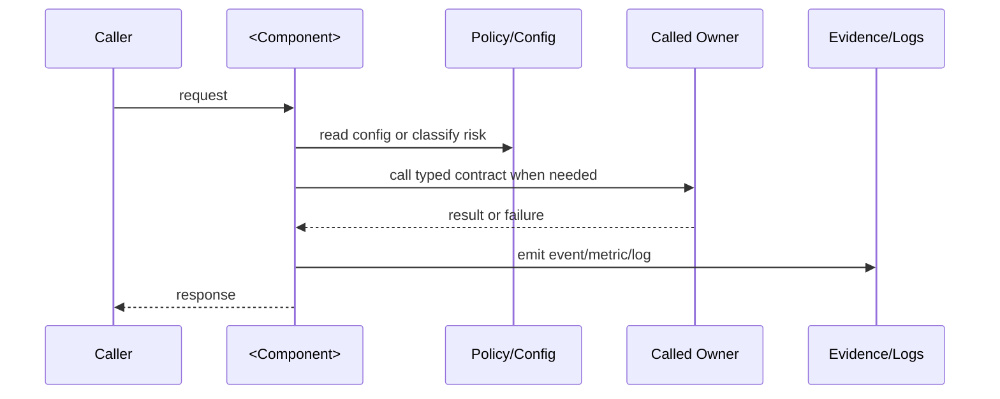
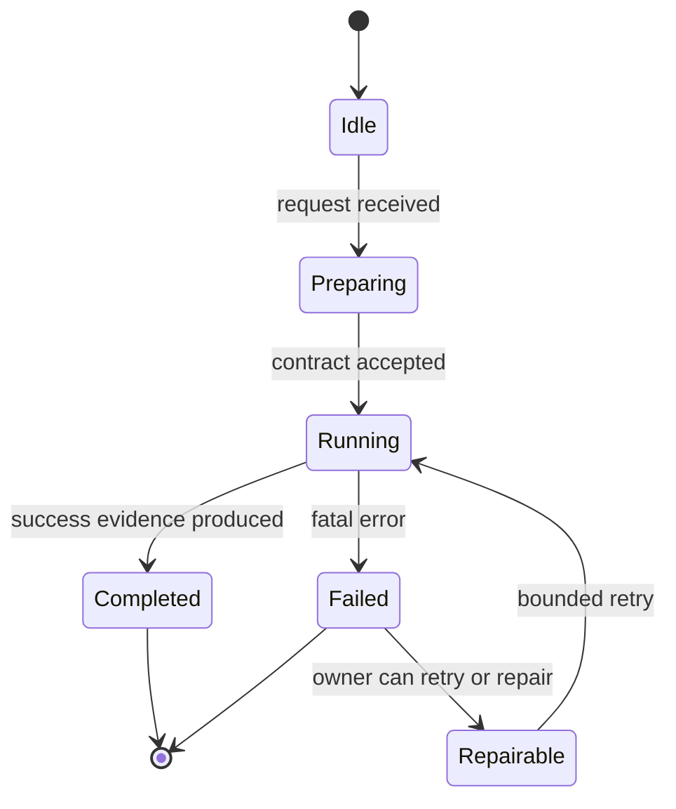

# <Component Name>

Status: <implemented | enabled-by-default | opt-in | draft | blocked>
Owner: `<owner-path>`
Last verified: <YYYY-MM-DD>
Applies to: `<paths>`, `<services>`, `<profiles>`
Audience: <developer | operator | maintainer | user>

## Page Index

- [Purpose](#purpose)
- [Ownership](#ownership)
- [User-Facing Behavior](#user-facing-behavior)
- [How To Use](#how-to-use)
- [Architecture](#architecture)
- [Data And Contracts](#data-and-contracts)
- [Failure Modes](#failure-modes)
- [Security And Safety](#security-and-safety)
- [Observability](#observability)
- [Operations](#operations)
- [Implementation Map](#implementation-map)
- [Change Rules](#change-rules)
- [Verification](#verification)
- [Open Questions](#open-questions)

## Purpose

Explain in 3-6 lines what this component does, why it exists, and what problem
it solves in the project.

## Ownership

| Responsibility | Owner | Notes |
| --- | --- | --- |
| Primary behavior | `<owner-path>` | <what this owner controls> |
| Configuration | `config/` or owner-local config | <runtime knobs and defaults> |
| Durable storage | `storage_guardian/` or none | <what is persisted, if anything> |
| Execution side effects | `<owner>` | <who may execute commands, write files, or start containers> |
| Observability | `<owner>` | <events, metrics, traces, logs> |

This component owns:

- <owned behavior>
- <owned contract>
- <owned state>

This component does not own:

- <behavior owned elsewhere>
- <storage or execution side effect owned elsewhere>
- <routing/policy owned elsewhere>

## User-Facing Behavior

Describe what the user can do with this component and what they should expect.

### Common Use Cases

| Use case | Input | Output | Success evidence |
| --- | --- | --- | --- |
| <use case> | <input> | <output> | <trace, file, API result, event> |

### Non-Goals

- <thing the component intentionally does not do>
- <thing delegated to another owner>

## How To Use

### Local Commands

```bash
# install, run, or test command
<command>
```

### API Or Contract

```http
<METHOD> <path>
Content-Type: application/json

{
  "example": "payload"
}
```

### Configuration

| Key | Owner | Default | Meaning | Safe values |
| --- | --- | --- | --- | --- |
| `<key>` | `<path>` | `<value>` | <meaning> | <values> |

## Architecture

### Context Diagram



### Runtime Flow



### State Or Lifecycle



## Data And Contracts

| Contract | Producer | Consumer | Schema/source | Compatibility rules |
| --- | --- | --- | --- | --- |
| `<contract-name>` | `<owner>` | `<consumer>` | `<path>` | <rules> |

### Inputs

- `<input>`: <type, validation, required/optional>

### Outputs

- `<output>`: <type, evidence, durability>

### Events And Evidence

| Event/evidence | When emitted | Required fields | Used by |
| --- | --- | --- | --- |
| `<event>` | <condition> | <fields> | <owner/tool> |

## Failure Modes

| Failure | Detection | User impact | Owner | Recovery |
| --- | --- | --- | --- | --- |
| <failure> | <signal> | <impact> | `<owner>` | <manual or automatic recovery> |

## Security And Safety

- Authentication/authorization: <how callers are authenticated>
- Policy gates: <risk checks, approval, deny rules>
- Storage safety: <how durable writes are governed>
- Execution safety: <sandbox, profile, no host writes, no network, etc.>
- Secrets: <where secrets live and what must never be logged>

## Observability

| Signal | Location | Meaning | Alert or action |
| --- | --- | --- | --- |
| <metric/log/event> | <path/tool> | <meaning> | <operator action> |

## Operations

### Start

```bash
<start command>
```

### Stop

```bash
<stop command>
```

### Health

```bash
<health command>
```

### Debug

```bash
<debug command>
```

## Implementation Map

| Area | Path | Notes |
| --- | --- | --- |
| Source | `<path>` | <notes> |
| Tests | `<path>` | <notes> |
| Config | `<path>` | <notes> |
| Docs/spec | `<path>` | <notes> |

## Change Rules

- <rule that must hold when changing this component>
- <owner boundary that must not be crossed>
- <test or smoke required before declaring done>

## Verification

| Check | Command or source | Expected result | Last run |
| --- | --- | --- | --- |
| Static docs check | `git diff --check -- <doc-path>` | no whitespace errors | <date or not-run> |
| Owner tests | `<command>` | `<expected>` | <date or not-run> |
| Runtime smoke | `<command>` | `<expected>` | <date or not-run> |

## Open Questions

- <question, owner, or decision still pending>
