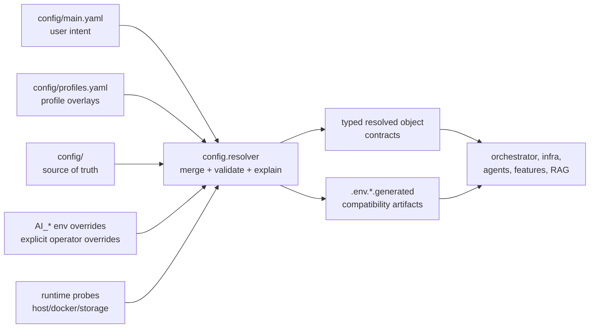
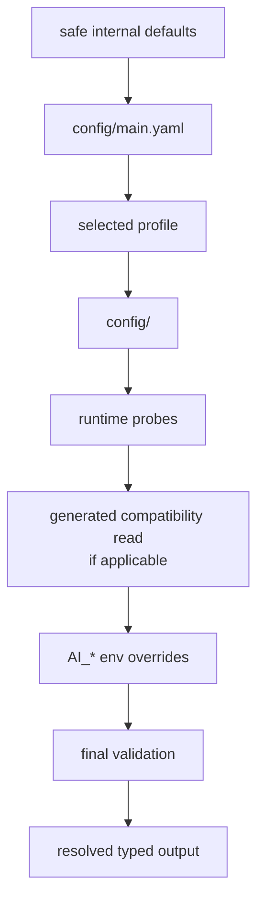
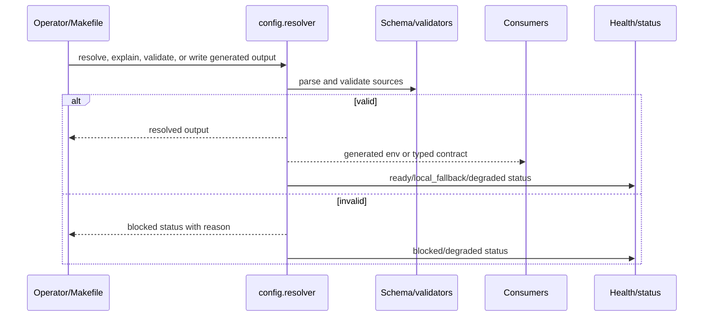
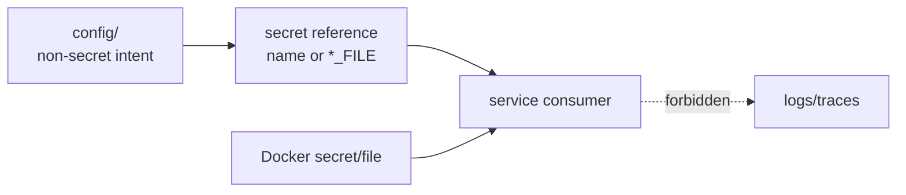

# <Config Area Name>

Status: <implemented | enabled-by-default | opt-in | draft | blocked>
Owner: `config/`
Last verified: <YYYY-MM-DD>
Applies to: `config/<path>`, generated outputs, consumers
Audience: developer, operator, maintainer

## Page Index

- [Purpose](#purpose)
- [Ownership Boundary](#ownership-boundary)
- [Source Of Truth](#source-of-truth)
- [Precedence](#precedence)
- [Schema And Validation](#schema-and-validation)
- [Generated Outputs](#generated-outputs)
- [Secrets Boundary](#secrets-boundary)
- [Consumers](#consumers)
- [Operational Flows](#operational-flows)
- [Runtime States](#runtime-states)
- [Drift And Migration Control](#drift-and-migration-control)
- [Safety Rules](#safety-rules)
- [Implementation Map](#implementation-map)
- [Change Rules](#change-rules)
- [Verification](#verification)
- [Open Questions](#open-questions)

## Purpose

Explain which runtime decision this config area owns and why it belongs in
central config instead of a feature, agent, service, or prompt.

Examples:

- machine/profile inference;
- model routing defaults;
- Docker/resource policy;
- generated env compatibility;
- service endpoints and ports;
- storage path resolution;
- security/admission policy inputs.

## Ownership Boundary

`config/` owns source-of-truth settings, resolution, validation, generated
compatibility artifacts, and operator-facing explanations.

`config/` does not own:

- feature business logic;
- agent prompt behavior;
- storage lifecycle;
- command execution;
- Docker lifecycle actions;
- runtime repair decisions;
- hidden fallbacks inside consumers.



## Source Of Truth

| Config source | Path | Owner | Editable by user? | Purpose |
| --- | --- | --- | --- | --- |
| User intent | `config/main.yaml` | `config/` | yes | high-level local choices |
| Profiles | `config/profiles.yaml` | `config/` | yes, carefully | named overlays |
| Area config | `config/<area>` | `config/` | depends | catalog/schema/policy inputs |
| Generated output | `.env.*.generated` or `.local/generated/*` | resolver | no | transition artifact |
| Runtime env override | `AI_*` | operator | yes | explicit local override |

Generated files are not source-of-truth config islands. They exist so Docker,
transition consumers and runtime services can read a stable transition surface.

## Precedence

Document the exact merge order for this config area.



| Rank | Source | Can override | Must not override |
| --- | --- | --- | --- |
| 1 | safe defaults | missing values | explicit user intent |
| 2 | `config/main.yaml` | defaults | secrets |
| 3 | selected profile | profile-scoped values | unrelated owner settings |
| 4 | runtime probes | auto values | explicit fixed values unless documented |
| 5 | generated compatibility read | migration compatibility | source-of-truth settings |
| 6 | `AI_*` env | explicit operator override | schema and safety validation |
| 7 | final validation | invalid values | valid explicit intent |

## Schema And Validation

| Field | Type | Required? | Default | Validation | Consumer |
| --- | --- | --- | --- | --- | --- |
| `<field>` | `<type>` | yes/no | `<default>` | <rule> | `<consumer>` |

Validation must fail or degrade explicitly. It must not silently invent behavior
inside consumers.



## Generated Outputs

| Artifact | Contract id/version | Producer command | Consumers | Source inputs | Sunset condition |
| --- | --- | --- | --- | --- | --- |
| `<artifact>` | `<contract>` | `<command>` | `<consumers>` | `<inputs>` | <when it can be removed> |

Rules:

- Generated outputs must include a contract id/version when consumers depend on
  their shape.
- Generated outputs must be reproducible from source-of-truth config and probes.
- Consumers must not write back to generated compatibility artifacts.
- Contract v2 requires a migration plan for every live consumer.

## Secrets Boundary

Secrets must not be normal resolved config.

| Secret/input | Correct owner/location | How consumer reads it | Must not happen |
| --- | --- | --- | --- |
| `<secret>` | `infra/docker/secrets/` or `*_FILE` | Docker secret or file path | log raw value |



## Consumers

| Consumer | Reads | How | Failure behavior |
| --- | --- | --- | --- |
| `<consumer>` | `<field/artifact>` | typed resolver/env/API | <ready/degraded/blocked/local fallback> |

Consumer rules:

- Consumers may read typed resolver output or generated compatibility artifacts.
- Consumers must not duplicate central inference logic.
- Consumers must fail visibly when required config is missing.
- Consumers must report stale or incompatible generated artifacts.

## Operational Flows

### Inspect

```bash
python -m config.resolver --print
python -m config.resolver --explain
python -m config.resolver --validate
```

### Generate

```bash
python -m config.resolver --write-storage-env
python -m config.resolver --write-llm-env
python -m config.resolver --write-services-env
python -m config.resolver --write-docker-resources-env
```

### Health And Self Model

```bash
python -m config.resolver --health-report
python -m config.resolver --self-model
python -m config.resolver --write-operational-self-model
```

### Area-Specific Commands

```bash
<command>
```

## Runtime States

| State | Meaning | User/operator action |
| --- | --- | --- |
| `ready` | Config is valid and consumers can proceed. | none |
| `degraded` | Config works with reduced capability. | inspect warnings |
| `blocked` | Required config is invalid or missing. | fix source config |
| `external_missing` | External resource is required but absent. | mount/provide resource |
| `local_fallback` | Local fallback is active. | restore preferred resource when possible |
| `stale` | Generated output no longer matches source. | regenerate with resolver |

## Drift And Migration Control

| Drift risk | Detection | Correct fix |
| --- | --- | --- |
| Consumer has private default | tests/static search | move default to `config/` or generated contract |
| Generated env stale | contract/version/hash/status | regenerate |
| Schema changed without migration | contract tests | add compatibility or migration |
| Secret leaked into config/logs | tests/review/log scan | move to secret ref and redact |
| Profile diverges from source | resolver explain/diff | update profile or source |

## Safety Rules

- Central config may describe and validate policy inputs, but must not execute
  policy actions itself.
- Central config may describe Docker resource and lifecycle knobs, but
  `infra/docker` owns lifecycle execution.
- Central config may describe storage roots and fallback policy, but
  `storage_guardian` owns durable storage lifecycle.
- Central config may describe model lanes and routing defaults, but model
  callers must report degradation instead of hiding fallback behavior.
- No owner should introduce private env/config islands for project-wide
  settings.

## Implementation Map

| Area | Path | Notes |
| --- | --- | --- |
| Source config | `<path>` | <notes> |
| Resolver code | `<path>` | <notes> |
| Schema/validation | `<path>` | <notes> |
| Generated contract | `<path>` | <notes> |
| Consumer tests | `<path>` | <notes> |
| Docs/spec | `<path>` | <notes> |

## Change Rules

- Update source, schema, generated contract, consumers, tests, and docs together
  when a field changes.
- Keep compatibility artifacts stable until all live consumers migrate.
- Add a validation failure or explicit degraded state for invalid input.
- Use scenario-neutral config. Do not add prompt-specific or benchmark-specific
  runtime shortcuts.
- Keep generated files reproducible and explainable.

## Verification

| Check | Command or source | Expected result | Last run |
| --- | --- | --- | --- |
| Resolver validation | `python -m config.resolver --validate` | valid or explicit blocked reason | <date or not-run> |
| Resolver explanation | `python -m config.resolver --explain` | precedence and sources visible | <date or not-run> |
| Generated contracts | `<command>` | contract id/version present | <date or not-run> |
| Consumer tests | `<command>` | pass | <date or not-run> |
| Runtime smoke | `<command>` | config consumed by live service | <date or not-run> |

## Open Questions

- <question, owner, or decision still pending>
