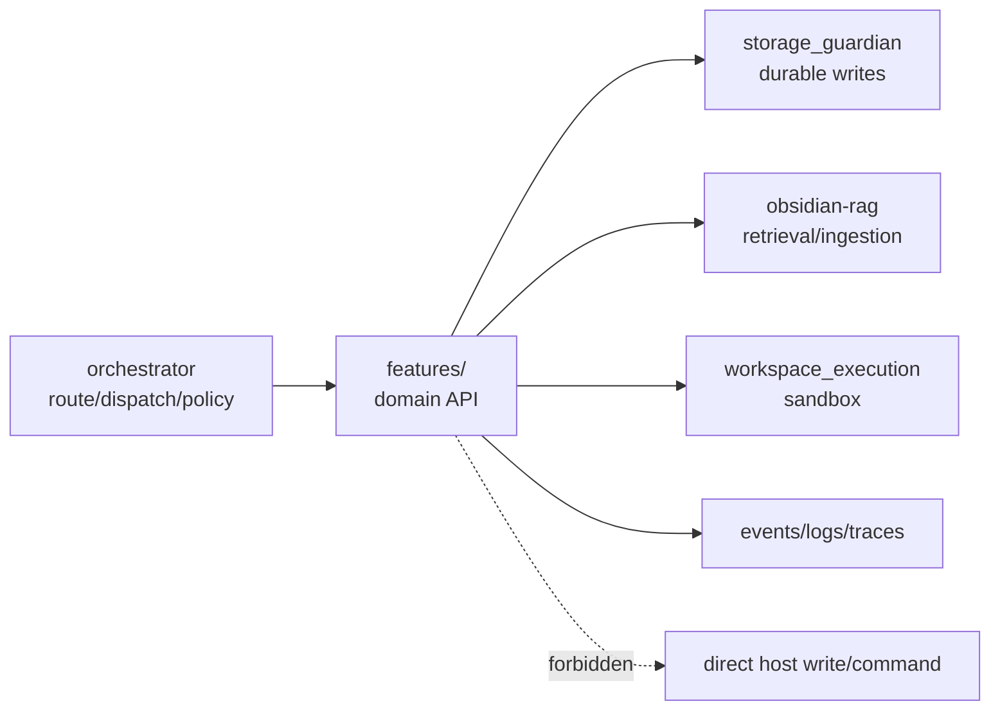
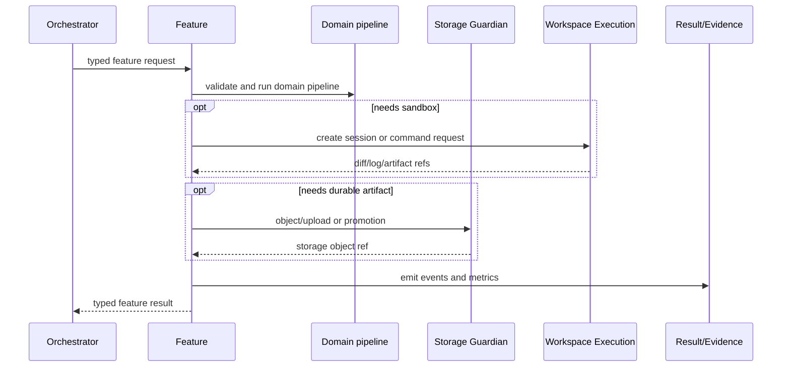
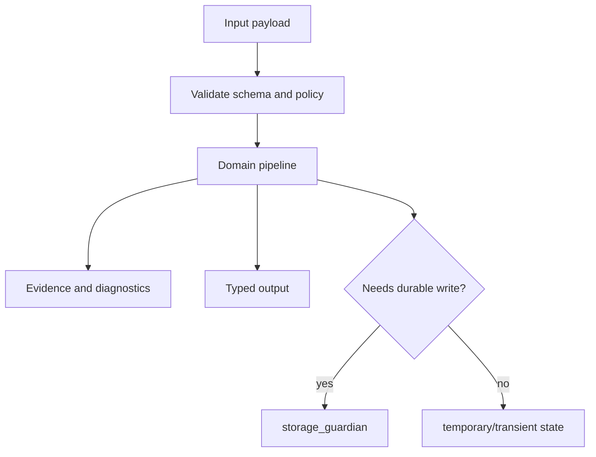

# <Feature Name>

Status: <implemented | enabled-by-default | opt-in | draft | blocked>
Owner: `features/<feature-name>`
Last verified: <YYYY-MM-DD>
Applies to: `features/<feature-name>`, APIs, manifests, tests
Audience: developer, operator, maintainer

## Page Index

- [Purpose](#purpose)
- [Ownership Boundary](#ownership-boundary)
- [User Workflows](#user-workflows)
- [API Or Entry Points](#api-or-entry-points)
- [Architecture](#architecture)
- [Data Flow](#data-flow)
- [Configuration](#configuration)
- [Failure Modes](#failure-modes)
- [Operations](#operations)
- [Verification](#verification)
- [Open Questions](#open-questions)

## Purpose

Explain the domain capability this feature exposes and the concrete user or
system problem it solves.

## Ownership Boundary

This feature owns:

- Domain pipeline/API behavior for <capability>.
- Feature-local validation and typed contracts.
- Feature-local temporary state, if any.

This feature does not own:

- Gateway-wide routing or policy.
- Managed durable writes outside its contract with `storage_guardian`.
- RAG internals unless this feature is the RAG owner.
- Host command execution unless it is `features/workspace_execution`.



## User Workflows

| Workflow | Caller | Input | Output | Evidence |
| --- | --- | --- | --- | --- |
| <workflow> | <caller> | <input> | <output> | <trace/event/file> |

## API Or Entry Points

| Entry point | Type | Auth/policy | Notes |
| --- | --- | --- | --- |
| `<endpoint/function>` | HTTP/function/worker | <policy> | <notes> |

```http
<METHOD> <path>
Content-Type: application/json

{
  "example": "payload"
}
```

## Architecture



## Data Flow



## Configuration

| Key | Path | Default | Meaning | Runtime impact |
| --- | --- | --- | --- | --- |
| `<key>` | `<path>` | `<value>` | <meaning> | <impact> |

## Failure Modes

| Failure | Detection | Feature response | Recovery |
| --- | --- | --- | --- |
| Invalid input | schema validation | 4xx or typed rejection | caller fixes input |
| Owner unavailable | health/client error | typed dependency failure | start profile or retry |
| Contract drift | tests/smoke | fail closed | update schema/tests/docs |
| Durable write denied | storage guardian response | no direct fallback | fix policy/storage owner |

## Operations

```bash
# Run focused tests
<test command>

# Run local smoke, if available
<smoke command>
```

## Verification

| Check | Command or source | Expected result | Last run |
| --- | --- | --- | --- |
| Feature tests | `<command>` | pass | <date or not-run> |
| API contract | `<command>` | pass | <date or not-run> |
| Runtime smoke | `<command>` | pass or not applicable | <date or not-run> |

## Open Questions

- <question, owner, or decision still pending>
