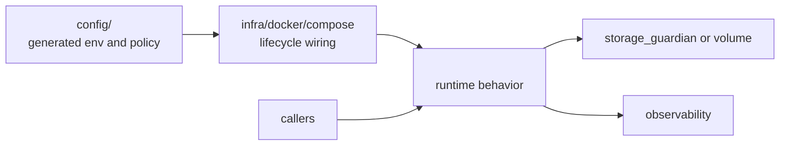
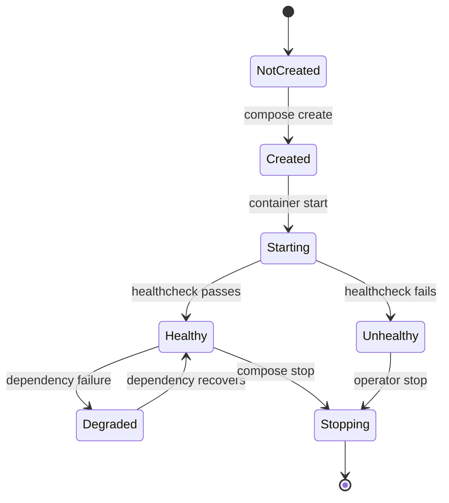
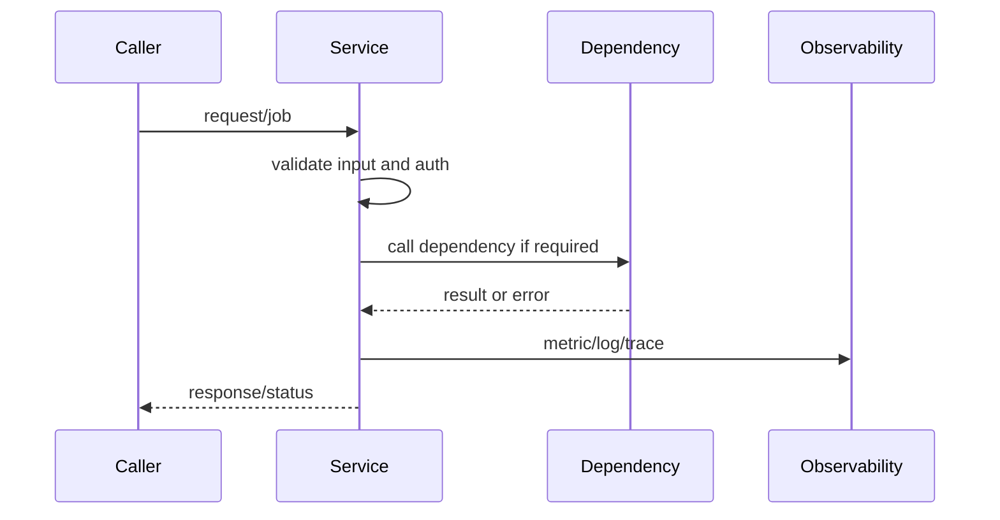

# <Service Name>

Status: <implemented | enabled-by-default | opt-in | draft | blocked>
Owner: `<service-owner-path>`
Last verified: <YYYY-MM-DD>
Applies to: `<compose-file>`, `<image>`, `<profile>`, `<service-name>`
Audience: operator, developer, maintainer

## Page Index

- [Purpose](#purpose)
- [Runtime Identity](#runtime-identity)
- [Ownership Boundary](#ownership-boundary)
- [Start, Stop, Health](#start-stop-health)
- [API Or Worker Contract](#api-or-worker-contract)
- [Lifecycle Diagram](#lifecycle-diagram)
- [Request Flow](#request-flow)
- [Dependencies](#dependencies)
- [Storage And Secrets](#storage-and-secrets)
- [Observability](#observability)
- [Failure Modes](#failure-modes)
- [Verification](#verification)
- [Open Questions](#open-questions)

## Purpose

Explain what this runtime service does, why it exists, and which callers depend
on it.

## Runtime Identity

| Field | Value |
| --- | --- |
| Compose service | `<service>` |
| Image | `<image>` |
| Profile | `<profile>` |
| Internal URL | `<url>` |
| External port | `<port or none>` |
| Health endpoint | `<endpoint or command>` |
| Secrets | `<secret names or none>` |
| Persistent volumes | `<volumes or none>` |

## Ownership Boundary



This service owns:

- <runtime behavior>
- <API/worker loop>
- <health and readiness semantics>

This service does not own:

- <config/policy owned elsewhere>
- <durable storage owned elsewhere>
- <caller-specific behavior>

## Start, Stop, Health

```bash
# Prepare infra/config/images
make infra

# Start with required profiles
AI_COMPOSE_PROFILES=<profiles> make up

# Inspect health
<health command>

# View logs
<logs command>
```

## API Or Worker Contract

```http
<METHOD> <path>
Authorization: Bearer <token-if-needed>
Content-Type: application/json

{
  "example": "payload"
}
```

Response:

```json
{
  "status": "ok",
  "evidence": {}
}
```

## Lifecycle Diagram



## Request Flow



## Dependencies

| Dependency | Required? | Contract | Failure behavior |
| --- | --- | --- | --- |
| `<dependency>` | yes/no | `<API/volume/env>` | <impact> |

## Storage And Secrets

| Item | Owner | Path/name | Durability | Notes |
| --- | --- | --- | --- | --- |
| `<volume>` | `<owner>` | `<path>` | persistent/transient | <notes> |
| `<secret>` | `<owner>` | `<name>` | secret | must not be logged |

## Observability

| Signal | Source | Meaning | Operator action |
| --- | --- | --- | --- |
| <metric/log/event> | <path/tool> | <meaning> | <action> |

## Failure Modes

| Failure | Signal | Impact | Recovery |
| --- | --- | --- | --- |
| Container unhealthy | healthcheck/logs | callers fail or degrade | inspect logs, restart, fix dependency |
| Config missing | startup error | service cannot start | regenerate config or fix central config |
| Dependency unavailable | client error | partial failure | start dependency/profile or degrade |
| Storage denied | storage error | no durable output | fix storage owner/policy |

## Verification

| Check | Command or source | Expected result | Last run |
| --- | --- | --- | --- |
| Compose config | `<command>` | valid | <date or not-run> |
| Health | `<command>` | healthy | <date or not-run> |
| Runtime smoke | `<command>` | pass | <date or not-run> |

## Open Questions

- <question, owner, or decision still pending>
