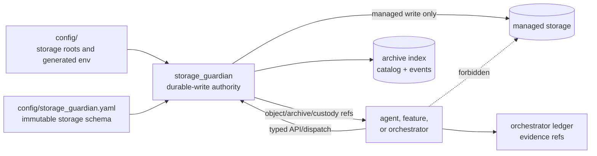
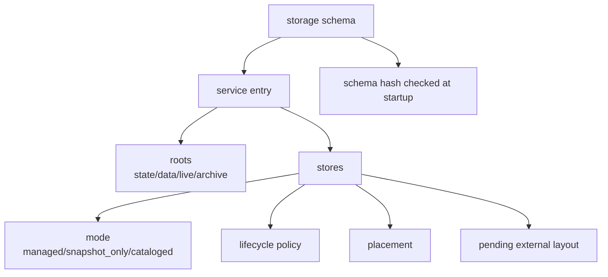
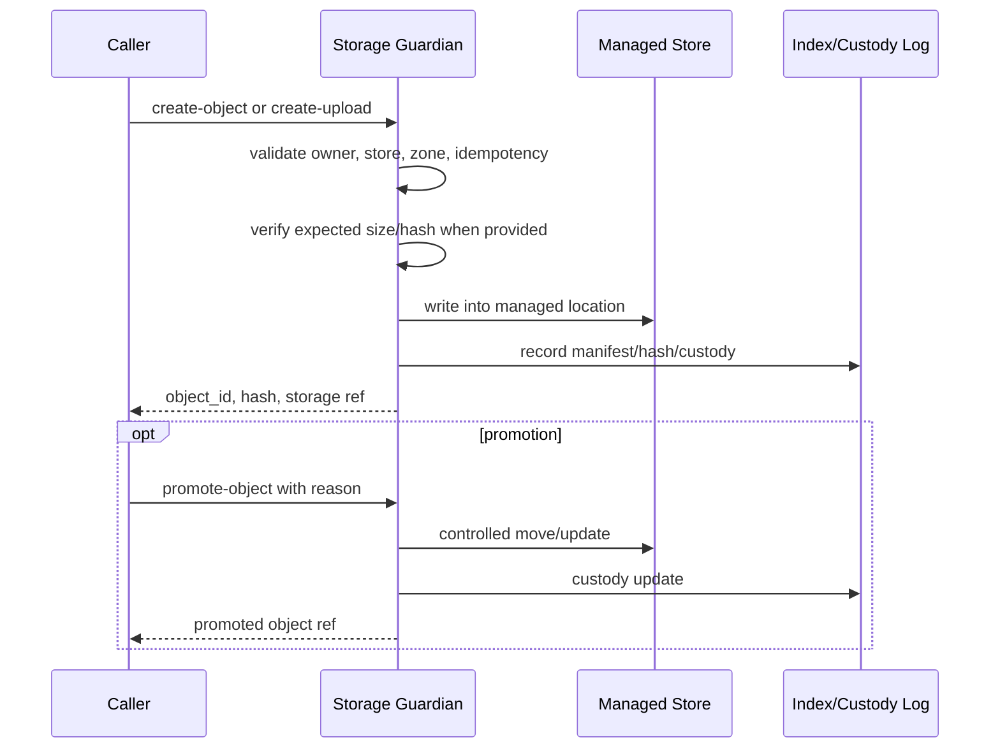
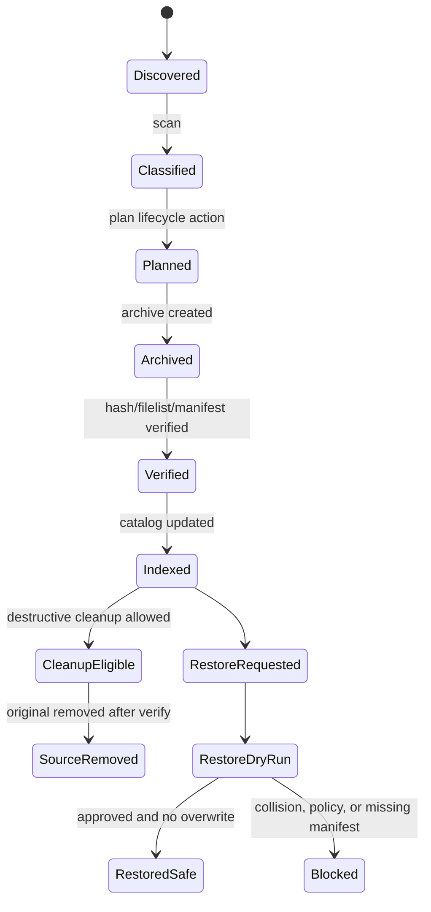
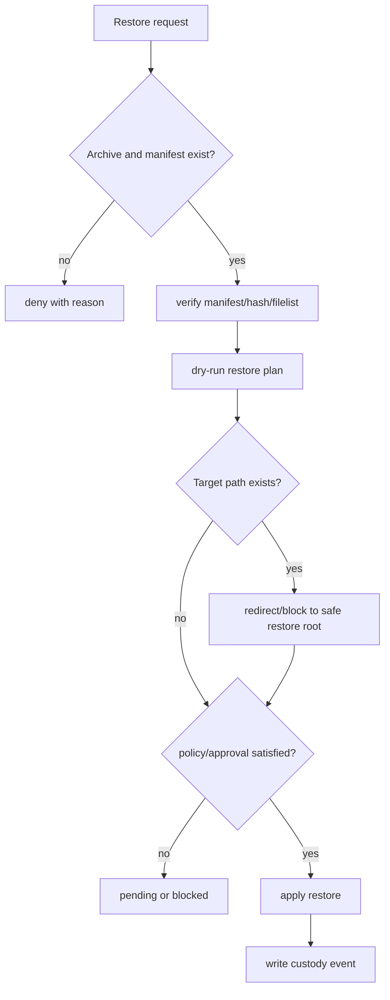
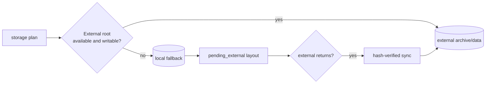
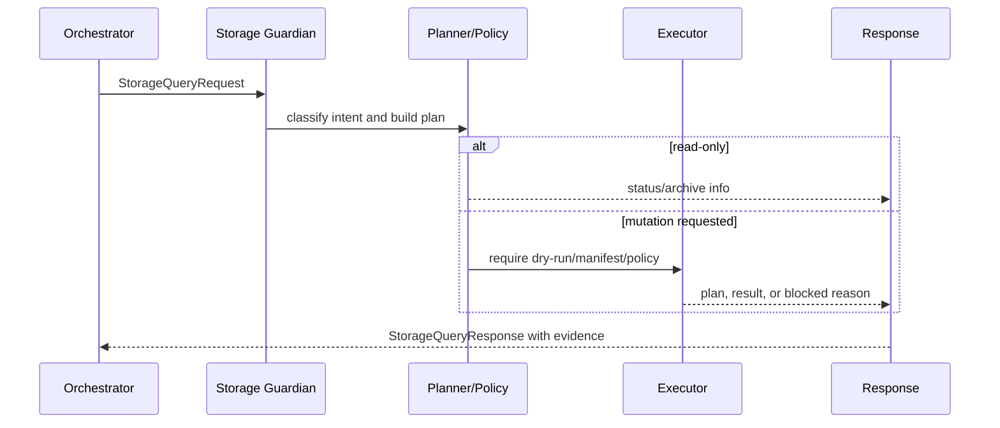

# <Storage Guardian Area Or Flow>

Status: <implemented | enabled-by-default | opt-in | draft | blocked>
Owner: `storage_guardian/`
Last verified: <YYYY-MM-DD>
Applies to: `storage_guardian/`, `config/storage_guardian.yaml`, storage API,
managed stores, generated storage envs
Audience: operator, developer, maintainer

## Page Index

- [Purpose](#purpose)
- [Authority Boundary](#authority-boundary)
- [Runtime Identity](#runtime-identity)
- [Storage Schema](#storage-schema)
- [API And CLI Surface](#api-and-cli-surface)
- [Object And Upload Flow](#object-and-upload-flow)
- [Archive Lifecycle](#archive-lifecycle)
- [Restore Safety](#restore-safety)
- [Lifecycle Policy](#lifecycle-policy)
- [Placement And Fallback](#placement-and-fallback)
- [Chain Of Custody](#chain-of-custody)
- [Natural-Language Storage Query](#natural-language-storage-query)
- [Safety Rules](#safety-rules)
- [Failure Modes](#failure-modes)
- [Observability](#observability)
- [Operator Commands](#operator-commands)
- [Implementation Map](#implementation-map)
- [Change Rules](#change-rules)
- [Verification](#verification)
- [Open Questions](#open-questions)

## Purpose

Explain which storage lifecycle, object, archive, restore, materialization, or
custody concern this page documents. Be explicit about whether the subject is a
runtime API, CLI flow, storage schema rule, lifecycle policy, recovery path, or
operator procedure.

## Authority Boundary

`storage_guardian` is the durable-write authority for managed storage. Other
owners may request objects, uploads, archive actions, restore plans, promotion,
delete, or materialization through typed contracts. They must not receive direct
filesystem write authority for managed stores.

This area owns:

- managed filesystem writes;
- object and upload sessions;
- archive, restore, and archive recovery;
- manifests, hashes, filelists, verify records, and policy snapshots;
- safe restore directories and collision prevention;
- zones, promotion/delete, and chain-of-custody;
- storage query intent mapping through `/internal/storage/query`;
- fallback/pending-external layout for managed stores.

This area does not own:

- central storage root inference, which belongs to `config/`;
- Docker lifecycle, which belongs to `infra/docker`;
- feature business logic;
- agent prompt behavior;
- workspace sandbox execution;
- RAG ingestion/retrieval internals;
- direct host writes from other owners.



## Runtime Identity

| Field | Value |
| --- | --- |
| Service name | `storage_guardian` |
| Profile | `storage` |
| Config | `config/storage_guardian.yaml` |
| Capability manifest | `storage_guardian/service_capabilities.toml` |
| Main package | `storage_guardian/src/storage_guardian` |
| CLI | `python -m storage_guardian.cli --config config/storage_guardian.yaml ...` |
| Health | `GET /health` |
| Metrics | `GET /metrics` |

## Storage Schema

Document the exact schema or store being described.

| Field | Value |
| --- | --- |
| Schema version | `<version>` |
| Immutable? | yes/no |
| Schema hash | `<sha256:...>` |
| Strict store coverage | yes/no |
| Fallback layout | `pending_external/services/{service}/stores/{store}` or other |
| Managed service | `<service>` |
| Store name | `<store>` |
| Store mode | `<managed | snapshot_only | cataloged | other>` |
| Placement | `<external_ssd_preferred | local | inherit | other>` |
| Policy | `<policy>` |



## API And CLI Surface

### Read-Only Status And Inspection

| Operation | API or CLI | Purpose | Mutates storage? |
| --- | --- | --- | --- |
| Health | `GET /health` | readiness | no |
| Status | `GET /status` or `status` | runtime state | no |
| Stores | `GET /stores` | configured stores | no |
| Archives | `GET /archives` | archive catalog | no |
| Effective config | `GET /effective-config` or `effective-config` | derived config | no |
| Storage schema | `GET /storage/schema` or `storage-schema` | schema view | no |
| Policies | `GET /storage/policies` or `storage-policies` | policy view | no |

### Mutating Or High-Risk Operations

| Operation | API or CLI | Required evidence | Policy/risk |
| --- | --- | --- | --- |
| Scan | `POST /internal/scan` or `scan` | scan result | read-only or low |
| Plan | `POST /internal/plan` or `plan` | storage plan | dry-run/plan |
| Run cycle | `POST /internal/run-cycle` or `run-cycle` | manifest + verify + events | high |
| Explicit archive | `/internal/storage/query` or archive command | manifest/dry-run | high |
| Restore | `POST /internal/restore` | restore plan + collision check | high |
| Create object | `POST /internal/storage/objects` | hash + owner + zone | controlled write |
| Upload session | `POST/PUT /internal/storage/uploads` | expected size/hash | controlled write |
| Materialize | `POST /internal/storage/materialize` | object/archive ref + hash | controlled write |
| Promote/delete | `POST /internal/storage/promote|delete` | custody update + reason | controlled mutation |

## Object And Upload Flow



## Archive Lifecycle



## Restore Safety

Restore must be fail-closed. It must never overwrite an existing path and must
use a safe restore directory or an explicit approved target.



## Lifecycle Policy

| Policy field | Value | Meaning | Safety impact |
| --- | --- | --- | --- |
| Hot until | `<days>` | files stay hot until this age | avoids premature archive |
| Cold after | `<days>` | archive/cold candidate threshold | lifecycle planning |
| Destructive actions | true/false | source deletion allowed | requires verify first |
| Delete originals | true/false | original source removal after archive | high-risk |
| Live storage protection | true/false | blocks live DB/vector files | prevents corruption |
| Lossy transforms | true/false | permits destructive transforms | should usually be false |
| Restore overwrite | true/false | permits overwrite | should be false |

## Placement And Fallback

| Placement path | Owner | Purpose | Failure behavior |
| --- | --- | --- | --- |
| local archive root | `storage_guardian` | local archive buffer | used when external missing |
| external archive root | `storage_guardian` + `config/` | preferred durable archive | require writable if configured |
| pending external root | `storage_guardian` | local fallback queue | sync when external available |
| index paths | `storage_guardian` | DuckDB/parquet/event log | keep local unless documented |



## Chain Of Custody

| Custody event | Trigger | Required fields | Consumer |
| --- | --- | --- | --- |
| object created | object/upload commit | object id, owner, store, hash, zone | caller/ledger |
| archive created | archive operation | archive id, manifest, filelist, policy snapshot | catalog/restore |
| archive verified | verification pass | hashes, verifier, timestamp | cleanup gate |
| object promoted | promote call | old zone, new zone, reason, actor | caller/ledger |
| object deleted | delete call | reason, actor, hash/ref | audit/recovery |
| restore dry-run | restore request | target, collision status, plan | approval/policy |
| restore applied | approved restore | target, source archive, hashes | audit/ledger |

## Natural-Language Storage Query

`POST /internal/storage/query` maps storage questions to the storage authority.
The orchestrator may route to this endpoint, but it must not implement storage
intent parsing or lifecycle actions itself.



## Safety Rules

- Never touch unregistered paths.
- Never touch live storage directly unless the store mode explicitly permits
  the operation.
- Never restore over an existing path.
- Require manifests and verification before archive visibility and cleanup.
- Require dry-run or manifest evidence before mutation.
- Require hashes for object/upload/materialization paths.
- Treat destructive cleanup, restore apply, promotion, and delete as high-risk.
- Keep storage lifecycle metadata under `storage_guardian/`, not feature
  manifests.
- Other services should receive object refs or materialized refs, not managed
  filesystem write paths.

## Failure Modes

| Failure | Detection | User impact | Recovery |
| --- | --- | --- | --- |
| External storage missing | config/resolver or placement check | local fallback or blocked state | mount external root or allow fallback |
| Schema hash mismatch | startup validation | service blocked/degraded | update schema hash intentionally |
| Archive verification failed | verifier result | no cleanup, archive not visible | inspect filelist/hash and retry |
| Restore collision | dry-run | restore blocked or redirected | choose safe target |
| Live storage candidate | safety rule | action denied | use snapshot/export path |
| Hash mismatch on upload | commit validation | object rejected | re-upload correct bytes |
| Policy approval missing | capability risk policy | mutation pending/blocked | approve or keep dry-run |

## Observability

| Signal | Location | Meaning | Action |
| --- | --- | --- | --- |
| `storage.plan.created` | events/ledger | lifecycle plan exists | review before mutation |
| `storage.restore.dry_run.completed` | events/ledger | restore has safe plan | approve/apply if correct |
| `storage.lifecycle.changed` | events/ledger | archive/promote/delete changed state | audit custody |
| `service.degraded` | service status/events | storage authority degraded | inspect health/config/storage |
| archive catalog | DuckDB/parquet | searchable archive state | query/verify |
| lifecycle events | JSONL/event log | chronological custody | inspect incident timeline |

## Operator Commands

```bash
# Status and derived config
python -m storage_guardian.cli --config config/storage_guardian.yaml status
python -m storage_guardian.cli --config config/storage_guardian.yaml effective-config

# Inspect schema and policy
python -m storage_guardian.cli --config config/storage_guardian.yaml storage-schema
python -m storage_guardian.cli --config config/storage_guardian.yaml storage-policies

# Scan, plan, and run lifecycle
python -m storage_guardian.cli --config config/storage_guardian.yaml scan
python -m storage_guardian.cli --config config/storage_guardian.yaml plan
python -m storage_guardian.cli --config config/storage_guardian.yaml run-cycle

# Archive inspection
python -m storage_guardian.cli --config config/storage_guardian.yaml archive-members <manifest>
python -m storage_guardian.cli --config config/storage_guardian.yaml read-archive-text <manifest> <relative-path>
```

## Implementation Map

| Area | Path | Notes |
| --- | --- | --- |
| API/app | `storage_guardian/src/storage_guardian/app.py` | service entrypoint |
| API routes | `storage_guardian/src/storage_guardian/api/routes.py` | HTTP surface |
| Contracts | `storage_guardian/src/storage_guardian/contracts.py` | typed request/response models |
| Config | `storage_guardian/src/storage_guardian/config.py` | config loading |
| Derived config | `storage_guardian/src/storage_guardian/derived_config.py` | calculated values |
| Schema | `config/storage_guardian.yaml` | immutable managed store schema |
| Capability manifest | `storage_guardian/service_capabilities.toml` | orchestrator dispatch metadata |
| Archive/restore | `storage_guardian/src/storage_guardian/archive_reader.py`, `restore.py`, `restore_execution.py` | archive and restore behavior |
| Object control | `storage_guardian/src/storage_guardian/storage_control.py` | object/upload/promote/delete |
| Safety | `storage_guardian/src/storage_guardian/safety.py`, `path_safety.py`, `verifier.py` | guards and verification |

## Change Rules

- Any new managed store must be represented in `config/storage_guardian.yaml`
  with owner, root, mode, policy, placement, and fallback semantics.
- Any new mutating API must define idempotency, evidence, policy risk, and
  rollback or fail-closed behavior.
- Any schema change must update validation, tests, docs, and the schema hash
  intentionally.
- Any consumer that wants durable output must use object/upload/materialization
  contracts instead of writing managed paths directly.
- Any archive cleanup change must preserve verify-before-delete.

## Verification

| Check | Command or source | Expected result | Last run |
| --- | --- | --- | --- |
| CLI status | `python -m storage_guardian.cli --config config/storage_guardian.yaml status` | service/config status visible | <date or not-run> |
| Effective config | `python -m storage_guardian.cli --config config/storage_guardian.yaml effective-config` | derived values match config | <date or not-run> |
| Schema | `python -m storage_guardian.cli --config config/storage_guardian.yaml storage-schema` | schema valid and hash expected | <date or not-run> |
| Unit tests | `<command>` | storage contracts pass | <date or not-run> |
| Runtime health | `GET /health` | healthy or explicit degraded reason | <date or not-run> |
| Archive/restore smoke | `<command>` | manifest, verify, dry-run, custody evidence | <date or not-run> |

## Open Questions

- <question, owner, or decision still pending>
